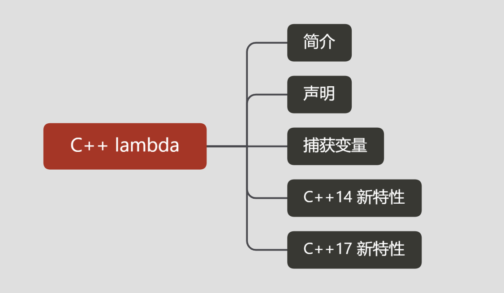

## 简介


### lambda与函数对象


### Lambda和闭包

1. lambda匿名函数和闭包的关系就如同类和类对象的关系，匿名函数和类的定义都只存在于源码（代码段）中，而闭包和类对象则是在运行时占用内存空间的实体；
2. 对匿名函数的定义会生成一个独一无二的类，并在运行时生成其类对象；


## Lambda表达式声明


1. 捕获
2. 参数列表 可有可无. (也称为 *lambda 声明符*)
3. 可变规范 可有可无.
4. 异常规范 可有可无.
5. 尾随-返回类型 可有可无.
6. lambda 定义。

### C++ 17 lambda

```
[ capture-list ] ( params ) mutable(optional) constexpr(optional)(c++17) exception attribute -> ret { body } 

// 简化语法
[ capture-list ] ( params ) -> ret { body }     
[ capture-list ] ( params ) { body }    
[ capture-list ] { body } 
```

- **capture-list**：捕捉列表，这个不用多说，前面已经讲过，记住它不能省略；
- **params**：参数列表，可以省略（但是后面必须紧跟函数体）；
- **mutable**：可选，将`lambda`表达式标记为`mutable`后，函数体就可以修改传值方式捕获的变量；
- **constexpr**：可选，C++17，可以指定`lambda`表达式是一个常量函数；
- **exception**：可选，指定`lambda`表达式可以抛出的异常；
- **attribute**：可选，指定`lambda`表达式的特性；
- **ret**：可选，返回值类型；
- **body**：函数执行体。


**示例**

```cpp
#include <algorithm>
#include <cmath>

void abssort(float* x, unsigned n) {
    std::sort(x, x + n,
        // Lambda expression begins
        [](float a, float b) {
            return (std::abs(a) < std::abs(b));
        } // end of lambda expression
    );
}
```


## 捕获变量

类似参数传递方式（值传递、引入传递、指针传递），在Lambda表达式中，外部变量的捕获方式也有值捕获、引用捕获、隐式捕获。

**C++11中的Lambda表达式捕获外部变量主要有以下形式：**

| 捕获形式    | 说明                                                         |
| ----------- | ------------------------------------------------------------ |
| []          | 不捕获任何外部变量                                           |
| [变量名, …] | 默认以值得形式捕获指定的多个外部变量（用逗号分隔），如果引用捕获，需要显示声明（使用&说明符） |
| [this]      | 以值的形式捕获this指针                                       |
| [=]         | 以值的形式捕获所有外部变量                                   |
| [&]         | 以引用形式捕获所有外部变量                                   |
| [=, &x]     | 变量x以引用形式捕获，其余变量以传值形式捕获                  |
| [&, x]      | 变量x以值的形式捕获，其余变量以引用形式捕获                  |

**示例：**

- []：默认不捕获任何变量；
- [=]：默认以值捕获所有变量；
- [&]：默认以引用捕获所有变量；
- [x]：仅以值捕获x，其它变量不捕获；
- [&x]：仅以引用捕获x，其它变量不捕获；
- [=, &x]：默认以值捕获所有变量，但是x是例外，通过引用捕获；
- [&, x]：默认以引用捕获所有变量，但是x是例外，通过值捕获；
- [this]：通过引用捕获当前对象（其实是复制指针）；
- [*this]：通过传值方式捕获当前对象；


### 注意事项

- 若要在类方法的主体中使用 lambda 表达式，请将 **`this`** 指针传递给捕获子句，以提供对封闭类的方法和数据成员的访问。
- 引用捕获可用于修改外部变量，而值捕获却不能实现此操作。 (**`mutable`** 允许修改副本，而不是原始副本。 )
- 引用捕获会反映外部变量的更新，而值捕获却不会反映。
- 引用捕获引入生存期依赖项，而值捕获却没有生存期依赖项。 当 lambda 以异步方式运行时，这一点尤其重要。 如果在异步 lambda 中通过引用捕获本地变量，该本地变量将很可能在 lambda 运行时消失，从而导致运行时访问冲突。


#### 隐式捕获

上面的值捕获和引用捕获都需要我们在捕获列表中显示列出Lambda表达式中使用的外部变量。除此之外，我们还可以让编译器根据函数体中的代码来推断需要捕获哪些变量，这种方式称之为隐式捕获。隐式捕获有两种方式，分别是[=]和[&]。[=]表示以值捕获的方式捕获外部变量，[&]表示以引用捕获的方式捕获外部变量。


#### 混合方式

上面的例子，要么是值捕获，要么是引用捕获，Lambda表达式还支持混合的方式捕获外部变量，这种方式主要是以上几种捕获方式的组合使用。

```
[]      // 沒有定义任何变量。使用未定义变量会引发错误。
[x, &y] // x以传值方式传入（默认），y以引用方式传入。
[&]     // 任何被使用到的外部变量都隐式地以引用方式加以引用。
[=]     // 任何被使用到的外部变量都隐式地以传值方式加以引用。
[&, x]  // x显式地以传值方式加以引用。其余变量以引用方式加以引用。
[=, &z] // z显式地以引用方式加以引用。其余变量以传值方式加以引用。
```


#### **修改捕获变量**

前面我们提到过，在Lambda表达式中，如果以传值方式捕获外部变量，则函数体中不能修改该外部变量，否则会引发编译错误。那么有没有办法可以修改值捕获的外部变量呢？这是就需要使用mutable关键字，该关键字用以说明表达式体内的代码可以修改值捕获的变量。


#### 悬空引用/指针

```cpp
int* x = new int[1000000];
x[0] = 0;
auto AnonyFunc = [&x]()
{        
    x[0] = 1; // Segmentation fault
};
delete[] x;
AnonyFunc();
struct Foo
{        
    int x_[1000000];
};
int main()
{
    Foo* f = new Foo();
    f->x_[0] = 0;
    auto AnonyFunc = f -> void
    {           
        f->x_[0] = 1; // Segmentation fault
    };
        delete f;
        AnonyFunc();
    }
}
```

```

```

**示例2：**

```
std::function<int(int)> add_x(int x)
{
    return [=](int a) { return x + a; };
}
```


#### 可变参数模板

```
template<class... Args>
void f(Args... args) {
    auto x = [args...] { return g(args...); };
    x();
}
```

#### 相互赋值

```
auto a = [] { cout << "A" << endl; };
auto b = [] { cout << "B" << endl; };

a = b;   // 非法，lambda无法赋值
auto c = a;   // 合法，生成一个副本
```


## C++14  lambda表达式


### 泛型`lambda`表达式

从`C++14`开始，`lambda`表达式支持泛型：其参数可以使用自动推断类型的功能，而不需要显示地声明具体类型。这就如同函数模板一样，参数要使用类型自动推断功能，只需要将其类型指定为`auto`，类型推断规则与函数模板一样。这里给出一个简单例子：


```cpp
auto add = [](auto x, auto y) { return x + y; };

int x = add(2, 3);   // 5
double y = add(2.5, 3.5);  // 6.0
```

### `lambda`捕捉表达式

前面讲过，`lambda`表达式可以按复制或者引用捕获在其作用域范围内的变量。而有时候，我们希望捕捉不在其作用域范围内的变量，而且最重要的是我们希望捕捉右值。所以`C++14`中引入了表达式捕捉，其允许用任何类型的表达式初始化捕捉的变量。看下面的例子：


```
// 利用表达式捕获，可以更灵活地处理作用域内的变量
int x = 4;
auto y = [&r = x, x = x + 1] { r += 2; return x * x; }();
// 此时 x 更新为6，y 为25

// 直接用字面值初始化变量
auto z = [str = "string"]{ return str; }();
// 此时z是const char* 类型，存储字符串 string
```


可以看到捕捉表达式扩大了`lambda`表达式的捕捉能力，有时候你可以用`std::move`初始化变量。这对不能复制只能移动的对象很重要，比如`std::unique_ptr`，因为其不支持复制操作，你无法以值方式捕捉到它。但是利用`lambda`捕捉表达式，可以通过移动来捕捉它：


```cpp
auto myPi = std::make_unique<double>(3.1415);

auto circle_area = [pi = std::move(myPi)](double r) { return *pi * r * r; };
cout << circle_area(1.0) << endl; // 3.1415
```

其实用表达式初始化捕捉变量，与使用`auto`声明一个变量的机理是类似的。

### 广义lambda捕获（Generalized Lambda Captures）

C++ 14 中引入了新的**广义 lambda 捕获**（[Generalized Lambda Captures](https://link.zhihu.com/?target=https%3A//en.wikipedia.org/wiki/C%2B%2B14%23Generic_lambdas)），即可以在捕获列表中以任意方式初始化匿名函数中的变量，使得某些被禁用了拷贝构造函数的类型可以通过 `std::move` 的方式被捕获到匿名函数中：

```cpp
auto ptr_0 = make_unique<int>( 0 );
auto AnonyFunc = [ptr_0 = move(ptr_0)]()
{
    *ptr_0 = 1;
    cout << *ptr_0 << endl;
};
AnonyFunc();
```

这里捕获列表中左边和右边的 `ptr_0` 不是同一个变量，它们的作用域分别是匿名函数内和匿名函数外；

除此之外广义 lambda 捕获还可以用来间接地捕获 `*this`，即在 C++ 11 中无法实现的按值捕获 this 指向的对象：

```cpp
auto AnonyFunc = [this_copy = *this]() mutable
{
    this_copy.x_ = 1;
    cout << this_copy.x_ << endl;
};
AnonyFunc();
```


## C++ 17 lambda表达式

### 捕获 `*this`

在 C++ 17 中，终于可以直接捕获 `*this` 了，[提案 P0018R3](https://link.zhihu.com/?target=http%3A//www.open-std.org/jtc1/sc22/wg21/docs/papers/2016/p0018r3.html) 指出捕获 `*this` 可以用于需要进行异步操作的并发应用，因为 `this` 可能失效：

```cpp
auto AnonyFunc = [*this]() mutable
{
    x_ = 1;
    cout << x_ << endl;
};
AnonyFunc();
cout << x_ << endl;
```

```text
1
0
```


## 相关参考

[C++ lambda表达式与函数对象](https://www.jianshu.com/p/d686ad9de817)