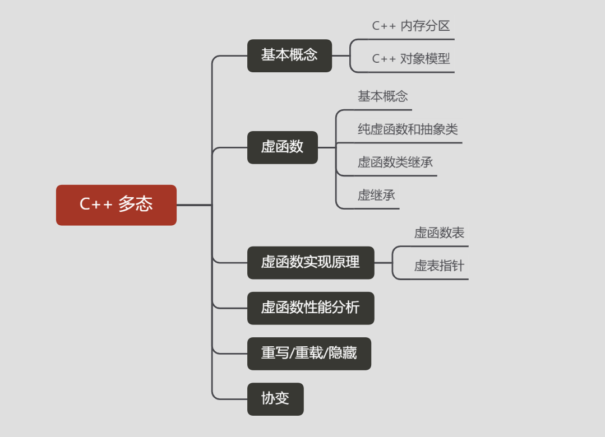
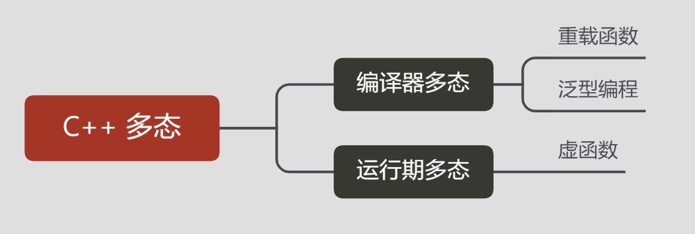
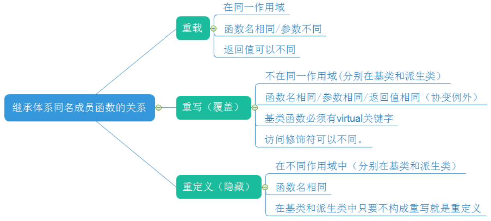

## 基本概念

**多态性指相同对象收到不同消息或不同对象收到相同消息时产生不同的实现动作。多态性(polymorphism)可以简单地概括为“一个接口，多种方法”，它是面向对象编程领域的核心概念。**



**C++支持两种多态性：**

- 编译时多态性（静态多态）：通过重载函数和泛型编程实现：先期联编 early binding 

- 运行时多态性（动态多态）：通过虚函数实现 ：滞后联编 late binding

C++运行时多态性是通过虚函数来实现的，虚函数允许子类重新定义成员函数，而子类重新定义父类的做法称为覆盖(Override)，或者称为重写。

-----

**静态联编和动态联编：**

- **静态联编：**在编译时所进行的这种联编又称静态束定，在编译时就解决了程序中的操作调用与执行该操作代码间的关系。 

- **动态联编：**编译程序在编译阶段并不能确切知道将要调用的函数，只有在程序运行时才能确定将要调用的函数，为此要确切知道该调用的函数，要求联编工作要在程序运行时进行，这种在程序运行时进行联编工作被称为动态联编。

-----

**动态多态的条件：**

- 基类中必须包含虚函数，并且派生类中一定要对基类中的虚函数进行**重写**。

- 通过基类对象的指针或者引用调用虚函数。

-----

**多态的表现形式：**

- **派生类的指针**可以赋给**基类指针**；
- 通过基类指针调用基类和派生类中的同名「虚函数」时:
  1. 若该指针指向一个基类的对象，那么被调用是 基类的虚函数；
  2. 若该指针指向一个派生类的对象，那么被调用 的是派生类的虚函数。


- **派生类的对象**可以赋给**基类**引用
- 通过基类引用调用基类和派生类中的同名「虚函数」时:
  1. 若该引用引用的是一个基类的对象，那么被调 用是基类的虚函数；
  2. 若该引用引用的是一个派生类的对象，那么被 调用的是派生类的虚函数。


-----


，


**派生类虚表：**
1.先将基类的虚表中的内容拷贝一份
2.如果派生类对基类中的虚函数进行重写，使用派生类的虚函数替换相同偏移量位置的基类虚函数
3.如果派生类中新增加自己的虚函数，按照其在派生类中的声明次序，放在上述虚函数之后


多态缺陷

●降低了程序运行效率（多态需要去找虚表的地址）
●空间浪费


**注意：**

- 构造函数不能为虚函数
- 析构函数可为虚函数，且推荐设置基类析构函数为虚函数
- 虚函数不能是static


-----

## C++ 对象模型


-----

### C++ 内存分区

C++的内存分区大概分成五个部分：

1. 栈（stack）：是由编译器在需要时自动分配，不需要时自动清除的变量存储区，通常存放局部变量、函数参数等。
2. 堆（heap）：是由`malloc`等分配的内存块，和堆十分相似，用`free`来释放
3. 自由存储区：是由`new`分配的内存块，由程序员释放（编译器不管），一般一个`new`与一个`delete`对应，一个`new[]`与一个`delete[]`对应，如果程序员没有释放掉，资源将由操作系统在程序结束后自动回收
4. 全局/静态存储区：**全局变量**和**静态变量**被分配到同一块内存中
5. 常量存储区：这是一块特殊存储区，里边存放常量，不允许修改


## 虚函数

一个虚函数是一个可继承和重写的函数，使动态调度变得更加容易.C++通过继承和虚函数来实现多态性，**虚函数**是通过一张**虚函数表**实现的，虚函数表解决了继承、覆盖、添加虚函数的问题，保证其真实反应实际的函数

虚函数继承是解决多态性的，当用基类指针指向派生类对象的时候，基类指针调用虚函数的时候会自动调用派生类的虚函数，这就是多态性，也叫动态编联。重要概念是 **虚函数指针(vfptr)** 和 **虚函数表(vftable)**


**需要注意：**

1. 只有类的成员函数才能声明为虚函数，虚函数仅适用于有继承关系的类对象。普通函数不能声明为虚函数。

2. 静态成员函数不能是虚函数，因为静态成员函数不受限于某个对象。

3. 内联函数（inline）不能是虚函数，因为内联函数不能在运行中动态确定位置。

4. 构造函数不能是虚函数。

5. 析构函数可以是虚函数，而且建议声明为虚函数。

6. 如果含有虚函数的类中没有定义构造函数，编译器会自动合成一个构造函数

7. 在面向对象的编程中，当派生类从基类继承时，可以通过基类类型的指针或引用而不是派生类类型来引用派生类的对象。如果存在派生类重写的基类方法，则可以根据指针或引用的声明类型或“后期”将此类引用或指针实际调用的方法“较早”（由编译器）绑定。 （即，由该语言的运行时系统），根据所引用对象的实际类型而定。

   

### 纯虚函数和抽象类

纯虚函数相当于基类只提供接口而不定义具体实现，在函数声明后加=0，如： virtual void Eat() = 0。重要概念是 **抽象类**。

在基类中不能对虚函数给出**有意义**的实现，凡是含有纯虚函数的类叫做抽象类。这种类不能声明对象，只是作为基类为派生类服务。除非在派生类中完全实现基类中所有的的纯虚函数，否则，派生类也变成了抽象类，不能实例化对象。


一般而言纯虚函数的函数体是缺省的，但是也可以给出纯虚函数的函数体（此时纯虚函数变为虚函数），这一点经常被人们忽视，调用纯虚函数的方法为baseclass::virtual function。


**抽象类的继承类不实现纯虚函数会怎样？**

那么继承类本身也是抽象类，不能直接用来实例化对象。


-----

### 虚函数类继承

- 一般继承时，子类的虚函数表中先将父类虚函数放在前，再放自己的虚函数指针。
- 如果子类覆盖了父类的虚函数，将被放到了虚表中**原来父类虚函数**的位置。
- 在多继承的情况下，**每个父类都有自己的虚表，子类的成员函数被放到了第一个父类的表中。**，也就是说当类在多重继承中时，其实例对象的内存结构并不只记录一个虚函数表指针。基类中有几个存在虚函数，则子类就会保存几个虚函数表指针


**简单的总结一下：**

>  **1. 每一个基类都会有自己的虚函数表，派生类的虚函数表的数量根据继承的基类的数量来定。** 
>
>  **2. 派生类的虚函数表的顺序，和继承时的顺序相同。** 
>
>  **3. 派生类自己的虚函数放在第一个虚函数表的后面，顺序也是和定义时顺序相同。** 
>
>  **4. 对于派生类如果要覆盖父类中的虚函数，那么会在虚函数表中代替其位置。** 


### 虚继承

虚继承主要用于菱形形式的继承形式，是为了在多继承的时候避免引发歧义，避免重复拷贝。重要概念是 **虚基类指针(vbptr)** 和 **虚基类表(vftable)**。


## 虚函数用法

**虚析构函数**

虽然析构函数是不继承的，但若基类声明其析构函数为 `virtual`，则派生的析构函数始终覆盖它。这使得可以通过指向基类的指针 delete 动态分配的多态类型对象

```cpp
class Base {
 public:
    virtual ~Base() { /* 释放 Base 的资源 */ }
};
 
class Derived : public Base {
    ~Derived() { /* 释放 Derived 的资源 */ }
};
 
int main()
{
    Base* b = new Derived;
    delete b; // 进行对 Base::~Base() 的虚函数调用
              // 由于它是虚函数，故它调用的是 Derived::~Derived()，
              // 这就能释放派生类的资源，然后遵循通常的析构顺序
              // 调用 Base::~Base()
}
```

此外，若类是*多态的*（声明或继承了至少一个虚函数），且其析构函数非虚，则删除它是*未定义行为*，无论不调用派生的析构函数时是否会导致资源泄漏。

一条有用的方针是，任何基类的析构函数必须为[公开且虚，或受保护且非虚](https://github.com/isocpp/CppCoreGuidelines/blob/master/CppCoreGuidelines.md#discussion-make-base-class-destructors-public-and-virtual-or-protected-and-nonvirtual)

**在构造和析构期间**

当从构造函数或从析构函数中直接或间接调用虚函数（包括在类的非静态数据成员的构造或析构期间，例如在成员[初始化器列表](https://zh.cppreference.com/w/cpp/language/initializer_list)中），且对其实施调用的对象是正在构造或析构中的对象时，所调用的函数是构造函数或析构函数的类中的最终覆盖函数，而非进一步的派生类中的覆盖函数。 换言之，在构造和析构期间，进一步的派生类并不存在。

当构建具有多个分支的复杂类时，在属于一个分支的构造函数内，多态被限制到该类及其基类：若它获得了指向这个子层级之外的某个基类子对象的指针或引用，且试图进行虚函数调用（例如通过显式成员访问），则行为未定义：

```cpp
struct V {
    virtual void f();
    virtual void g();
};
 
struct A : virtual V {
    virtual void f(); // A::f 是 V::f 在 A 中的最终覆盖函数
};
struct B : virtual V {
    virtual void g(); // B::g 是 V::g 在 B 中的最终覆盖函数
    B(V*, A*);
};
struct D : A, B {
    virtual void f(); // D::f 是 V::f 在 D 中的最终覆盖函数
    virtual void g(); // D::g 是 V::g 在 D 中的最终覆盖函数
 
    // 注意：A 在 B 之前初始化
    D() : B((A*)this, this) 
    {
    }
};
 
// B 的构造函数，从 D 的构造函数调用 
B::B(V* v, A* a)
{
    f(); // 对 V::f 的虚调用（尽管 D 拥有最终覆盖函数，D 也不存在）
    g(); // 对 B::g 的虚调用，在 B 中是最终覆盖函数
 
    v->g(); // v 的类型 V 是 B 的基类，虚调用如前调用 B::g
 
    a->f(); // a 的类型 A 不是 B 的基类，它属于层级中的不同分支。
            // 尝试通过这个分支进行虚调用导致未定义行为，
            // 即使此情况下 A 已完成构造
            // （它在 B 之前构造，因为它在 D 的基类列表中先于 B 出现）
            // 实践中，对 A::f 的虚调用会试图使用 B 的虚成员函数表，
            // 因为它在 B 的构造期间是活跃的
}
```


-----

### 虚函数的应用注意事项

- 内联函数 (inline)
  虚函数用于实现运行时的多态，或者称为晚绑定或动态绑定。而内联函数用于提高效率。内联函数的原理是，在编译期间，对调用内联函数的地方的代码替换成函数代码。内联函数对于程序中需要频繁使用和调用的小函数非常有用。默认地，类中定义的所有函数，除了虚函数之外，会隐式地或自动地当成内联函数(注意：内联只是对于编译器的一个建议，编译器可以自己决定是否进行内联).
  无论何时，**使用基类指针或引用来调用虚函数，它都不能为内联函数(因为调用发生在运行时)**。但是，无论何时，使用类的对象(不是指针或引用)来调用时，可以当做是内联，因为编译器在编译时确切知道对象是哪个类的。
- 静态成员函数 (static)
  static成员不属于任何类对象或类实例，所以即使给此函数加上virutal也是没有任何意义的。此外静态与非静态成员函数之间有一个主要的区别，那就是**静态成员函数没有this指针**，从而导致两者调用方式不同。虚函数依靠vptr和vtable来处理。vptr是一个指针，在类的构造函数中创建生成，并且只能用this指针来访问它，因为它是类的一个成员，并且vptr指向保存虚函数地址的vtable。**虚函数的调用关系：this -> vptr -> vtable ->virtual function**，对于静态成员函数，它没有this指针，所以无法访问vptr. 这就是为何**static函数不能为virtual**。
- 构造函数 (constructor)
  虚函数基于虚表vtable（内存空间），构造函数 (constructor) 如果是virtual的，调用时也需要根据vtable寻找，但是constructor是virtual的情况下是找不到的，因为constructor自己本身都不存在了，创建不到class的实例，没有实例class的成员（除了public static/protected static for friend class/functions，其余无论是否virtual）都不能被访问了。此外构造函数不仅不能是虚函数。而且在构造函数中调用虚函数，实际执行的是父类的对应函数，因为自己还没有构造好,多态是被disable的。
- 析构函数 (deconstructor)
  **对于可能作为基类的类的析构函数要求就是virtual的**。因为如果不是virtual的，派生类析构的时候调用的是基类的析构函数，而基类的析构函数只要对基类部分进行析构，从而可能导致派生类部分出现内存泄漏问题。
- 纯虚函数
  析构函数可以是纯虚的，但**纯虚析构函数必须有定义体**，因为析构函数的调用是在子类中隐含的。


-----

## 虚函数的实现原理

 **虚函数（Virtual Function）是通过一张虚函数表来实现的**。简称为V-Table。在这个表中，主要是一个类的虚函数的地址表，**这张表解决了继承、覆盖的问题，保证其真实反应实际的函数**。这样，在有虚函数的类的实例中分配了指向这个表的指针的内存，所以，当用父类的指针来操作一个子类的时候，这张虚函数表就显得尤为重要了，它就像一个地图一样，指明了实际所应该调用的函数。    

虚函数继承是解决多态性的，当用基类指针指向派生类对象的时候，基类指针调用虚函数的时候会自动调用派生类的虚函数，这就是多态性，也叫动态编联。重要概念是 **虚函数指针(vfptr)** 和 **虚函数表(vftable)**

### 虚函数的调用过程

当调用一个虚函数时，首先通过对象内存中的vptr找到虚函数表vtbl，接着通过vtbl找到对应虚函数的实现区域并进行调用。

其中**被执行的代码必须和调用函数的对象的动态类型相一致**。编译器需要做的就是如何高效的实现提供这种特性。不同编译器实现细节也不相同。大多数编译器通过虚表vtbl（virtual table）和虚表指针vptr（virtual table pointer）来实现的。 当一个类声明了虚函数或者继承了虚函数，这个类就会有自己的vtbl。vtbl核心就是一个函数指针数组，有的编译器用的是链表，不过方法都是差不多。vtbl数组中的每一个元素对应一个函数指针指向该类的一个虚函数，同时该类的每一个对象都会包含一个vptr，vptr指向该vtbl的地址。 在有继承关系时(子类相对于其直接父类)

### 虚函数表 Virtual method table

C++的编译器会保证**虚函数表的指针存在于对象实例中最前面的位置**（为了保证取虚函数表有最高的性能，在有多层继承或是多重继承的情况下），这意味着我们通过对象实例的地址得到这张虚函数表的地址，然后就可以遍历其中函数指针，并调用相应的函数

对于一个类来说，**如果类中存在虚函数，那么该类的大小就会多4个字节，然而这4个字节就是一个指针的大小，这个指针指向虚函数表**。所以，如果对象存在虚函数，那么编译器就会生成一个指向虚函数表的指针，所有的虚函数都存在于这个表中，**虚函数表就可以理解为一个数组，每个单元用来存放虚函数的地址**。


-----

### 虚表指针

在一个类实例中指向虚函数表的指针。


### 虚函数性能分析

**调用性能**

从前面虚函数的调用过程可知。当调用虚函数时过程如下（引自More Effective C++）:

- 通过对象的 vptr 找到类的 vtbl。
  这是一个简单的操作,因为编译器知道在对象内 哪里能找到 vptr(毕竟是由编译器放置的它们)。因此这个代价只是一个偏移调整(以得到 vptr)和一个指针的间接寻址(以得到 vtbl)。
- 找到对应 vtbl 内的指向被调用函数的指针。
  这也是很简单的, 因为编译器为每个虚函数在 vtbl 内分配了一个唯一的索引。这步的代价只是在 vtbl 数组内的一个偏移。
- 调用第二步找到的的指针所指向的函数。
  - 在单继承的情况下
    调用虚函数所需的代价基本上和非虚函数效率一样，在大多数计算机上它多执行了很少的一些指令，**所以有很多人一概而论说虚函数性能不行是不太科学的。**
  - 在多继承的情况
    由于会根据多个父类生成多个vptr，在对象里为寻找 vptr 而进行的偏移量计算会变得复杂一些，但这些并不是虚函数的性能瓶颈。**虚函数运行时所需的代价主要是虚函数不能是内联函数。**这也是非常好理解的，是因为内联函数是指在编译期间用被调用的函数体本身来代替函数调用的指令，但是虚函数的“虚”是指“直到运行时才能知道要调用的是哪一个函数。”但虚函数的运行时多态特性就是要在运行时才知道具体调用哪个虚函数，所以没法在编译时进行内联函数展开。当然如果通过对象直接调用虚函数它是可以被内联，但是大多数虚函数是通过对象的指针或引用被调用的，这种调用不能被内联。 因为这种调用是标准的调用方式，所以虚函数实际上不能被内联。


**空间占用**

在上面的虚函数实现原理部分，可以看到为了实现运行时多态机制，**编译器会给每一个包含虚函数或继承了虚函数的类自动建立一个虚函数表**，所以虚函数的一个代价就是会增加类的体积。

在虚函数接口较少的类中这个代价并不明显，虚函数表vtbl的体积相当于几个函数指针的体积，如果你有大量的类或者在每个类中有大量的虚函数,你会发现 vtbl 会占用大量的地址空间。但这并不是最主要的代价，主要的代价是发生在类的继承过程中，在上面的分析中，可以看到，当子类继承父类的虚函数时，子类会有自己的vtbl，如果子类只覆盖父类的一两个虚函数接口，子类vtbl的其余部分内容会与父类重复。**如果存在大量的子类继承，且重写父类的虚函数接口只占总数的一小部分的情况下，会造成大量地址空间浪费。**


在一些GUI库上这种大量子类继承自同一父类且只覆盖其中一两个虚函数的情况是经常有的，这样就导致UI库的占用内存明显变大。 由于虚函数指针vptr的存在，虚函数也会增加该类的每个对象的体积。在单继承或没有继承的情况下，类的每个对象会多一个vptr指针的体积，也就是4个字节；在多继承的情况下，类的每个对象会多N个（N＝包含虚函数的父类个数）vptr的体积，也就是4N个字节。当一个类的对象体积较大时，这个代价不是很明显，但当一个类的对象很轻量的时候，如成员变量只有4个字节，那么再加上4（或4N）个字节的vptr，对象的体积相当于翻了1（或N）倍，这个代价是非常大的。


## 重写/重载/隐藏




重写可以有两种，直接重写成员函数和重写虚函数，只有重写了虚函数的才能算作是体现了C++多态性。而重载则是允许有多个同名的函数，而这些函数的参数列表不同，允许参数个数不同，参数类型不同，或者两者都不同。编译器会根据这些函数的不同列表，将同名的函数的名称做修饰，从而生成一些不同名称的预处理函数，来实现同名函数调用时的重载问题。但这并没有体现多态性。


隐藏是指派生类的函数屏蔽了与其同名的基类函数。隐藏规则如下：

1. 如果派生类的函数与基类的函数同名，但是参数不同。此时，不论有无virtual 关键字，基类的函数将被隐藏（注意别与重载混淆，重载是在同一个类中发生）。
2. 如果派生类的函数与基类的函数同名，并且参数也相同，但是基类函数没有virtual 关键字。此时，基类的函数被隐藏（注意别与覆盖混淆，覆盖有virtual关键字）。


## 协变

**协变：**基类（或者派生类）的虚函数返回基类（派生类）的指针（引用）

**重写** ：
（a）基类中将被重写的函数必须为虚函数（上面的检测用例已经证实过了）
（b）基类和派生类中虚函数的原型必须保持一致（返回值类型，函数名称以及参数列表），**协变和析构函数（基类和派生类的析构函数是不一样的）除外**
（c）访问限定符可以不同


**协变返回类型：**

若函数 `Derived::f` 覆盖 `Base::f`，则其返回类型必须要么相同要么为*协变（covariant）*。当满足所有下列要求时，两个类型为协变：

- 两个类型均为到类的指针或引用（左值或右值）。不允许多级指针或引用。
- `Base::f()` 的返回类型中被引用/指向的类，必须是 `Derived::f()` 的返回类型中被引用/指向的类的无歧义且可访问的直接或间接基类。
- `Derived::f()` 的返回类型必须有相对于 `Base::f()` 的返回类型的相等或较少的 [cv 限定](https://zh.cppreference.com/w/cpp/language/cv)。

`Derived::f` 的返回类型中的类必须要么是 `Derived` 自身，要么必须是于 `Derived::f` 声明点的某个[完整类型](https://zh.cppreference.com/w/cpp/language/incomplete_type)。

进行虚函数调用时，最终覆盖函数的返回类型被[隐式转换](https://zh.cppreference.com/w/cpp/language/implicit_conversion)成所调用的被覆盖函数的返回类型：

```
class B {};
 
struct Base {
    virtual void vf1();
    virtual void vf2();
    virtual void vf3();
    virtual B* vf4();
    virtual B* vf5();
};
 
class D : private B {
    friend struct Derived; // Derived 中，B 是 D 的可访问基类
};
 
class A; // 前置声明的类是不完整类型
 
struct Derived : public Base {
    void vf1();    // 虚函数，覆盖 Base::vf1()
    void vf2(int); // 非虚函数，隐藏 Base::vf2()
//  char vf3();    // 错误：覆盖 Base::vf3，但具有不同且非协变的返回类型
    D* vf4();      // 覆盖 Base::vf4() 并具有协变的返回类型
//  A* vf5();      // 错误：A 是不完整类型
};
 
int main()
{
    Derived d;
    Base& br = d;
    Derived& dr = d;
 
    br.vf1(); // 调用 Derived::vf1()
    br.vf2(); // 调用 Base::vf2()
//  dr.vf2(); // 错误：vf2(int) 隐藏 vf2()
 
    B* p = br.vf4(); // 调用 Derived::vf4() 并将结果转换为 B*
    D* q = dr.vf4(); // 调用 Derived::vf4() 而不将结果转换为 B*
 
}
```


-----

## 面试题

**哪些函数不能定义为虚函数**？

1）友元函数，它不是类的成员函数

2）全局函数
 静态成员函数，它没有this指针

3）构造函数，拷贝构造函数，以及赋值运算符重载（可以但是一般不建议作为虚函数）


-----

## 相关参考

[Virtual method table wiki](https://en.wikipedia.org/wiki/Virtual_method_table)

[cppreference](https://zh.cppreference.com/w/cpp/language/virtual)


**相关文章**

[C++虚函数表深入探索(详细全面)](https://cloud.tencent.com/developer/article/1599283)

[C++ 虚函数表解析](https://coolshell.cn/articles/12165.html)

[C++ 对象的内存布局](https://coolshell.cn/articles/12176.html)


英文资料

[逆向C++中的虚继承 ](https://arxiv.org/pdf/2003.05039.pdf)

[ C++ Class Representations](http://refspecs.linux-foundation.org/LSB_5.0.0/LSB-Core-generic/LSB-Core-generic/cxxclasses.html)


相关文章

[C++虚函数的实现基本原理](https://jacktang816.github.io/post/virtualfunction/)

[C++ 多态](https://zhuanlan.zhihu.com/p/37340242)