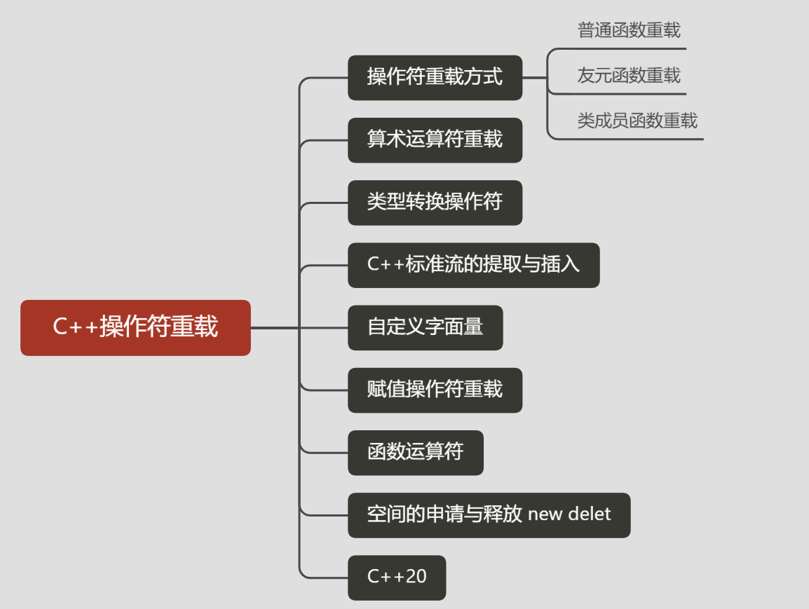
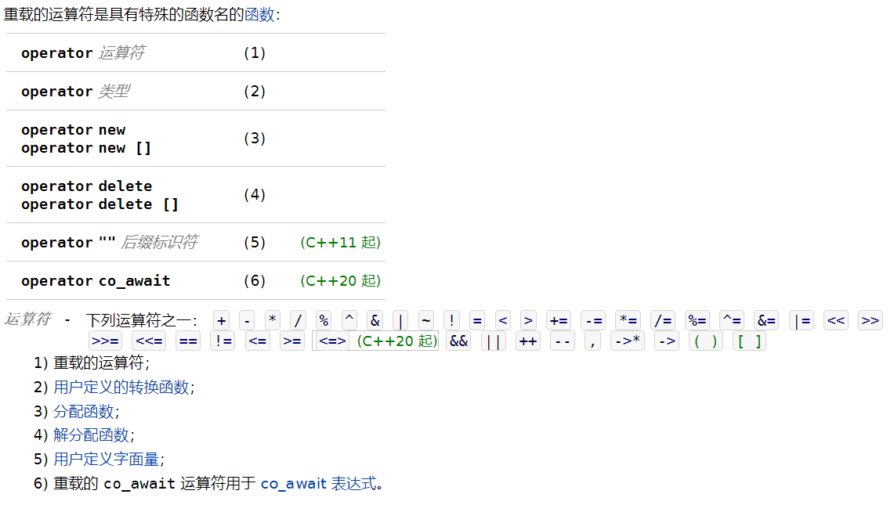

## 简介

为用户定义类型的操作数定制 C++ 运算符。

**语法**



-----

**实现方式**

- **类成员方式**

  即在类中定义一个成员函数来重载运算符。

- **友元函数方式**

  在类外部定义一个函数来重载运算符，并将这个函数声明为该类的友元函数，以达到可以访问类的私有属性的目的。

  用成员函数重载双目运算符时，左操作数无须用参数输入，而是通过隐含的`this`指针传入，这种做法的效率比较高。
  此外，操作符还可重载为友元函数形式，这将没有隐含的参数`this`指针。对双目运算符，友元函数有2个参数，对单目运算符，友元函数有一个参数。

- **普通函数方式**

  普通函数形式重载运算符，要求待操作的属性必须是`public`类型的。

-----

**下面是不可重载的运算符列表：**

- **.**  ：成员访问运算符
- **.\***, **->\*** ：成员指针访问运算符
- **::** ：域运算符
- **sizeof**：长度运算符
- **?:** ：条件运算符
- **#** ： 预处理符号

-----

**可重载运算符/不可重载运算符**

下面是可重载的运算符列表：

| 运算符         |                                                              |
| -------------- | ------------------------------------------------------------ |
| 一元运算符     | !(非)，-(负)，*(指针)，&(取地址)                             |
| 二元算术运算符 | + (加)，-(减)，*(乘)，/(除)，% (取模)                        |
| 逻辑运算符     | \|\|(逻辑或)，&&(逻辑与)，!(逻辑非)                          |
| 关系运算符     | ==(等于)，!= (不等于)，< (小于)，> (大于)，<=(小于等于)，>=(大于等于) |
| 自增自减运算符 | ++(自增)，--(自减)                                           |
| 位运算符       | \| (按位或)，& (按位与)，~(按位取反)，^(按位异或),，<< (左移)，>>(右移) |
| 赋值运算符     | =, +=, -=, *=, /= , % = , &=, \|=, ^=, <<=, >>=              |
| 空间申请与释放 | new, delete, new[ ] , delete[]                               |
| 其他运算符     | **()**(函数调用)，**->**(成员访问)，**,**(逗号)，**[]**(下标) |

## 算术运算符重载


-----

### 一元运算符重载

一元运算符只对一个操作数进行操作

```cpp
//类成员方式
T operator!();
T operator-();
T operator*();
T operator&();
```

### 自增自减运算符

vq 代表**volatile**或者非**no cv-qualifier** .


```cpp
//类内实现
//前缀
T& operator++();
T& operator--();
//后缀
T operator--(int);
T operator--(int);

//类外实现
T *vq & operator++(T *vq &);
T *vq & operator--(T *vq &);
T * operator++(T *vq &, int);
T * operator--(T *vq &, int);
```

**示例：**

```cpp
struct X
{
    // 前缀自增
    X& operator++()
    {
        // 实际上的自增在此进行
        return *this; // 以引用返回新值
    }
 
    // 后缀自增
    X operator++(int)
    {
        X old = *this; // 复制旧值
        operator++();  // 前缀自增
        return old;    // 返回旧值
    }
 
    // 前缀自减
    X& operator--()
    {
        // 实际上的自减在此进行
        return *this; // 以引用返回新值
    }
 
    // 后缀自减
    X operator--(int)
    {
        X old = *this; // 复制旧值
        operator--();  // 前缀自减
        return old;    // 返回旧值
    }
};}
};
```


### 二元运算符重载

可重载的二元运算符

| 运算符 | 名称           | 运算符 | 名称                     |
| :----- | :------------- | :----- | :----------------------- |
| ,      | 逗号           | <      | 小于                     |
| !=     | 不等于         | <<     | 左移                     |
| %      | 求模           | <<=    | 左移并赋值               |
| %=     | 求模并赋值     | <=     | 小于或等于               |
| &      | 按位与         | =      | 赋值、复制赋值和移动赋值 |
| &&     | 逻辑与         | ==     | 等于                     |
| &=     | 按位与并赋值   | >      | 大于                     |
| *      | 乘             | >=     | 大于或等于               |
| *=     | 乘并赋值       | >>     | 右移                     |
| +      | 加             | >>=    | 右移并赋值               |
| +=     | 加并赋值       | ^      | 异或                     |
| -      | 减             | ^=     | 异或并赋值               |
| -=     | 减并赋值       | \|     | 按位或                   |
| ->*    | 指向成员的指针 | \|=    | 按位或并赋值             |
| /      | 除             | \|\|   | 逻辑或                   |
| /=     | 除并赋值       | []     | 下标运算符               |

> **典型情况下，二元运算符都被实现为非成员以维持对称性**
>
> **（例如，将复数与整数相加时，若 `operator+` 是复数类型的成员函数，则唯有复数+整数能编译，而整数+复数不能）**
>
> **。因为对于每个二元算术运算符都存在对应的复合赋值运算符，所以二元运算符的规范形式是基于其对应的复合赋值实现的：**

- **LR**是返回类型

```cpp
LR operator*(L , R );
LR operator/(L , R );
LR operator+(L , R );
LR operator-(L , R );
bool operator<(L , R );
bool operator>(L , R );
bool operator<=(L , R );
bool operator>=(L , R );
bool operator==(L , R );
bool operator!=(L , R );
```

-----

**比较运算符**

比较运算符推荐使用友元重载，或类外部重载

```cpp
inline bool operator< (const X& lhs, const X& rhs){ /* 做实际比较 */ }
inline bool operator> (const X& lhs, const X& rhs){ return rhs < lhs; }
inline bool operator<=(const X& lhs, const X& rhs){ return !(lhs > rhs); }
inline bool operator>=(const X& lhs, const X& rhs){ return !(lhs < rhs); }
inline bool operator==(const X& lhs, const X& rhs){ /* 做实际比较 */ }
inline bool operator!=(const X& lhs, const X& rhs){ return !(lhs == rhs); }
```

**其他二元运算符：**

```cpp
LR operator%(L , R );
LR operator&(L , R );
LR operator^(L , R );
LR operator|(L , R );
L operator<<(L , R );
L operator>>(L , R );

vq L & operator%=(vq L &, R );
vq L & operator<<=(vq L &, R );
vq L & operator>>=(vq L &, R );
vq L & operator&=(vq L &, R );
vq L & operator^=(vq L &, R );
vq L & operator|=(vq L &, R );

bool operator!(bool);
bool operator&&(bool, bool);
bool operator||(bool, bool);

LR operator?:(bool, L , R );
T operator?:(bool, T , T );
```


### 数组下标运算符

提供数组式访问并同时允许读写的用户定义类，典型地为 operator[] 定义两个重载：const 和非 const 变体：

```cpp
struct T
{
          value_t& operator[](std::size_t idx)       { return mVector[idx]; }
    const value_t& operator[](std::size_t idx) const { return mVector[idx]; }
};
```

若已知值类型是内建类型，则 const 变体应当按值返回。

### 逐位算术运算符

实现位掩码类型 (BitmaskType) 的规定的用户定义类和枚举，要求重载逐位算术运算符 operator&、operator|、operator^、operator~、operator&=、operator|= 及 operator^=，而且可选地重载位移运算符 operator<<、operator>>、operator>>= 及 operator<<=。规范实现通常遵循上述的二元算术运算符。


-----

## 类型转换操作符

类型转换运算符是类的一种特殊成员函数，它负责将一个类类型的值转换成其他类型。
类型转换函数的一般形式如下：

```
operator type() const;
```

其中type表示某种类型。

- 一个类型转换函数必须是类的成员函数；它不能声明返回类型，形参列表也必须为空。类型转换函数通常应该是const。
- 因为类型转换运算符是隐式执行的，所以不能在类型转换运算符的定义中使用任何形参。尽管类型转换函数不负责指定返回类型，但实际上每个类型转换函数都会返回一个对应类型的值。


## 空间申请与释放

```cpp
void *operator new(size_t);     //allocate an object
void *operator delete(void *);    //free an object

void *operator new[](size_t);     //allocate an array
void *operator delete[](void *);    //free an array
```


示例 在静态储存器创建动态对象

[重载new/delete自定义内存管理](https://blog.csdn.net/naughfy/article/details/78409213)

## 函数运算符 operator()

当用户定义的类重载了函数调用运算符 operator() 时，它就成为函数对象 (FunctionObject) 类型。

这种类型的对象能用于函数调用式的表达式：

```cpp
// 此类型的对象表示一个变量的线性函数 a*x + b 。
struct Linear {
    double a, b;
 
    double operator()(double x) const {
        return a*x + b;
    }
};
int main() {
    Linear f{2, 1}; // 表示函数 2x + 1 。
    Linear g{-1, 0}; // 表示函数 -x 。
    // f 与 g 为能像函数一样使用的对象。
 
    double f_0 = f(0);
    double f_1 = f(1);
 
    double g_0 = g(0);
}
```

下面是不使用重载但拥有缺点的两个替代品。 1. 使用全局变量：

```cpp
double a, b; // 坏：全局变量。
double linear(double x) {
    return a*x + b;
}
int main() {
    a = 2; b = 1;
    double f_0 = linear(0);
    double f_1 = linear(1);
 
    // 坏：需要重新赋值参数使得能够计算不同的函数：
    a = -1; b = 0;
    double g_0 = linear(0);
}
```

2. 使用额外参数：

```cpp
double linear(double a, double b, double x) {
    return a*x + b;
}
int main() {
    double f_0 = linear(2, 1, 0);
    // 坏：必须重复输入同一参数：
    double f_1 = linear(2, 1, 1);
 
    double g_0 = linear(-1, 0, 0);
}
```

许多标准算法，从 [std::sort](http://zh.cppreference.com/w/cpp/algorithm/sort) 到 [std::accumulate](http://zh.cppreference.com/w/cpp/algorithm/accumulate) 的许多标准算法都接受[*函数对象* *(FunctionObject)* ](https://zh.cppreference.com/w/cpp/named_req/FunctionObject)以定制其行为。operator() 没有特别值得注意的规范形式，此处演示其用法

```cpp
struct Sum
{
    int sum;
    Sum() : sum(0) { }
    void operator()(int n) { sum += n; }
};
Sum s = std::for_each(v.begin(), v.end(), Sum());
```


## 流的提取与插入

接受 std::istream& 或 std::ostream& 作为左侧实参的 operator>> 与 operator<< 的重载，被称为插入与提取运算符。因为它们接收用户定义类型为右实参（a@b 中的 b），所以它们必须实现为非成员。

```cpp
std::ostream& operator<<(std::ostream& os, const T& obj)
{
    // 向流写入 obj
    return os;
}
std::istream& operator>>(std::istream& is, T& obj)
{
    // 从流读取 obj
    if( /* 不能构造 T */ )
        is.setstate(std::ios::failbit);
    return is;
}
```

**这些运算符有时实现为友元函数。**

## 自定义字面量

C++11新标准中引入了用户自定义字面量，也叫自定义后缀操作符，即通过实现一个后缀操作符，将申明了该后缀标识的字面量转化为需要的类型。

## 赋值运算符

重载赋值运算符（ = ），用于创建一个对象，比如拷贝构造函数。

## C++20

### operator<=>

若定义 operator== 则编译器会自动生成不等运算符。类似地，若定义三路比较运算符 operator<=> 则编译器会自动生成四个关系运算符。若定义 operator<=> 为预置，则编译器会生成 operator== 与 operator<=> ：

```cpp
struct Record
{
    std::string name;
    unsigned int floor;
    double weight;
    auto operator<=>(const Record&) = default;
};
// 现在能用 ==、!=、<、<=、> 和 >= 比较 Record
```

### co_await

[https://zh.cppreference.com/w/cpp/language/coroutines#co_await](https://zh.cppreference.com/w/cpp/language/coroutines#co_await)


## 注意

- 赋值(=),下标([]),调用( ( ) ),和成员访问箭头(->)运算符必须是成员函数。
- 改变对象状态的运算符或者与给定类型密切相关的运算符，如递增,递减,和解引用运算符,通常应该是成员。
- 具有对称性的运算符可能转换任意一端的运算对象,例如算术,相等性,关系和位运算符等,因此它们通常应该是普通的非成员函数。
- 对于一个运算符函数来说，它或者是类的成员，或者至少含有一个类类型的参数
  int operator+(int ,int); //error,不能为int重定义内置的运算符
- 重载运算符限制在C++语言中已有的运算符范围内的允许重载的运算符之中，不能创建新的运算符。
- 重载之后的运算符不能改变运算符的优先级和结合性，也不能改变运算符操作数的个数及语法结构。
- &&和||运算符的重载版本无法保留内置运算符的短路求值属性，两个运算对象总是会被求值。因此不建议重载它们。
- 通常情况下，不应该重载逗号，取地址，逻辑与和逻辑或运算符。
- 使用与内置类型一致的含义。重载运算符的返回类型通常情况下应该与其内置版本的返回类型兼容：逻辑运算符和关系运算符应该返回bool，算术运算符应该返回一个类类型的值，赋值运算符和复合赋值运算符应该返回左侧运算对象的一个引用。
- 事实上，我们的重载运算符返回void、返回对象本身、返回对象引用都是可以的，并不是说一定要返回一个引用，只不过在不同的情况下需要不同的返回值。
- 后置++的返回值是对象而非引用，因为，如果返回是引用，那么返回的是一块临时变量（old）的引用，当后置++的函数调用结束后，该临时变量会被自动释放掉，那么返回的引用的值就会是一个-37983219之类的为初始化的值了，发生bug。


> **那么什么情况下要返回对象的引用呢？**
>
> 原因有两个：1.允许进行连续赋值2.防止返回对象（返回对象也可以进行连续赋值）的时候调用拷贝构造函数和析构函数导致不必要的开销，降低赋值运算符等的效率。
>
> 对于第二点原因：如果用”值传递“的方式，虽然功能任然正确，但由于return语句要把*this拷贝到保存返回值的外部存储单元之中，增加了不必要的开销，会降低赋值函数的效率。

## 相关参考

[cppreference](https://zh.cppreference.com/w/cpp/language/operators)

[co await](https://zh.cppreference.com/w/cpp/language/coroutines#co_await)

相关文章

[C++ 运算符重载详解](https://blog.csdn.net/afei__/article/details/82082003)

[Effective C++ 50：为什么需要自定义 new 和 delete？](https://harttle.land/2015/09/19/effective-cpp-50.html)

[Effective C++ 51：写 new 和 delete 时请遵循惯例](https://harttle.land/2015/09/20/effective-cpp-51.html)

[自定义字面量](https://blog.csdn.net/K346K346/article/details/85322227)