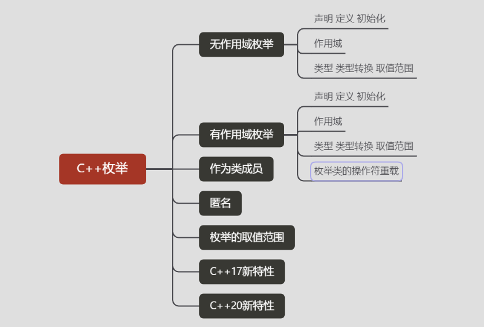

## 枚举（无作用域枚举）


### 声明 定义 初始化


```
enum <类型名> {<枚举常量表>};
```

**格式说明：**

- *无作用域枚举*（以 *enum-关键词* `enum` 声明）
- 枚举常量表——由枚举常量构成。"枚举常量"或称"枚举成员"，是以标识符形式表示的整型量，表示枚举类型的取值。枚举常量表列出枚举类型的所有取值，各枚举常量之间以"，"间隔，且必须各不相同。取值类型与条件表达式相同。

**示例：**

```cpp
enum Color { red, green, blue };
```


> 1) 声明无作用域枚举类型，其底层类型不固定（此情况中，底层类型是由实现定义的某个能表示所有枚举项值的整型类型；此类型不大于 `int`，除非枚举项的值不能放入 `int` 或 `unsigned int`。若 *枚举项列表* 为空，则底层类型为如同枚举拥有单个值为 0 的枚举项）。
>
> 2) 声明底层类型固定的无作用域枚举类型。
>
> 3) 无作用域枚举的不可见枚举声明必须指定名字与底层类型。

**初始化：**

每个枚举项都与一个底层类型的值相关联。当在 *枚举项列表* 中提供了初始化器时，各枚举项的值由那些初始化器所定义。若首个枚举项无初始化器，则其关联值为零。对于其他任何定义中无初始化器的枚举项，其关联值为前一枚举项加一。

```cpp
enum Foo { a, b, c = 10, d, e = 1, f, g = f + c };
//a = 0, b = 1, c = 10, d = 11, e = 1, f = 2, g = 12
```

### 枚举项

每个 *枚举项* 都成为该枚举类型（即 **名字**）的一个具名常量，在其外围作用域可见，且可用于要求常量的任何位置。

```cpp
enum Color { red, green, blue };
Color r = red;
switch(r)
{
    case red  : std::cout << "red\n";   break;
    case green: std::cout << "green\n"; break;
    case blue : std::cout << "blue\n";  break;
}
```

每个枚举项都与一个底层类型的值相关联。当在 *枚举项列表* 中提供了初始化器时，各枚举项的值由那些初始化器所定义。若首个枚举项无初始化器，则其关联值为零。对于其他任何定义中无初始化器的枚举项，其关联值为前一枚举项加一。

```cpp
enum Foo { a, b, c = 10, d, e = 1, f, g = f + c };
//a = 0, b = 1, c = 10, d = 11, e = 1, f = 2, g = 12
```

### 作用域

每个 **枚举项** 都成为该枚举类型（即 名字）的一个具名常量，在其外围作用域可见，且可用于要求常量的任何位置。


### 类型 类型转换

- 无作用域枚举类型的值可**隐式转换**为整型类型。

```cpp
enum color { red, yellow, green = 20, blue };
color col = red;
int n = blue; // n == 21
```

- 整数、浮点和枚举类型的值，可用 `static_cast` 或**显式转型转换**到任何枚举类型。

  ```cpp
  enum access_t { read = 1, write = 2, exec = 4 }; //枚举项：1、2、4 范围：0..7
  access_t rwe = static_cast<access_t>(7);
  assert((rwe & read) && (rwe & write) && (rwe & exec));
   
  access_t x = static_cast<access_t>(8.0); // C++17 起为未定义行为
  access_t y = static_cast<access_t>(8); // C++17 起为未定义行为
   
  enum foo { a = 0, b = UINT_MAX }; // 范围：[0, UINT_MAX]
  foo x= foo(-1); // C++17 起为未定义行为，即使 foo 的底层类型为 unsigned int
  ```

  

### 匿名

无作用域枚举的 *名字* 可以忽略：这种声明仅将各枚举项引入到其外围作用域中：

```cpp
enum { a, b, c = 0, d = a + 2 }; // 定义 a = 0, b = 1, c = 0, d = 2
```


### 作为类成员

当无作用域枚举是类成员时，其枚举项可用类成员访问运算符 `.` 和 `->` 访问：

```cpp
struct X
{
    enum direction { left = 'l', right = 'r' };
};
X x;
X* p = &x;
 
int a = X::direction::left; // 仅于 C++11 及之后允许
int b = X::left;
int c = x.left;
int d = p->left;
```

### 无作用域枚举类型的缺陷

- 同作用域同名枚举值会报重定义错误。传统 C++ 中枚举常量被暴漏在同一层作用域中，如果同一作用域下有两个不同的枚举类型，但含有同名的枚举常量也是会报编译错误的，比如：

  ```cpp
  enum Fruits{Apple,Tomato,Orange};
  enum Vegetables{Cucumber,Tomato,Pepper};	//编译报Tomato重定义错误
  ```

- 由于枚举类型被设计为常量数值的“别名”，所以枚举常量总是可以被隐式转换为整型，且用户无法为枚举常量定义类型。

- 枚举常量占用存储空间以及符号性不确定。C++ 标准规定 C++ 枚举所基于的“基础类型”是由编译器来具体实现，这会导致枚举类型成员的基本类型存在不确定性问题，尤其是符号性问题。考察如下示例：

  ```cpp
  enum A{A1=1,A2=2,ABig=0xFFFFFFFFU};
  enum B{B1=1,B2=2,BBig=0xFFFFFFFFFUL};
  int main()
  {
  	cout<<sizeof(A1)<<endl;	//4
  	cout<<ABig<<endl;		//4294967295
  	cout<<sizeof(B1)<<endl;	//8
  	cout<<BBig<<endl;		//68719476735
  }
  ```

> 以上输出结果是在Linux平台下使用 g++ 编译输出的结果，在 VC++（VS2017）中的输出结果分别是 4、-1、4 和 -1。可见不同编译器对枚举常量的整型类型的宽度和符号有着不同的实现。GNU C++ 会根据枚举数值的类型使用不同宽度和符号的整型，VC++ 则始终以有符号 int 来表示枚举常量。


## 有作用域枚举 C++11

也叫 **强类型枚举**（Strongly-typed enums）

**特性：**

- **强作用域** 强类型枚举成员的名称不会被输出到其父作用域，所以不同枚举类型定义同名枚举成员编译不会报重定义错误。传统C++中枚举常量被暴漏在外层作用域中，这样若是同一作用域下有两个不同的枚举类型，但含有相同的枚举常量也是不可的，比如：

  ```cpp
  enum Side{Right,Left};
  enum Thing{Wrong,Right};
  ```

- **转换限制** 强类型枚举成员的值不可以与整型发生隐式相互转换。

- **指定底层类型**。 枚举类的底层数据必须是有符号或无符号整型，比如char unsigned int unsigned long，默认为int。

  

### 声明 定义 初始化


 **声明：** 强类型枚举使用`enum class` 或 `enum struct`语法来声明，如下：

```cpp
enum class Enumeration{
    One,
    Two,
    Three=3
};
```

- 枚举中每个成员(标识符)结束符是 **,** ，不是 **;** ，最后一个成员可省略 **,** ；
- **初始化**时可以赋负数，以后的标识符仍依次加1；
- 枚举变量只能取枚举说明结构中的某个标识符常量；
- 未区分范围的枚举常数可以隐式转换为int，但是int不可以隐式转换为枚举值；
- 为名称指定的值不必是唯一的，即各枚举常量的值可以重复；
- 枚举值可以用来作判断比较；

**初始化：**自定义枚举量的值

```cpp
enum enumType {Monday=1, Tuesday=2, Wednesday=3, Thursday=4, Friday=5, Saturday=6, Sunday=7};
//也可以只显式的定义一部分枚举量的值：
enum enumType {Monday=1, Tuesday, Wednesday=1, Thursday, Friday, Saturday, Sunday};
```


### 作用域

- 通过枚举类的名字进行访问
- 强类型枚举能解决传统枚举不同枚举类下同枚举值名的问题，使用枚举类型的枚举名时，必须指明所属范围，比如：Enumeration::One，而单独的One则不再具有意义。

### 类型 类型转换

- 枚举类型所使用的类型默认为int类型，也可指定其他类型，比如：

  枚举类的底层数据必须是有符号或无符号整型，比如 char unsigned int unsigned long，默认为 int。

  ```cpp
  enum calss Enum:unsigned int{One,Two};
  ```


------

### 枚举类的操作符重载


**示例：**

```cpp
#include <iostream>
using namespace::std;
enum Day {sun,mon,tue,wed,thu,fri,sat};
Day& operator++(Day& d)
{
    return d = (sat == d) ? sun : Day(d+1);
}
int main()
{
    Day day = tue;
    ++day;
    cout<<day<<endl;
}
```

```
3
```


------

### 类作用域枚举

声明在类定义中的匿名枚举相当于static const常量，枚举常量可在类作用域内访问。

普通的枚举作用域范围按定义的位置可能是块作用域或者文件作用域，如果同一个作用域内存在相同枚举常量的枚举则编译报错枚举常量重复定义。枚举定义时加上class或者struct，可以限制枚举作用域的范围在指定的类下，允许不同的类的枚举常量一直。

```cpp
#include <iostream>

class ClassA
{
  private:
    //类作用域下的匿名枚举，类定义内都可以使用MONTH，编译器自动替换为12，等价于常规的static const用法
    enum
    {
        MONTH = 12
    };
    //	static const int MONTH=12;
    int a = 1;
    double b[MONTH] = {1, 2, 3, 4};

  public:
    ClassA();
    void print();
};

//编译警告 list-initializer for non-class type must not be parenthesized
// ClassA::ClassA():b({1,2,3,4}),a(1) {

ClassA::ClassA()
{
    //	a = 1;
    //数组只能在初始化时赋值，不能二次赋值，所以这里编译报错，需要使用声明初始化方式或者列表初始化方式
    //	b = {1,2,3,4};
}

void ClassA::print()
{
    double sum = a;
    for (int i = 0; i < MONTH; i++)
    {
        sum += b[i];
    }
    std::cout << "sum=" << sum << "\n";
}

int main()
{
    double dou[12] = {};
    ClassA a;
    a.print();

    using namespace std;
    // A的作用域为整个main方法
    enum a
    {
        A = 10,
        B,
        C
    };
    //报错A,B,C重复声明
    //    enum b{A=1,B,C};
    //加上class或者struct以后，作用域被限制在类c中
    enum class c
    {
        D = 20,
        E,
        F
    };
    enum struct d
    {
        D = 30,
        E,
        F
    };
    // cout的符号重载没有针对枚举enum c的实现，所以需要显示类型转换成int
    cout << "enum A:" << A << ",c::D:" << (int)c::D << ",d::D:" << (int)d::D << endl;
    //当赋值给int变量或者执行比较时，常规枚举会自动做类型转换
    int b = A;
    //作用域枚举不能自动转换，需要显示转换
    //	int c=c::E;
    int c = (int)c::E;
    //指定作用域枚举底层的整型数据类型，默认是int，但是GNU 不支持，报语法错误
    //	enum class :short e{D=20,E,F};
    return 0;
}
```


------

### 枚举的取值范围

**上限： **大于枚举量最大值的最小的2的幂减一

**下限：**如果枚举量的最小值不小于0，则取值范围的下限为0，否则则采用与找上限相同的方式。

> 选择用多少空间来存储枚举由编译器决定。对于取值范围较小的枚举，使用一个字节或更少的空间；而对于包含 long 类型值的枚举，则使用 4 个字节。


------

### 注意事项

- 枚举类型时安全的，枚举值也不会被隐式转换为整数，无法和整数数值比较，比如（Enumeration::Three==3会触发编译错误）

- 另外枚举类型所使用的类型默认为int类型，也可指定其他类型，比如：

  ```cpp
  enum calss Enum:unsigned int{One,Two};
  ```

- 强类型枚举能解决传统枚举不同枚举类下同枚举值名的问题，使用枚举类型的枚举名时，必须指明所属范围，比如：Enumeration::One，而单独的One则不再具有意义。

- C++11中枚举类型的前置声明也是可行的，比如：

  ```cpp
  enum calss Enum;
  enum class Enum1:unsigned int;
  ```

- 由于强类型枚举是强类型作用域的，故匿名的enum class可能什么都做不了，如下代码会报编译错误：

  ```cpp
  enum class{General,Light,Medium,Heavy}weapon;
  int main()
  {
  weapon=Medium;						//编译出错
  bool b=weapon == weapon::Medium;	//编译出错
  return 0;
  }
  ```

  当然对于匿名强类型枚举我们还是可以使用decltype来获得其类型并进而使用，但是这样做可能违背强类型枚举进行匿名的初衷。

- 在不进行强制类型转换的情况下，只能将定义枚举时使用的枚举量赋给这种枚举的变量：

  ```cpp
  Enumeration myEnum = Three;   // 正确
  Enumeration myEnum = 20;      // 错误
  ```

- 对于枚举，只定义了赋值操作符。具体地说，没有为枚举变量定义算术运算：

- 枚举量是整型，可被提升为int类型，但int型不能自动转换为枚举类型：

  ```cpp
  int Num = Three;    //正确
  myEnum = 2;    		//错误
  Num = 4 + One;      //正确
  Num = Two + One;    //正确
  ```

- 如果int值是有效的，则可以通过强制类型转换，将它赋给枚举变量，但必须保证使用枚举中存在的值：

  ```cpp
  Enumeration myEnum = Enumeration(1);   //正确
  ```


------

### C++17 特性

底层类型固定的有作用域枚举类型和无作用域枚举类型，若下列全部条件为真，则都能用[列表初始化](https://zh.cppreference.com/w/cpp/language/list_initialization)从一个整数初始化而无需转型：

- 初始化是直接列表初始化
- 初始化器列表仅有单个元素
- 枚举是底层类型固定的有作用域枚举或无作用域枚举
- 转换为非窄化转换

这使得我们能引入新的整数类型（例如 SafeInt）并享受与其底层整数类型相同的既存调用约定，即使在不利于以值传递/返回结构体的 ABI 上也是如此。

```cpp
enum byte : unsigned char {}; // byte 是新的整数类型
byte b { 42 }; // C++17 起 OK（直接列表初始化）
byte c = { 42 }; // 错误
byte d = byte{ 42 }; // C++17 起 OK；与 b 的值相同
byte e { -1 }; // 错误
 
struct A { byte b; };
A a1 = { { 42 } }; // 错误（构造函数形参的复制列表初始化）
A a2 = { byte{ 42 } }; // C++17 起 OK
 
void f(byte);
f({ 42 }); // 错误（函数形参的复制列表初始化）
 
enum class Handle : std::uint32_t { Invalid = 0 };
Handle h { 42 }; // C++17 起 OK
```


------

### C++20 特性

**using enum 声明**

using enum 声明引入其所指名的枚举的枚举项名字，如同用对每个枚举项的 using 声明。在类作用域中时， using enum 声明将其所指名的枚举的枚举项名字作为成员添加到作用域，使成员查找能访问它们。

```cpp
enum class fruit { orange, apple };
struct S {
  using enum fruit; // OK ：引入 orange 与 apple 到 S 中
};
void f()
{
    S s;
    s.orange;  // OK ：指名 fruit::orange
    S::orange; // OK ：指名 fruit::orange
}
```

引入二个同名的枚举项的二个 using enum 声明会冲突。

```cpp
enum class fruit { orange, apple };
enum class color { red, orange };
void f()
{
    using enum fruit; // OK
    // using enum color; // 错误： color::orange 与 fruit::orange 冲突
}
```


***

**参考**

[cppreference](https://zh.cppreference.com/w/cpp/language/enum)