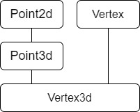

# 

### a


## 第一章 关于对象（Object Lessons）

C语言实现point3d

```cpp
typedef struct point3d
{
float x;
float y;
float z;
} Point3d;
void
Point3d_print( const Point3d *pd )
{
printf("( %g, %g, %g )", pd->x, pd->y, pd->z );
}
```

C++ 实现Point3d

```cpp
class Point3d
{
public:
Point3d( float x = 0.0,
float y = 0.0, float z = 0.0 )
: _x( x ), _y( y ), _z( z ) {}
float x() { return _x; }
float y() { return _y; }
float z() { return _z; }
void x( float xval ) { _x = xval; }
// ... etc ...
private:
float _x;
float _y;
float _z;
};
inline ostream&
operator<<( ostream &os, const Point3d &pt )
{
os << "( " << pt.x() << ", "
<< pt.y() << ", " << pt.z() << " )";
};
```

C++层次化结构实现Point3d

```cpp
class Point {
public:
Point( float x = 0.0 ) : _x( x ) {}
float x() { return _x; }
void x( float xval ) { _x = xval; }
// ...
protected:
float _x;
};
class Point2d : public Point {
public:
Point2d( float x = 0.0, float y = 0.0 )
: Point( x ), _y( y ) {}
float y() { return _y; }
void y( float yval ) { _y = yval; }
// ...
protected:
float _y;
};
class Point3d : public Point2d {
public:
Point3d( float x = 0.0, float y = 0.0, float z = 0.0 )
: Point2d( x, y ), _z( z ) {}
float z() { return _z; }
void z( float zval ) { _z = zval; }
// ...
protected:
float _z;
};
```

**三种不同的实现方式的不同布局成本有什么不同吗?**

- 一般来说，不会增加任何成本。
- 三个 data members 直接内含于一个 class object 中，就像 C 中的 struct 一样。
- 而 member functions 虽然含在 class 的声明中，却不出现在 object 中 （更像是类命名空间中的普通函数）。

**C++在内存布局以及存取时间上的主要额外负担都是由 virtual 引起的，包括：**

- virtual function 机制：引起了保存 vtable 和透过 vtable 找到函数地址；用以支持一个有效的“执行期绑定”（runtime binding）
- virtual base class 机制：引起了透过指针来找到基类的成员。 用以实现“多次出现在继承体系中的 base class，有一个单一而被共享的实体”

### C++对象模型

```cpp
class Point {
 public:
  Point(float xval);
  virtual ~Point();
  float      x() const;
  static int PointCount();

 protected:
  virtual ostream& print(ostream& os) const;
  float            _x;
  static int       _point_count;
};
```

**在C++中，**

- 有两种class data member:static和nostatic。
- 有三种class member function：static、nostatic和virutal。

**简单对象模型 (A Simple Object Model)  **

- 对象保存成员的指针，成员实际存放在其他区域
- 这种模型保证了成员中每个元素需要的内存空间都是一样的, 不论元素是何种类型, 访问时只需要确定成员的index和对象首地址即可. 坏处是访问成员时需要多进行一次内存访问, 并且占用了更多的内存空间.


**表格驱动对象模型(A Table-driven Object Model)**

- 将对象中的数据成员和函数成员分别组织, 放在不同的内存区域, 对象中保存了指向这两个内存区域的指针.

- 这种模型保证了不同类型的对象具有相同的内存布局,


**C++ 对象模型（The C++ Object Model）**


- Nonstatic data members 被配置于每一个 class object 之内；

- Static data members 则被存放在所有的 class object 之外；

- Static 和 Nonstatic function members 也被放在所有的 class object 之外。

> 优点：空间和存取效率；
>
> 缺点：如果应用程序代码本身未改变，但其所使用的 class objects 的 nonstatic data members 修改了，那么应用程序代码也得重新编译。前面的双表格模型就不需要这样，因为它用指针来索引 class objects 的成员，多了一层间接性（有点设计模式的味道），不过牺牲了一些空间和执行效率。

**Virtual function 机制则由以下的 2 个的两个步骤来支持：**

- 每一个 class 产生出一系列指针 Virtual function 的指针，放在一个被称为 virtual
  table(vtbl, vtable)的表格中；

- 每一个 class object 被添加了一个指针 vptr，指向相对应的 vtable。vptr 的设置由编译器
  全权负责，程序员无需关心。

> 需要清楚的明白一点是：
> 一个
> vtable
> 对应
> 一个
> class
> ，
> 一个
> vptr
> 才对应一个
> class object，必须区分开这 2 个概念。


**C++ 继承结构**

单一继承

```
class Library_materials { ... };
class Book : public Library_materials { ... };
class Rental_book : public Book { ... };
```

多继承

```
// original pre-Standard iostream implementation
class iostream:
public istream,
public ostream { ... };
```

虚继承

```
class istream : virtual public ios { ... };
class ostream : virtual public ios { ... };
```

**引入继承后的对象模型成本：**

- 如果是普通的继承，父对象被直接包含在子对象里面，这样对父对象的存取也是直接进行的，
  没有额外的成本；

- 如果是虚拟继承，则父对象会由一个指针被指出来，这样的话对父对象的存取就添加了一层
  间接性，必须经由一个指针来访问，添加了一次间接的额外成本。


```cpp
X foobar()
{
X xx;
X *px = new X;
// foo() is virtual function
xx.foo();
px->foo();
delete px;
return xx;
};
```

这段代码有可能转化为

```cpp
// Probable internal transformation
// Pseudo C++ code
void foobar( X &_result )
{
// construct _result
// _result replaces local xx ...
_result.X::X();
// expand X *px = new X;
px = _new( sizeof( X ));
if ( px != 0 )
px->X::X();
// expand xx.foo(): suppress virtual mechanism
// replace xx with _result
foo( &_result );
// expand px->foo() using virtual mechanism
( *px->_vtbl[ 2 ] )( px )
// expand delete px;
if ( px != 0 ) {
( *px->_vtbl[ 1 ] )( px ); // destructor
_delete( px );
}
// replace named return statement
// no need to destroy local object xx
return;
};
```


### 关键字差异

如果不是为了维护与 C 之间的兼容性，C++ 远可以比现在更简单。比如：

```
// don't know if declaration or invocation
// until see the integer constant 1024
int (*pf)(1024);
```

在看到 1024 之前，是不知道 pf 是一个函数声明还是调用操作（invocation）。而下面这个声明，这个“前向预览”甚至起不了作用了：

```
// meta-language rule:
// declaration of pq, not invocation
int (*pq)()
```

这时候就需要一个超越语言范围的规则，将上述表达式判断为一个“声明”。

同样的问题有 struct 和 class。在 C++ 中应该优先使用 class 而不是 struct

**策略性正确的 struct**

C 程序中，把单一元素的数组放在 struct 的尾端，就可以让 struct object 拥有可变大小的数组：

```
struct mumble {
  /* stuff */
  char pc[1];
};

// grab a string from file or standard input
// allocate memory both for struct & string
struct mumble* pmumb1 = (struct mumble*)
  malloc(sizeof(struct mumble) + strlen(string) + 1);

strcpy(&mumble.pc, string);
Copy
```

如果改用 class 来声明，而该 class 是：

- 指定多个 access sections，内含数据；
- 从另一个 class 派生而来；
- 定义有一个或多个 virtual function

那么，或许可以顺利转换，但也或许不行。

C++ 中处于同一个 access section 的数据，必须保证以其声明次序出现在内存布局中。但多个 access sections 中的数则不保障按次序出现。


**struct 和 class 关键字的意义：**

- 它们之间在语言层面并无本质的区别，更多的是概念和编程思想上的区别。

- struct 用来表现那些只有数据的集合体 POD（Plain OI' Data）、而 class 则希望表达的
  是 ADT（abstract data type）的思想；

- 由于这 2 个关键字在本质是无区别，所以 class 并没有必须要引入，但是引入它的确非常令
  人满意，因为这个语言所引入的不止是这个关键字，还有它所支持的封装和继承的哲学；

- 可以这样想象：struct 只剩下方便 C 程序员迁徙到 C++的用途了。


### 对象的差异

C++ 程序设计模型直接支持三种 programming paradigms（程序设计典范）：

1. **程序模型（procedural model）**，如字符串的处理，可以使用字符数组以及 str* 函数集。

   ```
   char boy[] = "Danny";
   char *p_son;
   // ...
   p_son = new char[strlen( boy ) + 1];
   strcpy( p_son, boy );
   // ...
   if (!strcmp(p_son, boy))
   take_to_disneyland(boy);
   ```

2. **抽象数据类型模型（abstract data type model: ADT）**，所谓的“抽象”是和一组表达式（public 接口）一起提供，其具体的运算被隐含。

   ```
   String girl = "Anna";
   String daughter;
   //...
   // String::operator=();
   daughter = girl;
   //...
   // String::operator==();
   if (girl == daughter)
   take_to_disneyland(girl);
   ```

3. **面向对象模型（object-oriented model）**，彼此相关的类型通过一个抽象的 base class（提供公共接口）封装起来，如 Library_materials class，正真的 subtypes 如 Book、Video、Laptop 等等都可以从中派生而来。

   ```
   void check_in(Library_materials* pmat) {
     if (pmat->late())
       pmat->fine();
     pmat->check_in();
     if (Lender* plend = pmat->reserved())
       pmat->notify(plend);
   }
   ```


-----

**C++ 用下列方法支持多态：**

1. 经由一组隐含的转化操作。如：把一个 derived class 类型的指针转化为一个指向 base type 的指针：

   ```cpp
   shape *ps = new circle();
   ```

2. 经由 virtual function 机制。

3. 经由 dynamic_cast 和 typeid 运算符：

   ```cpp
   if (circle *pc = dynamic_cast<circle*>(ps))...
   ```

**需要多少内存才能表现一个 class object？一般而言：**

- 其 nonstatic data members 的总和大小；
- 加上任何由于 alignment 的需求而填补（padding）上去空间；
- 加上为了支持 virtual 而由内部产生的任何额外负担（overhead）。


**多态只能由指针或引用来使用，根本原因在于：**

- 
  指针和引用（通常以指针来实现）的大小是固定的（一个
  word
  ），而对象的大小却是可变
  的。其类的指针和引用可以指向（或引用）子类，但是基类的对象永远也只能是基类，没有
  变化则不可能引发多态。

- 一个 point 或 reference
  ”
  “
  绝不会引发任何 与类型有关的内存委托操作 ，在指针类型转换时
  会受到的改变的只有它们所指向内存的解释方式而已。（例如指针绝不会引发 slice，因为它们大小相同）

> 注意：
>
> - 运行时多态必须通过public继承实现
> - 在初始化、 assignment 等操作时，编译器会保证对象的 vptrs 得到正确的设置。这是编译器的 职责，它必须做到。一般都是通过在各种操作中插入编译器的代码来实现的。


**指针的类型：**

- 
  对于内存来说，不同类型的指针并没有什么不同。它们都内是占用一个 word 的大小，包含
  一个数字，这个数字代表内存中的一个地址；

- 感觉上，指针的类型是编译器的概念，对于硬件来说，并没有什么指针类型的概念；

- 转型操作也只是一种编译器的指令，它改变的内是编译器对被指内存的解释方式而已！
- “指向不同类型的各个指针”间的差异，不在于指针表示法不同，也不再其内容（地址）不同，而是在其所寻址出来的 object 类型的不同。也就是说，“指针类型”会教导编译器如何解释某个特定地址中的内存内容及大小。

**加上多态之后（Adding Polymorphism）：**


```
class ZooAnimal {
 public:
  ZooAnimal();
  virtual ~ZooAnimal();
  // ...
  virtual void rotate();

 protected:
  int    loc;
  String name;
};

class Bear : public ZooAnimal {
 public:
  Bear();
  ~Bear();
  // ...
  void         rotate();
  virtual void dance();
  // ...
 protected:
  enum Dances {... };
  Dances dances_known;
  int    cell_block;
};

Bear  b("Yogi");
Bear* pb = &b;
Bear& rb = *pb;
```

- 不管 pointer 还是 reference 都只需要一个 word 的空间（32 位机器上为 4-bytes）。

- Bear object 需要 24 bytes，也就是 ZooAnimal 的 16 bytes 加上 Bear 所带来的 8 bytes。


有如下指针：

```
Bear b;
ZooAnimal *pz = &b;
Bear *pb = &b;
Copy
```

它们每个都指向 Bear object 的第一个 bytes。差别是：pb 所涵盖整个 Bear object，而 pz 值涵盖 Bear object 中的 ZooAnimal subobject。

当我们写下 `pz->protate()` 时，pz 的类型将在编译时期决定以下两点：

- 固定可用的接口。pz 只能调用 ZooAnimal 的 public 接口。
- 该接口的 access level （例如 rotate() 是 ZooAnimal 的一个 public member）。

OO 程序设计不支持对 object 的直接处理，考虑如下例子：

```
ZooAnimal za;
ZooAnimal *pza;

Bear b;
Panda *pp = new Panda;

pza = &b;
Copy
```

其内存布局可能如下：


- 将 za 或 b 的地址，或 pp 所含内容（也是地址）指定给 pza，显然没问题。

- 一个 pointer 或一个 reference 之所以支持多态，是因为它们并不引发内存中任何“与类型有关的内存委托操作”，改变的只是他们所指向的内存的“大小和内容解释方式”。

- 任何企图改变 object za 大小的行为，都会违反其定义中的“资源需求量”，如：把整个 Bear object 指定给 za，那么就会溢出它所配置得到的内存。当一个 base class object 被指定为一个 derived class object 时，derived object 就会被切割，以塞入较小的 base type 内存中。derived type 将不会留下任何痕迹。


- C++ 也支持 object-based（OB）风格（非 OO），区别是对象构建不需要 virtual 机制，编译时即可决定类型。


## 第二章 构造函数语意学 （The Semantics of Constructors）

iostream 函数库的建筑师：Jerry Schwarz 早期意图支持一个 iostream class object 的纯测试量（scalar test)：

```
if (cin) ...
```

为了让 cin 可以求得真假值，Jerry 定义了一个 conversion 运算符：`operator int()` （把 cin 转换成 int 类型）。正确使用的话确实可行，但如下情况：

```
// oops: meant cout, not cin
cin << intVal;
```

这里程序员犯了个粗心的错误，本应使用 cout 而不是 cin，Class 的 “type-safe”本应可以捕捉这种运算符的错误运用，但是，编译器比较喜欢找到一个正确的诠释，而不是仅仅抛出错误，此例中，编译器首先会认出 << 是一个左移运算符，而左移运算符只有在“cin 可以改变为和一个整数值同义”才可用，然后编译器就去找 conversion 运算符，于是找到了 `operator int()` 。那么：

```
int temp = cin.operator int();
temp << intVal;
```

现在合法了，这种错误被戏称为“Schwarz Error”。

### Default Construtor 的建构操作

default constructors 在需要的时候会被编译器产生出来，被谁需要？有如下程序：

```
class Foo {
 public:
  int  val;
  Foo *pnext;
};

void foo_bar() {
  // Oops: program needs bar's members zeroed out
  Foo bar;
  if (bar.val || bar.pnext)
  // ... do something
  // ...
}
```

- 正确的程序语意是要求 default constructor，可以将两个 members 初始化为 0，但编译器并不会为之合成出一个 default constructor，因为上述所说的需要，是指编译器需要的时候，而不是程序员需要的时候，这里编译器并不需要这个 default constructor。

- 所以正确的表述应该是：如果没有任何 user-declared constructor，那么就会有一个 default constructor 被声明，但其是一个 trivial constructor（没啥用的 constructor）。那么，编译器什么时候会生成一个 nontrivial default constructor 呢？

**“带有 Default Constructor”的 Member Class Object**

简单来说：如果一个 class 没有任何 constructor，但其内含一个 member object，而这个 member object 有 default constructor，那么编译器就会合成出一个“nontrivial default constructor”。举个例子：

```
class Foo {
 public:
  Foo(), Foo(int)...
};

class Bar {
 public:
  Foo   foo;
  char *str;
};

void foo_bar() {
  Bar bar;  // Bar::foo must be initialized here

  if (str) {
  }
  ...
}
```

这个程序当中，编译器会为 class Bar 合成一个 default constructor，因为在 foo_bar 中，声明了一个 Bar 对象，这时候就需要初始化其中的 member，其中 `Bar::foo` 就需要调用 Foo 的 default constructor 才能初始化，这里初始化 foo 就是编译器的责任，但是 `Bar::str` 的初始化，则还是程序员的责任。合成出的 default constructor 可能如下：

```
// possible synthesis of Bar default constructor
// invoke Foo default constructor for member foo
inline Bar::Bar() {
  // Pseudo C++ Code
  foo.Foo::Foo();
}
```

假如程序员定义了一个 default constructor，提供了 str 的初始化操作，但没有提供 foo 的初始化操作：

```
Bar::Bar() {
	str = 0;
}
```

现在程序的需求满足，但编译器的需求没有满足，还需要初始化 foo，但 default constructor 已经被程序员定义了，没法再合成一个了，那么编译器会按如下准则行动：“如果 class A 内含一个或一个以上的 member class objects，那么，class A 的每个 constructor 必须调用每一个 member class 的default constructor”。所以，编译器可能会将代码扩展成：

```
// Augmented default constructor
// Pseudo C++ Code
Bar::Bar() {
  foo.Foo::Foo();  // augmented compiler code
  str = 0;         // explicit user code
}
```

如果有多个 class member object 都需要进行初始化操作，那么编译器会按 member object 再 class 中的声明次序，一个个调用其 default constructors。这些代码都将被安插在 explicit user code（生成的代码是 implicit 的）之前。

-----

**“带有 Default Constructor”的 Base Class**

- 如果一个没有任何 constructor 的 class 派生自一个“带有 default constructor”（包括自动生成的）的 base class，那么编译器就会为其生成一个 nontrivial default constructor，在其中调用 base class 的 default constructor。


- 如果程序员写了好几个 constructor，但就是没写 default constructor 呢？那么编译器就会扩张现有的每一个 constructor，将所需要调用的 base calss 的 default constructor 一个个加上去，但并不会为其合成新的 default constructor（因为程序员已经提供了 constructor，所以不会再合成了）。注意，如果还有上一小节说的 member class object，那么这些 object 的 default constructor 也会被安插进去，位置在 base class constructor 之后。

-----

**“带有一个 Virtual Function”的 Class**

在下面两种情况下，也需合成 default constructor：

1. class 声明（或继承）一个 virtual function。
2. class 派生自一个继承串链，其中有一个或多个 virtual base class。

有如下程序：

```
class Widget {
 public:
  virtual void flip() = 0;
  // ...
};
void flip(const Widget& widget) {
  widget.flip();
}
// presuming Bell and Whistle are derived from Widget
void foo() {
  Bell    b;
  Whistle w;
  flip(b);
  flip(w);
}
```

其中，Bell 和 Wistle 都继承自 Widget。那么下面两个扩张操作会在编译期间发生：

1. 编译器会产生一个 virtual function table（vtbl），其中存放 class 的 virtual function 的地址。
2. 在每个 class object 中，会合成一个额外的 pointer member（vptr），存放 vtbl 的地址。

并且，widget.flip() 的调用会被重新改写：

```
// simplified transformation of virtual invocation: widget.flip()
(*widget.vptr[1])(&widget)
```

其中：

- 1 表示 flip() 在 virtual table 中的索引；
- &widget 是 this 指针（每个成员函数都有一个隐含的 this 指针哦）。

编译器会为每个 Widget object 的 vptr 设定初值，所以对于 class 所定义的每个 constructor，编译器都会安插一些代码来做这样的事。对于没有任何 constructor 的 class，编译器则合成一个 default constructor 来做此事。

-----

**“带有一个 Virtual Base Class”的 Class**

因为 virtual base class 在内存中的位置也是由一个指针指示出的，所以编译器也会对每个 constructor 安插一些代码，用来支持 virtual base class，如果没有声明任何 constructor，那么编译器就会合成一个 default constructor。

-----

**小结**

以上四种情况，编译器都会给未声明 constructor 的 class 合成一个 default constructor。C++ Standard 把这些合成物称为 implicit nontrivial default constructor。至于没有存在这四种情况下且没有声明 constructor 的 class，它们拥有的是 implicit trivial default constructor，且实际上并不会被合成出来。

在合成的 default constructor 中，只有 base class subobject 和 member class object 会被初始化，其他的 nonstatic data member 都不会被初始化，因为编译器不需要。

C++ 新手一般有两个误解：

1. 任何 class 如果没有定义 default constructor，就会被合成出一个来。
2. 编译器合成出来的 default constructor 会明确设定 “class 内每一个 data member 的默认值”。


### Copy Constructor 的建构操作

有三种情况，会以一个 object 的内容作为另一个 class object 的初值：

1. 对一个 object 做明确的初始化操作。
2. 当 object 被当作参数交给某个函数时。
3. 当函数传回一个 class object 时。

当程序员定义了 copy constructor 时，以上情况都会调用这个 copy constructor。

-----

**Default Memberwise Initialization**

若程序员没有定义 copy constructor，那么当 class object 以 **相同 class** 的另一个 object 作为初值时，其内部是以 default memberwise initialization 手法完成的。比如下列程序：

```
class String {
 public:
  // ... no explicit copy constructor
 private:
  char *str;
  int   len;
};

String noun("book");
String verb = noun;
Copy
```

则 verb 的初始化就会这样进行：

```
// semantic equivalent of memberwise initialization
verb.str = noun.str;
verb.len = noun.len;
Copy
```

如果一个 String object 被声明为另一个 class 的 member：

```
class Word {
 public:
  // ...no explicit copy constructor
 private:
  int    _occurs;
  String _word;
};
Copy
```

那么一个 Word object 的 default memberwise initialization 会在 _word 身上递归的进行 memberwise initialization。

一个 class object 可以从两种方式复制得到，一种是被初始化（也就是我们这里所说的），另一种是被指定（assignment）。这两个操作分别以 copy constructor 和 copy assignment operator 完成。

就像 default constructor 一样，如果 class 没有声明 copy constructor，那么只有 nontrivial 的情况出现时，编译器才会在**必要的时候**合成一个 copy constructor，而在 trivial 的情况下，则会使用 bitwise copy semantics 。

-----

**Bitwise Copy Semantics（位逐次拷贝）**

有如下程序：

```
#include "Word.h"

Word noun("block");
void foo() {
  Word verb = noun;
  // ...
}
Copy
```

很明显 verb 是根据 nonun 来初始化。如果 class Word 定义了一个 copy constructor，则 verb 的初始化操作会调用它，但如果没有，则编译器会先看看 Word 这个 class 是否展现了 “bitwise copy semantics”，然后再决定要不要合成一个 copy constructor。若 class Word 声明如下：

```
// declaration exhibits bitwise copy semantics
class Word {
 public:
  Word(const char*);
  ~Word() {
    delete[] str;
  }
  // ...
 private:
  int   cnt;
  char* str;
}
Copy
```

那么这时候并不会合成一个 default copy constructor，因为上述声明展现了“default copy semantics”（但上述程序是有问题的，Word 的析构函数可能会重复 delete str，因为 str 被浅拷贝了）。

如果 class Word 这样声明：

```
// declaration does not exhibits bitwise copy semantics
class Word {
 public:
  Word(const String&);
  ~Word();
  // ...
 private:
  int    cnt;
  String str;
};
Copy
```

其中，String 有自己的 copy constructor，这样的情况，编译器则必须合成一个 copy constructor 用来调用 String 的 copy constructor：

```
// A synthesized copy constructor
// Pseudo C++ Code
inline Word::Word(const Word& wd) {
  str.String::String(wd.str);
  cnt = wd.cnt;
}
Copy
```

注意：在合成的 copy constructor 中，不只 String 被复制，普通的成员如数组、指针等等 nonclass member 也会被复制。

-----

**不要 Bitwise Copy Semantics！**

以下四种情况 class 不展现出“bitwise copy semantics”：

1. 当 class 内含一个 member object，而这个 member object 有一个 copy constructor（包括程序员定义的和编译器合成的）。
2. 当 class 继承自一个 base class，而这个 base class 有一个 copy constructor（同样，包括程序员定义的和编译器合成的）。
3. 当 class 声明了 virtual function 时。
4. 当 class 派生自一个继承串链，其中有 virtual base class 时。

-----

**重新设定 Virtual Table 的指针**

在 class 声明了 virtual function 后，编译期间会有两个程序扩张操作：

- 增加一个 virtual function table（vtbl），内含每个 virtual function 的地址。
- 将一个指向 virtual function table 的指针（vptr），安插在每一个 class object 内。

很显然，在 copy 的时候需要为 vptr 正确的设定初值才行，而不是简单的拷贝。这时候，class 就不再展现 bitwise semantics 了。

有如下程序：

```
class ZooAnimal {
 public:
  ZooAnimal();
  virtual ~ZooAnimal();
  virtual void animate();
  virtual void draw();
  // ...
 private:
  // data necessary for ZooAnimal's
  // version of animate() and draw()
};
class Bear : public ZooAnimal {
 public:
  Bear();
  void         animate();
  void         draw();
  virtual void dance();
  // ...
 private:
  // data necessary for Bear's version
  // of animate(), draw(), and dance()
};

Bear yogi;
Bear winnie = yogi;
Copy
```

其中，yogi 会被 default Bear constructor 初始化。且在 constructor 中，yogi 的 vptr 指向了 Bear class 的 virtual table（靠编译器完成的）。此时，把 yogi 的 vptr 的值拷贝给 winnie 是安全的。


### 程序转化语义学（Program Transformation Semantics）

有如下程序片段：

```
#include "X.h"

X foo() {
  X xx;
  // ...
  return xx;
}
```

我们可能会做出如下假设：

1. 每次 foo() 被调用，就传回 xx 的值。
2. 如果 class X 定义了一个 copy constructor，那么当 foo() 被调用时，保证该 copy constructor 也会被调用。

这两个假设都得视编译器所提供的进取性优化程度（degree of aggressive optimization）而定。在高品质的 C++ 编译器中，上述两点对于 class X 的 nontrivial definitions 都不正确。

-----

**明确的初始化操作（Explicit Initialization）**

有如下程序：

```
void foo_bar() {
  X x1(x0);
  X x2 = x0;
  X x3 = X(x0);
  // ...
}
```

会有如下两个转化阶段：

1. 重写每一个定义，其中的初始化操作会被删除。
2. class 的 copy constructor 调用操作会被安插进去。

转化后可能的样子：

```
// Possible program transformation
// Pseudo C++ Code
void foo_bar() {
  X x1;
  X x2;
  X x3;
  // compiler inserted invocations
  // of copy constructor for X
  x1.X::X(x0);
  x2.X::X(x0);
  x3.X::X(x0);
  // ...
}
```

**参数的初始化（Argument Initialization）**

有如下函数定义：

```
void foo(X x0);
```

以下调用方式：

```
X xx;
// ...
foo(xx);
```

将会要求局部实体（local instance）x0 以 memberwise 的方式将 xx 当作初值。编译器的一种策略如下，导入暂时性的 object，并调用 copy constructor 将其初始化：

```
// Pseudo C++ code
// compiler generated temporary
X __temp0;
// compiler invocation of copy constructor
__temp0.X::X(xx);
// rewrite function call to take temporary
foo(__temp0);
```

这样的话，还要将 foo 函数的声明改写才行：

```
void foo(X& x0);
```

需要该为引用传参。在 foo() 函数完成之后，将会调用 class X 的 destructor 将其析构。

另一种策略是以“拷贝建构”（copy construct）的方式把实际参数直接建构在其应该的位置上（堆栈中）。同样，在函数返回之前，其 destructor（如果有）会被执行。

**返回值的初始化（Return Value Initialization）**

有如下函数定义：

```
X bar() {
  X xx;
  // 处理 xx ...
  return xx;
}
```

编译器可能会做如下的双阶段转化：

1. 首先加上一个额外的参数，类型是 class object 的一个引用。这个参数将用来放置被“拷贝建构（copy constructed）”而得的返回值。
2. 在 return 指令之前安插一个 copy constructor 调用操作，以便将欲传回的 object 的内容当作上述新参数的初值。

而真正的返回值则没有了，return 将不返回任何东西：

```
// function transformation to reflect
// application of copy constructor
// Pseudo C++ Code
void bar(X& __result) {	// 这里多了一个参数哦
  X xx;
  // compiler generated invocation
  // of default constructor
  xx.X::X();
  // ... process xx
  // compiler generated invocation
  // of copy constructor
  __result.X::X(xx);
  return;
}
```

现在编译器则会将如下调用操作：

```
X xx = bar();
```

转化为：

```
// note: no default constructor applied
X xx;
bar( xx );
```

而：

```
bar().memfunc();	// 执行 bar 函数返回的 object 的成员函数
```

则可能转化为：

```
X __temp0;
(bar(__temp0), __temp0).memfunc();
```

函数指针的类型也会被转换：

```
X (*pf) ();
```

转化为：

```
void (*pf) (X&);
```

**在使用者层面做优化（Optimization at the User Level）**

对于如下函数，xx 会被拷贝到编译器所产生的 __result 之中：

```
X bar(const T &y, const T &z) {
  X xx;
  // ... process xx using y and z
  return xx;
}
```

程序员可以换种形式编写，可以在 X 当中另外定义一个 constructor，接收 y 和 z 类型的值，然后改写函数为：

```
X bar(const T &y, const T &z) {
  return X(y, z);
}
```

于是经过编译器转换后：

```
// Pseudo C++ Code
void bar(X &__result, const T &y, const T &z) {
  __result.X::X(y, z);
  return;
}
```

__result 直接被计算出来，而非经过 copy constructor 拷贝而得（本来应该是在 bar 中构造出 xx，然后用 copy constructor 把 __result 初始化为 xx 的值）。这种方法的优劣有待探讨。

**在编译器层面做优化（Optimization at the Compiler Level）**

有如下函数：

```
X bar() {
  X xx;
  // ... process xx
  return xx;
}
```

所有的 return 指令传回相同的具名数值（named value），因此编译器可能会做优化，以 __result 参数代替 named return value：

```
void bar(X &__result) {
  // default constructor invocation
  // Pseudo C++ Code
  __result.X::X();
  // ... process in __result directly
  return;
}
```

这种优化被称为 Named Retrun Value（NRV）优化。有如下测试代码：

```
class test {
  friend test foo(double);

 public:
  test() {
    memset(array, 0, 100 * sizeof(double));
  }

 private:
  double array[100];
};

test foo(double val) {
  test local;
  local.array[0] = val;
  local.array[99] = val;
  return local;
}

int main() {
  for (int cnt = 0; cnt < 10000000; cnt++) {
    test t = foo(double(cnt));
  }
  return 0;
}
```

上面的代码中，没有 copy constructor，所以在 foo() 中不会实施 NRV 优化。增加 copy constructor 后（不是很懂为什么需要一个 copy constructor 才能进行优化）：

```
inline test::test( const test &t ) {
memcpy( this, &t, sizeof( test ));
}
```

激活了编译器的 NRV 优化。下面是原书测试时间表：

|      | 未实施 NRV | 实施 NRV | 实施 NRV + -O （带上优化） |
| :--: | :--------: | :------: | :------------------------: |
|  CC  |  1:48.42   |  46.73   |           46.05            |
| NCC  |  3:00.57   | 1:33.48  |          1:32.36           |

注意，只有当所有的 named return 指令在函数的 top level 时，优化才施行，比如在 if 语句里也有个 return 的话，优化就会关闭。

如下三个初始化操作在语义上相等：

```
X xx0(1024);
X xx1 = X(1024);
X xx2 = (X) 1024;
```

但是 2、3 两行有两个步骤的初始化操作：

1. 将一个暂时性的 object 设初值为 1024；
2. 将暂时性的 object 以拷贝建构的方式作为 explicit object 的初值。

（我用 gcc 7.4.0 测试，在性能上并没有任何差别，带不带上 -O 也都一样，难道我用错了方法？）=> 经过测试（在 constructor 和 copy constructor 当中输出调试信息），发现如 2、3 两行这样的语句，并没有调用 copy constuctor。看来现在已经在这里把 copy constructor 优化掉了。

-----

**Copy Constructor：要还是不要？**

如果一个 class 没有任何 member（或 base）class object 带有 copy constructor，也没有任何 virtual base class 或 virtual function，那么这个 class 会以“bitwise copy”，这样效率高，且安全，不会有 memory leak，也不会产生 address aliasing。这时候程序员没理由，也不需要提供一个 copy constructor。但如果这个 class 需要 大量的 memberwise 初始化操作，例如上面的测试，以传值的方式传回 object，那么就可以提供一个 copy constructor 来让编译器进行 NRV 优化。

有一点需要注意，在使用 memcpy 进行初始化的时候，要注意有没有 virtual function 或者 virtual base class：

```
class Shape {
 public:
  // oops: this will overwrite internal vptr!
  Shape() {
    memset(this, 0, sizeof(Shape));
  }
  virtual ~Shape();
  // ...
};
```

上面这个 Shape 类有 virtual function，那么编译器会在 constructor 当中安插一些代码以正确设置 vptr：

```
// Expansion of constructor
// Pseudo C++ Code
Shape::Shape() {
  // vptr must be set before user code executes
  __vptr__Shape = __vtbl__Shape;
  // oops: memset zeros out value of vptr
  memset(this, 0, sizeof(Shape));
};
```

如代码所示，memset 会将 vptrShape 变成 0，memcpy 也类似，会将 vptrShape 设为错误的值。

-----

**小结**

copy constructor 会使编译器对代码做出优化，尤其是当函数以传值的方式传回一个 class object 时，编译器会将 copy constructor 的调用操作优化，通过在参数表中额外安插一个参数，用来取代 NRV。

### 成员们的初始化队伍（Member Initialization List）

初始化 class members，要么通过 member initialization list，要么就在 constructor 函数体内初始化。以下四种情况则必须使用 member initialization list：

1. 当初始化一个 reference member 时；
2. 当初始化一个 const member 时；
3. 当调用一个 base class 的 constructor，而它拥有一组参数时；
4. 当调用一个 member class 的 constructor，而它拥有一组参数时。

如下情况中，如果在函数体内初始化，会影响效率：

```
class Word {
  String _name;
  int    _cnt;

 public:
  // not wrong, just naive ...
  Word() {
    _name = 0;
    _cnt = 0;
  }
};
```

这时候，编译器会做出如下扩张：

```
// Pseudo C++ Code
Word::Word(/* this pointer goes here */) {
  // invoke default String constructor
  _name.String::String();
  // generate temporary
  String temp = String(0);
  // memberwise copy _name
  _name.String::operator=(temp);
  // destroy temporary
  temp.String::~String();
  _cnt = 0;
}
```

可以看到，Word constructor 会先产生一个暂时的 String object，然后将它初始化，最后用赋值运算符将其指定给 _name。

如果这样写则效率更佳：

```
// preferred implementation
Word::Word : _name(0) {
  _cnt = 0;
}
```

它会被扩张为：

```
// Pseudo C++ Code
Word::Word(/* this pointer goes here */) {
  // invoke String( int ) constructor
  _name.String::String(0);
  _cnt = 0;
}
```

这种优化会导致一些程序员（是在下了）坚持所有的 member 初始化操作必须在 member initialization list 中完成，即使是行为良好的 member 如 _cnt。

事实上，编译器会一个个操作 initialization list，以 **声明** 的次序，将代码安插在 constructor 内，并且是安插在 **explicit user code 之前**。下面这个初始化操作就会出错：

```
class X {
  int i;
  int j;

 public:
  // oops! do you see the problem?
  X(int val) : j(val), i(j){}...
};
```

程序员的本意是想吧 j 用 val 先初始化，然后再用 j 把 i 初始化，而事实上，初始化的顺序是按照 member 的声明次序来的，所以会先用 j 初始化 i，而 i 目前是个随机值。

另外，可以调用一个 member function 来设定一个 member 的初值。但这时候应该在 constructor 体内调用 member function 做初始化，而不是在 member initialization list 中，因为这时候，和此 object 相关的 this 指针已经准备好了，可以通过 this 指针调用 member function 了。

最后，用一个 derived class member function 的调用结果来初始化 base class constructor 会如何：

```
// is the invocation of FooBar::fval() ok?
class FooBar : public X {			// FooBar 继承自 X
  int _fval;

 public:
  int fval() {
    return _fval;
  }
  // 用成员函数 fval 的调用结果作为 base class constructor 的参数
  FooBar(int val) : _fval(val), X(fval()){} 
  ...
};
```

编译器可能会将其扩张为：

```
// Pseudo C++ Code
FooBar::FooBar( /* this pointer goes here */ ) {
  // Oops: definitely not a good idea
  X::X( this, this->fval() );
  _fval = val;
};
```

很显然，调用 fval() 回传的 _fval 还是个随机值（不是很懂，这个情况在前面所述的在自己的 constructor 内部使用 member function 初始化不也一样存在吗？跟 base class 有什么关系么？）=> 可能是由于 base class 必须在 initialization list 里面初始化，而之前那种情况可以在 constructor 函数体内初始化，这时候就可以将所需要的 member 先初始化好，再调用成员函数。

-----

**小结**

- 详细的讨论了 constructor 如何工作，讨论构造一个对象的过程以及构造一个对象给程序带来的影响。
- C++中对于默认构造函数的解释是：默认的构造函数会在需要的时候被编译器产生出来。
- 这里非常重要的一点是：谁需要？是程序的需要还是编译器的需要？如果是程序的需要，那是程
  序员的责任；只有在是编译器的需要时，默认构造函数才会被编译器产生出来，而且被产生出来
  的默认构造函数只会执行编译器所需要的行动，而且这个产生操作只有在默认构造函数真正被调
  用时才会进行合成。

**区分 trivial 和 notrivial：**

1. 只有编译器需要的时候（为什么会需要？后面讲的很清楚），合成操作才是 notrivial 的，
这样的函数才会被真正的合成出来；
2. 如果编译器不需要，而程序员又没有提供，这时的默认构造函数就是
trivial
的。虽然它在概
念上存在，但是编译器实际上根本不会去合成出来，因为他不做任何有意义的事情，所以当
然可以忽略它不去合成。trivial 的函数只存在于概念上，实际上不存在这个函数

**总结变量的初始化：**

- 只有全局变量和静态变量才会保证初始化，其中静态变量可以视为全局变量
  的一种，因它静态变量也是保存在全局变量的存储空间上的。

**C++新手常见的 2 个误区：**

1. ERROR:
   如果
   class
   没有定义
   default constructor
   就会被合成一个；
   首先定义了其它的 constructor 就不会合成默认构造函数，再次即使没有定义任何构造函数
   也不一定会合成 default constructor，可能仅仅是概念上有，但实际上不合成出来。
2. ERROR:
   编译器合成出来的默认构造函数会明确设定每一个
   data member
   的默认值；
   明显不会，区分了 Global objects, Stack objects, Heap objects 就非常明白了只有在
   Global 上的 objects 会被清 0，其它的情况都不会保证被清 0。

**其他：**

- Golbal objects 的内存保证会在程序激活的时候被清 0；


- Local objects 配置于程序的堆栈中，
  Heap objects 配置于自由空间中，都不一定会被清为 0,它们的内容将是内存上次被使用后的痕迹

- 类声明头文件可以被许多源文件所包含，如何避免合成默认构造函数、拷贝构造函数、析构函数、
  赋值拷贝操作符（4 大成员函数）时不引起函数的重定义？解决方法是以 inline 的方式完成，如果函数太复杂不适合 inline，就会合成一个 explicit non-
  inline static 实体（Static 函数独立于编译单元）。

- 如果 class A 内含一个或以上的 member objects，那么 A 的 constructor 必须调用每一个
  member class 的默认构造函数。

  具体方法是：编译器会扩张
  constructors
  ，在其中安插代码使得在
  user code
  被调用之前先调
  用
  member objects
  的默认构造函数（当然如果需要调用基类的默认构造函数，则放在基类的
  默认构造函数调用之后：基类构造函数
  ->
  成员构造函数
  ->user code
  ）。
  C++
  “
  要求以 member objects 在 class
  ”
  中的声明次序 来调用各个 construtors。这就是声明
  的次序决定了初始化次序（构造函数初始化列表一直要求以声明顺序来初始化）的根本原因

- 带有 virtual functions 的类的默认构造函数毫无疑问是 notrivial 的，需要编译器安插额外的
  成员 vptr 并在构造函数中正确的设置好 vptr，这是编译器的重要职责之一。
  带有 virtual base class 的类的默认构造函数同样也毫无疑问的 notrivial，编译器需要正确设
  置相关的信息以使得这些虚基类的信息能够在执行时准备妥当，这些设置取决于编译实现虚基类
  的手法

- 编译器有 4 种情况会使得编译器真正的为 class 生成 nontrivial 的默认构造函数，这个
  nontrivial
  的默认构造函数只满足编译器的需要（调用 member objects 或 base class 的默
  认构造函数、初始化 virtual function 或 virutal base class 机制）。其它情况时，类在概念
  上拥有默认构造函数，但是实际上根本不会被产生出来（前面的区分 trivial 和 notrivial）。

- Copy constructors 和默认构造函数一样，只有在必须的时候才会被产生出来，对于大部分的
  class 来说，拷贝构造函数仅仅需要按位拷贝就可以。满足
  bitwise copy semantics
  的拷贝构
  造函数是
  trivial
  的，就不会真正被合成出来（与默认构造函数一样，只有
  nontrivial
  的拷贝构
  造函数才会被真正合成出来）。
  对大多数类按位拷贝就够了，什么时候一个 class 不展现出 bitwise copy semantics 呢？分
  为 4 中情况，前 2 种很明显，后 2 种是由于编译器必须保证正确设置虚机制而引起的。
  1. 当 class 内含一个 member object 而后者声明了（也可能由于 nontrivial 语意从而编译器
     真正合成出来的）一个 copy constructor 时；
  2. 当 class 继承自一个存在有 copy constructor 的 base class（同样也可能是合成）时；
  3. 当 class 声明了一个或多个 virtual functions 时；（vf 影响了位语意，进而影响效率）
  4. 当 class 派生自一个继承串链，其中一个或多个 virtual base classes 时。

- NVR 优化：编译器会把返回值作为一个参数传到函数内，比如：
  X foo() {…}
  会被自动更改（也可以自己手动做这个优化）为：void foo(X &__result) { … }
  从使用者的角度，用 return X(...)
  代替 X x; return x;能够辅助这个优化操作。

- 不要随意提供 copy constructor，对于满足
  bitwise copy semantics
  的类来说，编译器自
  动生成的拷贝构造函数自动地使用了位拷贝（这是效率最高的），如果你自己随意提供 copy
  constructor 就会压抑掉编译器的这个行为，画蛇添足还影响了效率。

- 成员初始化列表：在成员初始化列表背后实际发现的事情是什么呢？

  编译器会一一操作初始化列表，把其中的初始化操作以 member 声明的次序在 constructor
  内安插初始化操作，并且在任何 explicit user code 之前。
  “ 以
  member
  ”
  “
  ”
  声明的次序来决定初始化次序 和 初始化列表中的排列次序 之间的
  外观错乱，可能会导致一些不明显的 Bug。
  不过 GCC 已经可以强制要求使用声明次序来进行初始化以避免了这个陷阱。

- 理解了初始化列表中的实际执行顺序中 以 member
  ”
  声明的次序 来决定的，就可以理解一些很微妙的错误了。比如声明顺序影响初始化。

## 第三章 Data 语义学（The Semantics of Data）

```
class X {};
class Y : public virtual X {};
class Z : public virtual X {};
class A : public Y, public Z {};
```

按理说每个 class 的大小都为 0，书中的结果为：

- sizeof X 结果为 1
- sizeof Y 结果为 8
- sizeof Z 结果为 8
- sizeof A 结果为 12

一个空的 class 如上述 X，事实并非为空，它有一个隐晦的 1 byte，是被编译器安插进去的 char，使得这个 class 的两个 objects 可以在内存中分配独一无二的地址。

**而 Y 和 Z 的大小和机器还有编译器有关，其受三个因素影响：**

1. 语言本身所造成的额外负担（overhead）：当语言支持 virtual base class 时，在 derived class 中，会有一个指针，指向 virtual base class subobject 或者是一个相关表格，表格中存放的是 virtual base class subobject 的地址或者是其偏移量（offset）。书中所用机器上，指针是 4 bytes（我的机器上是 8 bytes）。
2. 编译器对于特殊情况所提供的优化处理：Virtual base class X subobject 的 1 bytes 大小也出现在 class Y 和 Z 身上。传统上它被放在 derived class 的尾端。某些编译器会对 empty virtual base class 提供特殊支持（看来我用的 gcc 7.4.0 有提供支持）。
3. Alignment 的限制：class Y 和 Z 的大小截至目前为 5 bytes。为了更有效率的在内存中存取，会有 alignment 机制。在书中所用机器上，alignment 是 4 bytes（我的机器上为 8 bytes），所以 class Y 和 Z 必须填补 3 bytes，最终结果为 8 bytes。

下图表现了 X，Y，Z 对象布局：


有的编译器会将一个 empty virtual base class 视为最开头的部分，这样就不需要任何额外的空间了，省下了上述第二点的 1 bytes。侯捷所用的 vc++ 就是这样，其 X，Y，Z 的对象布局如下：


编译器之间的差异正说明了 C++ 对象模型的演化，这是一个例子，第二章的 NRV 优化也是一个例子。

Y 和 Z 的大小都是 8，而 A 的大小却是 12，分许一下即可，首先一个 virtual base class subobject 只会在 derived class 中存一份实体，所以：

- 被共享的一个 class X 实体，大小 1 bytes。
- Base class Y 的大小本来还有个 virtual base class，现在减去 virtual base class 的大小，就是 4 bytes，Z 也是一样，这样加起来就是 8 bytes。
- class A 大小 0 byte。
- 然后是 A 的 alignment 大小（如果有）。上述三项总和：9 bytes。然后 class A 必须对齐 4 bytes，所以填补 3 bytes，最后是 12 bytes。

-----

如果编译器对”empty virtual base class“有所处理，那么 class X 的 1 bytes 就没有了，于是额外 3 bytes 的对齐也不需要了，所以只需 8 bytes 即可。

综上，一个 class object 的大小可能会受以下两个因素的影响：

1. 由编译器自动加上的额外 data members，用来支持某些语言特性（如 virtual 特性）。
2. alignment 的需要。

### Data Member 的绑定（The Binding of a Data Member）

有如下代码：

```
// A third party foo.h header file
// pulled in from somewhere
extern float x;
// the programmer's Point3d.h file
class Point3d {
 public:
  Point3d(float, float, float);
  // question: which x is returned and set?
  float X() const {
    return x;
  }
  void X(float new_x) const {
    x = new_x;
  }
  // ...
 private:
  float x, y, z;
};
```

Point3d::X() 很显然会传回 class 内部的 x，而非外部（extern）那个 x，但并不总是这样！以前的编译器是会返回 global x 的。所以导致了两种防御性程序设计风格：

1. 把所有的 data members 放在 class 声明的起头处，以确保正确的绑定。
2. 把所有的 inline functions，不管大小都放在 class 声明之外。

这种风格现在依然存在（我一直好奇很多程序都是上述第 2 种所说的风格，到底为什么，原来如此！）。但它们的必要性从 C++ 2.0 之后就没了。后来的这种语言规则被称为“member rewriting rule”，大意是“一个 inline 函数实体，在整个 class 未被完全看见之前，是不会被评估求值（evaluated）的”。C++ Stantard 以“member scope resolution rules”来精炼这个“rewriting rule”：如果一个 inline 函数在 class 声明之后立刻被定义，那么就还是对器评估求值（evaluate）。<== （完全不同想表达什么意思！我尝试在 class 声明之后立刻定义这个 inline 函数，但效果和在 class 内定义是一样的）

也就是说，在 member function 体内的 data member 的绑定操作，会在整个 class 声明完成之后才发生。

然而，对于 member function 的 argument list 并不是这样，Argument list 中的名词还是会在第一次遇到时就被决议（resolved）完成。所以对于 nested type（typedef）的声明，还是应该放在 class 的起始处。

### Data Member 的布局（Data Member Layout）

Nonstatic data member 在 class object 中的排列顺序和其被声明的顺序一样，任何中间插入的 static data member 都不会放进对象布局中。**static data member 放在程序的 data segment 中**。

同一个 access section 章，member 的排列只需符合“较晚出现的 member 在 class object 中有较高的地址”即可，而 member 并不一定要连续排列（alignment 可能就需要安插在当中）。

编译器可能合成一些内部使用的 data member，比如 vptr，vptr 传统上放在所有明确声明的 member 之后，不过也有一些编译器把 vptr 放在 class object 的最前端（放在中间都是可以的）。

各个 access section 中的 data member 也可自由排列，不必在乎顺序，但目前各家编译器都是把一个以上 access sections 按照声明的次序放在一起的。section 的数量不会有额外的负担。

可用以下函数模板来查看 data member 的相对位置：

```
template <class class_type, class data_type1, class data_type2>
char* access_order(data_type1 class_type::*mem1, 
                   data_type2 class_type::*mem2) {
  assert(mem1 != mem2);
  return mem1 < mem2 ? 
    "member 1 occurs first" : "member 2 occurs first";
}

// 这样调用：
access_order(&Point3d::z, &Point3d::y)
```

-----

**Data Member 的存取**

考虑如下问题：

```
Point3d origin, *pt = &origin;

origin.x = 0.0;
pt->x = 0.0;
```

通过 origin 存取和通过 pt 存取，有什么重大差异吗？

-----

**Static Data Members**

Static data member 被编译器提出于 class 之外，并被视为 global 变量（但只在 class 的范围内可见），其存取效率不会受 class object 的影响，不会有任何空间或时间上的额外负担。

每个 static data member 只有一个实体，放在程序的 data segment 之中。每次对 static member 取用，都会做出如下转换：

```
// origin.chunkSize = 250;
Point3d::chunkSize = 250;
// pt->chunkSize = 250;
Point3d::chunkSize = 250;
```

通过 member selection operaor（也就是 . 运算符）只不过是语法上的方便而已，member 并不在 class object 中。对于从复杂继承关系中继承而来的 static data member，也是一样。

若取一个 static data member 的地址，会得到一个指向其数据类型的指针，而不是一个指向其 class member 的指针，应为 static member 并不在 class object 中：

```
&Point3d::chunkSize;
```

会得到类型如下的内存地址：

```
const int*
```

如果有两个 class，声明了一个相同名字的 static member。那么编译器会给每个 static data member 编码（所谓的 name-mangling），以获得独一无二的程序识别代码，以免放在 data segment 中时导致名称冲突。

-----

**Nonstatic Data Members**

Nonstatic data member 直接放在每个 class object 中，除非有一个 class object，不然无法直接存取。再 member function 中直接取一个 nonstatic data member 时，会有如下转换：

```
Point3d Point3d::translate( const Point3d &pt ) {
  x += pt.x;
  y += pt.y;
  z += pt.z;
}
```

对于 x，y，z 的存取，实际上是由“implicit class object”（this 指针）完成的：

```
// internal augmentation of member function
Point3d Point3d::translate( Point3d *const this, const Point3d &pt ) {
  this->x += pt.x;
  this->y += pt.y;
  this->z += pt.z;
}
```

要想对 nonstatic data member 进行存取，编译器需要把 class object 的起始地址加上一个 data member 的偏移量（offset）：

```
origin._y = 0.0;
```

那么地址 `&origin._y` 就等于：

```
&origin + (&Point3d::_y - 1);
```

注意 -1 操作。指向 data member 的指针，其 offset 值总是被加上 1，这样就可以使编译器区分出“一个指向 data member 的指针，用以指出 class 的第一个 member”和“一个指向 data member 的指针，没有指出任何 member（不就是空指针吗）”两种情况（我在 gcc 7.4.0 上测试，发现 offset 并没有被加 1，但当我输出一个 data member 类型的空指针时，其值为：0xffffffffffffffff）。

每一个 nonstatic data member 的偏移量（offset）在编译时期即可获得，即使 member 数以 base class，所以，存取 nonstatic data member 的效率和存取一个 C struct member 是一样的。

若有虚拟继承，则存取虚拟继承的 base class 当中的 member 时，会有一层间接性：

```
Point3d *pt3d;
pt3d->_x = 0.0;
```

如果 _x 是一个 virtual base class 的 member，存取速度则会变慢。

现在考虑本小节开始的问题，从 origin 存取和从 pt 存取有什么差异？

答案是：当 Point3d 是一个 derived class ，并且继承结构中有一个 virtual base class 时，就会有差异。这时候我们不知道 pt 到底指向哪一种类型（是 base class 类型还是 derived class 类型？），所以也就不知道 member 真正的 offset 位置，所以必须延迟至执行期才行，且需要一层间接引导。

## “继承”与 Data Member

C++ 继承模型种，一个 derived class object 是其自己的 member 加上其 base class member 的总和，至于 derived class member 和 base class member 的排列次序则无所谓。但大部分都是 base class member 先出现，**有 virtual base class 的除外**。

有如下两个抽象数据类型：

```
// supporting abstract data types
class Point2d {
 public:
  // constructor(s)
  // operations
  // access functions
 private:
  float x, y;
};

class Point3d {
 public:
  // constructor(s)
  // operations
  // access functions
 private:
  float x, y, z;
};
Copy
```

下图就是 Point2d 和 Point3d 的对象布局，在没有 virtual function 的情况下，它们和 C struct 完全一样：

[](https://guodong.plus/2020/0326-135945/point2d_point3d_layout.jpg)

下面讨论 Point 的“单一继承且不含 virtual function”、“单一继承含 virtual function”、“多重继承”、“虚拟继承”等四种情况。

### 只要继承不要多态（Inheritance without Polymorphism）

我们可以使用具体继承（concrete inheritance，相对于虚拟继承 virtual inheritance）。具体继承不会增加空间或存取时间上的额外负担，且可以共享“数据本身”和“数据的处理方法”：

```
class Point2d {
 public:
  Point2d(float x = 0.0, float y = 0.0) : _x(x), _y(y){};
  float x() {
    return _x;
  }
  float y() {
    return _y;
  }
  void x(float newX) {
    _x = newX;
  }
  void y(float newY) {
    _y = newY;
  }
  void operator+=(const Point2d& rhs) {
    _x += rhs.x();
    _y += rhs.y();
  }
  // ... more members
 protected:
  float _x, _y;
};

// inheritance from concrete class
class Point3d : public Point2d {
 public:
  Point3d(float x = 0.0, float y = 0.0, float z = 0.0) : Point2d(x, y), _z(z){};
  float z() {
    return _z;
  }
  void z(float newZ) {
    _z = newZ;
  }
  void operator+=(const Point3d& rhs) {
    Point2d::operator+=(rhs);
    _z += rhs.z();
  }
  // ... more members
 protected:
  float _z;
};
Copy
```

Point2d 和 Point3d 的继承关系如下图所示：

[](https://guodong.plus/2020/0326-135945/point_concrete_without_virtual_function.jpg)

对于这样的继承，经验不足的人可能会重复设计一些相同的操作，如这个例子种的 constructor 和 operator+=，它们没有被做成 inline 函数（我记得现在是定义在 class 中的函数默认是 inline 的）。

还有个容易犯的错误是把一个 class 分解为两次或更多层，这样可能会导致所需空间的膨胀。

C++ 语言保证“出现在 derived class 中的 base class subobject 有其完整原样性”，结合以下代码理解。

```
class Concrete {
 public:
  // ...
 private:
  int  val;
  char c1;
  char c2;
  char c3;
};
Copy
```

其内存布局如下，共占用 8 bytes：

[](https://guodong.plus/2020/0326-135945/concrete_obj.jpg)

现在，将 concrete 分裂成三层结构：

```
class Concrete1 {
 public:
  // ...
 protected:
  int  val;
  char bit1;
};

class Concrete2 : public Concrete1 {
 public:
  // ...
 protected:
  char bit2;
};

class Concrete3 : public Concrete2 {
 public:
  // ...
 protected:
  char bit3;
};
Copy
```

现在，Concrete3 object 的大小是 16 bytes！下面是内存布局图：

[](https://guodong.plus/2020/0326-135945/concrete_obj_derive.jpg)

这就是“base class subobject 在 derived 中的原样性”，你可能以为在 Concrete1 中，val 和 bit1 占用 5 bytes，然后 padding 了 3 bytes，所以对于 Concrete2，只增加了一个 bit2，应该把 bit2 放在原来填补空间的地方，于是 Concrete2 还是 8 bytes，其中 padding 了 2 bytes。然而 Concrete2 object 的 bit2 是放在填补空间所用的 3 bytes 之后的，于是其大小变为了12 bytes，这样，总共有 6 bytes 浪费在了空间填补上面。同理可得，Concrete3 浪费了 9 bytes 用于空间填补。

为什么要这样，让我们声明以下一组指针：

```
Concrete2 *pc2;
Concrete1 *pc1_1, *pc1_2;
Copy
```

如下赋值操作：

```
*pc1_2 = *pc1_1;
Copy
```

应该执行 memberwise 复制操作，那么，如果把 pc1_1 指向一个 Concrete2 object，则上述操作会将 Concrete2 的内容复制给 Concrete1 subobject：

```
pc1_1 = pc2;
*pc1_2 = *pc1_1;
Copy
```

这时，如果 Concrete2 用了 Concrete1 的填补空间会发生什么？如下图：

[](https://guodong.plus/2020/0326-135945/concrete_assign_bug.jpg)

（我怎么都觉得不是代码错了，就是侯捷这里画错了，上面代码写的是将 Concrete2 复制给 Concrete1，那上面那个箭头不应该画反了吗？还是说，原书作者本来的意思是将 Concrete1 复制给 Concrete2？）=> 看了原书，貌似作者和侯捷这里都写错了（原书代码变量的命名让人疑惑，所以侯捷在这里修改了），图中反应的操作应该如下所示：

```
pc1_1 = pc2;
*pc1_1 = *pc1_2;
Copy
```

也就是说，把一个 Concrete1 复制给 Concrete2 时，Concrete2 原本的 bit2 的值被修改了。

### 加上多态（Adding Polymorphism）

如果要处理一个坐标点，不论其是一个 Point2d 还是 Point3d 实例，那么，就需要提供 virtual function 接口：

```
class Point2d {
 public:
  Point2d(float x = 0.0, float y = 0.0) : _x(x), _y(y){};
  // access functions for x & y same as above
  // invariant across type: not made virtual
  // add placeholders for z — do nothing ...
  virtual float z(){return 0.0};
  virtual void  z(float) {}
  // turn type explicit operations virtual
  virtual void operator+=(const Point2d& rhs) {
    _x += rhs.x();
    _y += rhs.y();
  }
  // ... more members
 protected:
  float _x, _y;
};
Copy
```

可以用多态方式处理 2d 或 3d 坐标点：

```
void foo( Point2d &p1, Point2d &p2 ) {
  // ...
  p1 += p2;
  // ...
}
Copy
```

foo 接收的指针可能指向 2d 也可能指向 3d。这样的弹性带来了以下负担：

- 导入一个和 Point2d 有关的 virtual table，这个 table 的元素数目一般而言是 virtual function 的数目在加上 1 或 2 个 slots（用来支持 runtime time identification）。
- 在每个 class object 中导入 vptr，提供执行期的链接。
- 加强 constructor，用来为 vptr 设定初值。
- 加强 destructor， 用来消除 vptr。

vptr 所放位置是编译器领域里的一个讨论题目，在 cfront 编译器中，它被放在 class object 的尾端，这样，当 base class 是 struct 时，就可以保留 base class C struct 的对象布局。

也有一些编译器把 vptr 放在 class object 的起头处，这样在多重继承下会有点好处（4.4 节会讨论）。两种布局如下图所示：

[](https://guodong.plus/2020/0326-135945/vptr_back.jpg)

[](https://guodong.plus/2020/0326-135945/vptr_front.jpg)

### 多重继承（Multiple Inheritance）

单一继承提供了一种“自然多态（natural polymorphism）”形式，是关于 class 体系中的 base type 和 derived type 之间的转换，它们的 base class 和 derived class 的 objects 都是从相同的地址开始，差异只在于，derived object 比较大，用来容纳它自己的 nonstatic data member。如以下操作：

```
Point3d p3d;
Point2d *p = &p3d;
Copy
```

把一个 derived class object 指定给 base class 的指针或 reference，并不需要编译器去修改地址（因为它们的起始地址是相同的，指针的值无需改变，只是解释指针的方式改变了），提供了最佳执行效率。

如果像图 3.2b 那样把 vptr 放在 class object 的起始处，这时候，如果 base class 没有 virtual function 而 derived class 有，那么这种自然多态就会被打破，因为将 derived object 转换为 base 类型，需要编译器介入，用来调整地址（把 vptr 排除掉）。

多重继承更为复杂，它没有了这种自然多态，考虑如下图所示的继承体系：

[](https://guodong.plus/2020/0326-135945/vertex3d.jpg)

其中，Point2d 与 Point3d 和 Vertex 都有 virtual function 接口。它们的数据布局如下图所示：

[](https://guodong.plus/2020/0326-135945/vertex3d_layout.jpg)

如图所示，多重继承的问题主要发生于 derived class object 和其第二或后继的 base class object 之间的转换，对一个多重派生对象，将其地址指定给“最左端（也就是第一个）base class 的指针”，情况和单一继承一样，因为它们有相同的地址。而第二或后继的 base class 起始的地址，则与 derived class 不同（可以在上图中看出，Vertex 在 Point3d 后面）。所以如下操作：

```
Vertex3d v3d;
Vertex *pv;
Point3d *p2d;
Point3d *p3d;

// 如下指定操作：
pv = &v3d;
Copy
```

会被转换为：

```
// 伪码
pv = (Vertex*)(((char*)&v3d) + sizeof(Point3d));
Copy
```

而下面的指定操作：

```
p2d = &v3d;
p3d = &v3d;
Copy
```

只需见到拷贝其地址即可。

而如下操作：

```
Vertex3d *pv3d;
Vertex *pv;

pv = pv3d;
Copy
```

不可以简单做如下转换：

```
// 伪码
pv = (Vertex*)((char*)pv3d) + sizeof(Point3d);
Copy
```

因为 p3d 可能是空指针，所以，正确写法：

```
// 伪码
pv = pv3d ? (Vertex*)((char*)pv3d) + sizeof(Point3d) : 0;
Copy
```

如上多重继承，如果要存取第二个或后继 base class 的 data member，也不需要付出额外的成本，因为 member 的位置是编译时就固定的，只需一个 offset 运算即可。

### 虚拟继承（Virtual Inheritance）

Class 如果含有一个或多个 virtual base class subobjects，将会被分割为两个部分：一个不变的局部和一个共享局部。不变局部不管后继如何演化，总是拥有固定的 offset，这一部分可以直接存取。而共享局部（就是 virtual base class subobject 的部分），这一部分会因为每次的派生操作而发生变化，所以会被间接存取。这时候各家编译器的实现就有差别了，下面是三种主流策略。

有如下继承体系：

[](https://guodong.plus/2020/0326-135945/vertex3d_virtual.jpg)

一般的布局策略是先安排好 derived class 的不变部分，再建立其共享部分。cfront 编译器会在每一个 derived class object 中安插一些指针，每个指针指向一个 virtual base class，要存取继承来的 virtual base class member，可以用相关指针间接完成。

这样的模型有两个主要缺点：

1. 每一个对象必须针对其每一个 virtual base class 背负一个额外的指针，然而我们希望 class object 有固定的负担，不会因为 virtual base class 的数目而有所变化。
2. 由于虚拟机串链的加成，导致间接存取层次的增加，比如，如果有三层虚拟继承，我就需要三次间接存取（经过三个 virtual base class 指针），然而我们希望有固定的存取时间，而不会因为继承深度改变而改变。

第二个问题可以通过将所用的 virtual base class 指针拷贝到 derived class object 中来解决，这就付出了空间上的代价。下图为该方式的布局：

[](https://guodong.plus/2020/0326-135945/vertex3d_virtual_layout.jpg)

至于第一个问题，有两个解决办法。Microsoft 编译器引入所谓的 virtual base class table。每一个 class object 如果有一个或多个 virtual base class，则编译器会安插一个指针，指向 virtual base class table，真正的 virtual base class 指针则放在这个 table 中。第二个解决方法是在 virtual function table 中放置 virtual base class 的 offset（不是地址哦），下图显示了这种布局：

[](https://guodong.plus/2020/0326-135945/vertex3d_virtual_layout1.jpg)

经由一个非多态的 class object 来存取一个继承而来的 virtual base class 的 member：

```
Point3d origin;
...
origin._x;
Copy
```

可以被优化为一个直接存取操作，就好像一个经由对象调用的 virtual function 调用操作，可以在编时期被决议（resolved）完成一样。

一般而言，virtual base class 最有效的运用形式是：一个抽象的 virtual base class，没有任何 data members。

## 对象成员的效率（Object Member Efficiency）

直接看表吧：

[](https://guodong.plus/2020/0326-135945/object_member_efficiency.jpg)

[](https://guodong.plus/2020/0326-135945/object_member_efficiency1.jpg)

## 指向 Data Members 的指针（Pointer to Data Members）

指向 data member 的指针可以用来调查 class member 的底层布局，比如 vptr 的位置。考虑下面的 Point3d 声明：

```
class Point3d {
 public:
  virtual ~Point3d();
  // ...
 protected:
  static Point3d origin;
  float          x, y, z;
};
Copy
```

每个 Point3d class 有三个坐标值：x，y，z，以及一个 vptr，而 static data member origin 则被放在 class object 之外。唯一可能因编译器不同而不同的是 vptr 的位置。C++ Standard 对 vptr 的位置没有限制，但实际上不是在对象头部就是在对象尾部。

那么，取某个坐标成员的地址：

```
&Point3d::z;
Copy
```

实际上得到的是 z 坐标在 class object 中的偏移量（offset）。其最小值是 x 和 y 的大小总和，因为 C++ 要求同一个 access level 中的 member 的排列次序应该和其声明次序相同。

如果 vptr 在对象的尾端，则三个坐标值的 offset 分别是 0，4，8。如果 vptr 在对象起头，则三个坐标值的 offset 分别是 4，8，12。然而若去取 data member 的地址，传回值总是多 1，也就是 1，6，9 或 5，9，13（前面已经说了 gcc 7.4.0 并不是这样了）。这是为了区分一个“没有指向任何 data member”的指针和一个指向“第一个 data member” 的指针（gcc 7.4.0 将“没有指向任何 data member”的指针设为了 0xffffffffffffffff）。考虑如下例子：

```
float Point3d::*p1 = 0;
float Point3d::*p2 = &Point3d::x;
// oops: how to distinguish?
if (p1 == p2) {
  cout << " p1 & p2 contain the same value — ";
  cout << " they must address the same member!" << endl;
}
Copy
```

为了区分 p1 和 p2，每一个真正的 member offset 都被加 1。

现在，可以很容易知道下面两者的区别：

```
&Point3d::z;
&origin.z;
Copy
```

把 `&origin.z` 的值减去 z 的偏移值再加 1（gcc 7.4.0 并不需要加 1 了），就是 origin 的起始地址。上面代码第 2 行返回值的类型是：`float*` ，而第一行的返回值类型是：`float Point3d::*` 。

在多重继承的情况下，若要将第二个（或后继）base class 的指针和一个“与 derived class object 绑定”之 member 接合起来，那么会因为“需要加入 offset 值”而变得很复杂：

```
struct Base1 { int val1; };
struct Base2 { int val2; };
struct Derived : Base1, Base2 { ... };

void func1(int Derived::*dmp, Derived* pd) {
  // expects a derived pointer to member
  // what if we pass it a base pointer?
  pd->*dmp;
}

void func2(Derived* pd) {
  // assigns bmp 1
  int Base2::*bmp = &Base2::val2;
  // oops: bmp == 1,
  // but in Derived, val2 == 5
  func1(bmp, pd)
}
Copy
```

当 bmp 作为 func1() 的第一个参数时，它的值就必须调整（因为 Base2 和 Derived 之间还有个 Base1），否则 func1() 中的操作，将存取到 `Base1::val1` ，而不是我们想要的 `Base2::val2` 。所以编译器会做出如下转换：

```
func1(bmp + sizeof(Base1), pd);
Copy
```

注意，我们不能保证 bmp 不是 0，所以应该改进为如下：

```
func1(bmp ? bmp + sizeof(Base1) : 0, pd);
Copy
```

### “指向 Members 的指针”的效率问题

直接看结果吧：

[](https://guodong.plus/2020/0326-135945/data_member_efficiency.jpg)

[](https://guodong.plus/2020/0326-135945/data_member_efficiency1.jpg)

由于虚拟继承引入的间接性，每次存取 `Point::x` （pB 是一个虚基类）：

```
pB.*bx
Copy
```

会被转化为（这里的虚拟继承采用了前面说的第一种策略：直接安插一个指针指示 base class）：

```
&pB->__vbcPoint + (bx - 1);
Copy
```

而不是最直接的（单一继承）：

```
&pB + (bx - 1);
```


# 第四章 Function 语义学（The Semantics of Function）

假设 Point3d 有如下成员函数：

```
Point3d Point3d::normalize() const {
  register float mag = magnitude();
  Point3d normal;
  normal._x = _x/mag;
  normal._y = _y/mag;
  normal._z = _z/mag;
  return normal;
}

float Point3d::magnitude() const {
  return sqrt(_x * _x + _y * _y + _z * _z);
}
Copy
```

通过以下两种方式调用：

```
Point3d obj;
Point3d *ptr = &obj;

obj.normalize();
ptr->normalize();
Copy
```

会发生什么？答案是不知道！C++ 的三种类型的 member function：static、nonstatic 和 virtual，每种类型被调用的方式都不同。

## Member 的各种调用方式

### Nonstatic Member Functions（非静态成员函数）

C++ 的设计准则之一：nonstatic member function 至少和一般的 nonmember function 有相同的效率。也就是说对于下面两个函数：

```
float magnitude3d(const Point3d *_this) { ... }
float Point3d::magnitude() const { ... }
Copy
```

选择第 2 行的 member function 不应带来额外负担。实际上，编译器已经将第 2 行的 member 函数实体转换成了第 1 行 nonmember 函数实体了。下面是转换步骤：

1. 改写函数的 signature（函数原型）以安插一个额外的参数到 member function 中，该额外参数就是 this 指针。

   ```
   // non-const nonstatic member augmentation
   Point3d Point3d::magnitude( Point3d *const this )
   Copy
   ```

   如果 member function 是 const 的，则变为：

   ```
   // const nonstatic member augmentation
   Point3d Point3d::magnitude( const Point3d *const this )
   Copy
   ```

2. 将每一个“对 nonstatic data member 的存取操作”改为经由 this 指针来存取：

   ```
   {
     return sqrt(this->_x * this->_x + this->_y * this->_y + this->_z * this->_z );
   }
   Copy
   ```

3. 将 member function 重新写成一个外部函数，并对函数名进行“mangling”处理，使其名称独一无二：

   ```
   extern magnitude__7Point3dFv(
   	register Point3d *const this );
   Copy
   ```

于是现在调用 `obj.magnitude()` 将变为 `magnitude__7Point3dFv(&obj)` 。而 `ptr->magnitude()` 则变为了 `magnitude__7Point3dFv(ptr)` 。

#### 名称的特殊处理（Name Mangling）

一般而言，member 的名称前面会加上 class 的名称，这样在继承体系中基类和父类拥有相同变量名的情况下也可以区分两者了。同时，还会在 member function 的名字后面加上参数链表，这样就可以区分重载的函数了。

### Virtual Member Functions（虚拟成员函数）

如果 normalize() 是一个 virtual member function，那么以下的调用：

```
ptr->normalize();
Copy
```

会被转化为：

```
(*ptr->vptr[1])(ptr);
Copy
```

其中：

- vptr 表示由编译器产生的指针，指向 virtual table。它被安插在每一个“声明有（或继承自）一个或多个 virtual function”的 class object 中。事实上其名字也会被“mangled”，因为在复杂的 class 派生体系中，可能存在多个 vptr。
- 1 是 virtual table slot 的索引值，关联到 normalize() 函数。
- 第二个 ptr 表示 this 指针。

同样，如果 magnitude() 也是一个 virtual function，那么其在 normalize() 中的调用将被转换为：

```
register float mag = (*this->vptr[2])(this);
Copy
```

但此时，由于 `Point3d::magnitude()` 是在 `Point3d::normalize()` 中被调用的，而后者已经由虚拟机制确定了实体，所以这里明确调用 Point3d 实体会更有效率：

```
register float msg = Point3d::magnitude();
Copy
```

使用 class scope operator 明确的调用一个 virtual function，就和调用 nonstatic member function 的效果是一样的。通过一个 class object 调用一个 virtual function，也和调用 nonstatic member function 的效果一样：

```
// Point3d obj;
obj.normalize();
// 可以转换为：
(*obj.vptr[1])(&obj);
// 但没必要，因为 obj 已经确定了，不需要 virtual 机制了
Copy
```

### Static Member Function（静态成员函数）

如果 normalize() 是一个 static member function，以下两个调用：

```
obj.normalize();
ptr->nomalize();
Copy
```

将被转化为一般的 nonmember 函数调用：

```
normalize__7Point3dSFv();
Copy
```

在引入 static member function 之前，C++ 语言要求所有的 member function 必须由该 class 的 object 来调用，所以就有了下面奇特的写法：

```
((Point3d*)0)->object_count();
Copy
```

其中 object_count() 只是简单的回传 _object_count 这个 static data member。上面的调用将被转化为：

```
object_count((Point3d*)0);
Copy
```

通过将 0 强转为 class 的指针，从而为 member function 提供一个 this 指针，这样在函数内部就可以通过这个指针来取类中的 nonstatic member 了，然而这个函数并不需要这个 this 指针。所以 static member function 应运而生。

Static member function 主要特性就是它没有 this 指针，其次，它还有以下几个次要特性（都是源于主要特性）：

- 它不能直接存取 class 中的 nonstatic member。
- 它不能被声明为 const、volatile 或 virtual。
- 它不需要经由 class object 才被调用。

通过“member selection”语法来使用 static member function 仍会被转化为直接调用操作。但是如果是通过某个表达式而获得的 class object：

```
if (foo().object_count() > 1) ...
Copy
```

那么，这个表达式仍然会被求出来，上述代码将转化为：

```
(void) foo();
if (Point3d::object_count() > 1) ...
Copy
```

一个 static member function 当然也会被提出于 class 声明之外，并经给一个经过“mangled”的名称：

```
// SFv 表示其为 static member function，拥有 void（空白）的参数列表
unsigned int object_count__5Point3dSFv() {
  return _object_count_5Point3d; // 由 _object_count 转换而来
}
Copy
```

如果取一个 static member function 的地址，获得的将是其在内存中的位置，也就是其地址，而不是偏移量 offset，并且其指针类型为 nonmember 函数指针，而不是指向 class member function 的指针：

```
&Point3d::object_count();
Copy
```

会得到一个类型为：`unsigned int (*) ();` 类型的指针，而不是 `unsigned int (Point3d::*) ();` 类型。

## Virtual Member Function（虚拟成员函数）

C++ 中，多态（polymorphism）表示“以一个 public base class 的指针（或 reference），寻址出一个 derived class object”的意思。

识别一个 class 是否支持多态，唯一适当的方法就是看看它是否有任何 virtual function，只要 class 拥有一个 virtual function，它就需要这份额外的执行期信息。那么，什么样的额外信息是我们需要存起来的？也就是说，这样的调用：`ptr->z();` 。其中 z() 是一个 virtual function，那么我们需要以下信息才可以在执行期调用正确的 z() 实体：

- ptr 所指对象的真实类型，这可使我们选择正确的 z() 实体；
- z() 实体的位置，以便我们能够调用它。

在现实中，可以在每一个多态的 class object 身上增加两个 member：

1. 一个字符串或数字，表示 class 的类型;
2. 一个指针，指向某表格，表格中带有程序的 virtual function 的执行期地址。

如何构建这个表格？virtual function 的地址可以在编译时期获知，并且这些地址是固定不变的，执行期不会新增或替换，表格的大小和内容的不会改变，所以这个表格在编译期被构建出来，无需执行期的介入。

如何找到函数地址？两个步骤：

1. 为了找到表格，每个 class object 被安插一个由编译器内部产生的指针，指向表格。
2. 为了找到函数地址，每个 virtual function 被指派一个表格索引值。

这些工作依然由编译器完成，执行期要做的仅仅是去表格中取用 virtual function。

一个 class 只有一个 virtual table，每个 table 内含对应的 class object 中的 virtual function 的地址，包括：

- 这个 class 所定义的函数实体。
- 继承自 base class 的函数实体。
- 一个 pure_virual_called() 函数实体。

在单一继承的情况下，virtual table 的布局如下图所示：

[](https://guodong.plus/2020/0331-160614/virtual_table_layout.jpg)

当一个 class 派生自 Point 时，会发生什么？例如上图中的 class Point2d。三种可能：

1. 继承 base class 所声明的 virtual function 的函数实体，将该函数实体的地址拷贝到 derived class 的 virtual table 相对应的 slot 之中。
2. 使用自己的函数实体，这表示它自己的函数实体地址必须放在对应的 slot 之中。
3. 加入一个新的 virtual function，这时候 virtual table 的尺寸会增大一个 slot，新的函数实体的地址会放进该 slot 之中。

现在，如果有这样的调用 `ptr->z();` ，那么，如何有足够的信息来调用在编译时期设定的 virtual function 呢：

- 一般而言，并不知道 ptr 所指对象的真正类型，然而，可以知道的是经由 ptr 可以存取到该对象的 virtual table。
- 虽然不知道哪一个 z() 函数实体会被调用，但可以知道的是每一个 z() 函数地址都放在 slot 4 中（如图 4.1 所示）

所以该调用会被转化为：`(*ptr->vptr[4])(ptr);` 。

### 多重继承下的 Virtual Functions

在多重继承中支持 virtual function，难点在于第二个及后继的 base class 身上，以及“必须在执行期调整 this 指针”这一点。以如下 class 体系为例：

```
// hierarchy to illustrate MI complications
// of virtual function support
class Base1 {
 public:
  Base1();
  virtual ~Base1();
  virtual void   speakClearly();
  virtual Base1 *clone() const;

 protected:
  float data_Base1;
};

class Base2 {
 public:
  Base2();
  virtual ~Base2();
  virtual void   mumble();
  virtual Base2 *clone() const;

 protected:
  float data_Base2;
};

class Derived : public Base1, public Base2 {
 public:
  Derived();
  virtual ~Derived();
  virtual Derived *clone() const;

 protected:
  float data_Derived;
};
Copy
```

“Derived 支持 virtual function”的难度，统统落在了 Base2 subobject 身上，需解决三个问题，对本例而言是：

1. virtual destructor。
2. 被继承下来的 `Base2::mumble()` 。
3. 一组 clone() 函数实体。

依次来看每个问题。

首先，把一个从 heap 中配置得到的 Derived 对象的地址，指定给一个 Base2 指针：

```
Base2 *pbase2 = new Derived;
Copy
```

新的 Derived 对象的地址必须调整，以指向 Base2 subobject：

```
Derived *temp = new Derived;
Base2 *pbase2 = temp ? tmp + sizeof(Base1) : 0;
Copy
```

从而像这样非多态的调用：

```
pbase2->data_Base2;
Copy
```

也可以正确执行。

当程序员要删除 pbase2 所指对象时：

```
// 首先调用正确的 virtual destructor 函数实体
// 然后施行 delete 运算符
// pbase2 可能需要调整，以指出完整对象的起始点
delete pbase2;
Copy
```

指针必须再调整一次，以指向 Derived 对象的起始处。然而，这些调整操作的 offset 并不能在编译时设定，因为 pbase2 所指的真正对象只有在执行期才能确定。

一般规则是，经由指向“第二或后继的 base class”的指针（或 reference）来调用 derived class virtual function（如本例），该调用操作所连带的“必要的 this 指针调整”操作，必须在执行期完成，一开始实施于 cfront 编译器中的方法是将 virtual table 加大，使它容纳此处所需的 this 指针，调整相关事务，每一个 virtual table slot，都被加上了一个可能的 offset，于是以下 virtual function 的调用操作：

```
(*pbase2->vptr[1])(pbase2);
Copy
```

被改为：

```
(*pbase2->vptr[1].faddr)(pbase2 + pbase2->vptr[1].offset);
Copy
```

其中，faddr 为 virtual function 的地址，offset 为 this 指针的调整值。这个做法的缺点就是对每个 virtual function 的调用操作都有影响，即使不需要 offset 的情况也是如此。比较有效率的方法是利用所谓的 thunk（这里我就看不懂了，涉及到汇编码，所以跳过关于 thunk 的内容，简单来说就是 thunk 可以继续让 virtual table slot 继续内含一个简单的指针，但需要的时候也可以指向一个相关的 thunk，从而不影响普通的 virtual function 调用操作）。

调整 this 指针还存在第二个负担，考虑如下调用：

```
Base1 *pbase1 = new Derived;
Base2 *pbase2 = new Derived;

delete pbase1;
delete pbase2;
Copy
```

虽然两个 delete 会调用相同的 Derived destructor，但他们用的是不同的 virtual table slot：

1. pbase1 不需调整 this 指针，其指向的就是 Derived 对象的起始处，所以其 virtual table slot 放置的是真正的 destructor 地址。
2. pbase2 需要调整 this 指针，其 virtual table slot 需要相关的 thunk 地址。

所以，在多重继承下，一个 derived class 内含 n - 1 个额外的 virtual table，n 表示上一层 base class 的数目（如果是单一继承，只需要一个 virtual table 即可）。对本例而言，有两个 virtual table：

1. 一个主要实体，与 Base1（最左端 base class）共享。
2. 一个次要实体，与 Base2（第二个 base class）有关。

对于每个 virtual table，都有一个对应的 vptr，vptr 会在 constructor 中被设定初值。例如本例中，可能会有这样两个虚函数表：

```
vtbl__Derived;					// 主要实体
vtbl__Base2__Derived;		// 次要实体
Copy
```

其布局如下图所示：

[](https://guodong.plus/2020/0331-160614/virtual_table_layout_multi.jpg)

现在看第二个需要解决的问题，通过一个“指向 derived class”的指针，调用第二个 base class 中一个继承而来的 virtual function。这种情况下，derived class 指针必须再次调整，以指向第二个 base subobject：

```
Derived *pder = new Derived;
// pder 必须向前调整 sizeof(Base1) 个 bytes
pder->mumble();
Copy
```

第三个问题发生于一个语言扩充性质之下：允许一个 virtual function 的返回值类型有所变化，比如本例中的 clone() 函数：

```
Base2 *pb1 = new Derived;
// 调用 Derived* Derived::clone()
// 返回值必须调整，以指向 Base2 subobject
Base2 *pb2 = pb1->clone();
Copy
```

第 1 行调用时，pb1 会被调整以指向 Derived 对象的起始地址，从而 clone() 的 Derived 版会被调用，它会传回一个指向 Derived 对象的指针，在这个指针值被指定给 pb2 之前，必须先经过调整，以指向 Base2 subobject。

当函数被认为“足够小”的时候，Sun 编译器会提供“split function”技术：用相同的算法产生两个函数，其中第二个在返回之前，为指针加上必要的 offset。这样，不论是通过 Base1 指针或 Derived 指针调用函数，都不需要调整返回值，而通过 Base2 指针调用的实际上是另一个函数。

### 虚拟继承下的 Virtual Functions

虚拟继承下 virtual table 的布局如下图所示：

[](https://guodong.plus/2020/0331-160614/virtual_table_layout_virtual.jpg)

当一个 virtual base class 从另一个 virtual base class 派生而来，并且两者都支持 virtual function 和 nonstatic data member 时，情况过于复杂，不在此讨论，书中的建议是：不要在一个 virtual base class 中声明 nonstatic data member。

## 函数的效能

下面用 nonmember friend function、member function、virtual member function 的形式测试以下函数：

```
void cross_product( const pt3d &pA, const pt3d &pB ) {
  Point3d pC;
  pC.x = pA.y * pB.z - pA.z * pB.y;
  pC.y = pA.z * pB.x - pA.x * pB.z;
  pC.z = pA.x * pB.y - pA.y * pB.x;
}
Copy
```

其中，virtual member function 又分为单一、虚拟、多重继承三种情况，main() 函数：

```
main() {
  Point3d pA( 1.725, 0.875, 0.478 );
  Point3d pB( 0.315, 0.317, 0.838 );
  for (int iters = 0; iters < 10000000; iters++)
  	cross_product( pA, pB );	// 不同类型函数调用方式当然不一样
  return 0;
}
Copy
```

下图为测试结果：

[](https://guodong.plus/2020/0331-160614/function_efficiency.jpg)

可以看到，inline 的表现惊人，这是因为编译器将“被视为不变的表达式”提到循环之外，因此只计算了一次。

CC 和 NCC 都使用了 delta-offset（偏移差值）模型来支持 virtual function，在该模型中，需要一个 offset 来调整 this 指针，如下调用形式：

```
ptr->virt_func();
Copy
```

都会被转化为：

```
(*ptr->__vptr[index].addr)(ptr + ptr->__vptr[index].delta);
Copy
```

即使大部分调用操作中，offset 都是 0。这种实现技术下，不论是单一继承或多重继承，虚拟调用都会消耗相同的成本，但上面表中的结果却显示多重继承会有额外负担。这是因为 cross_product() 中出现的局部性 Point3d class object pC。于是 default Point3d constructor 就被调用了一千万次。而增加继承深度，就多增加执行成本。这也能解释为什么多重继承有额外的负担了。

导入 virtual function 之后，class constructor 将获得参数以设定 virtual table 指针。所以每多一层继承，就会多增加一个额外的 vptr 设定。

如果在 cross_product() 中不使用局部对象（两者应该都是多重继承下的 virtual function）：

1. 在函数参数中加上一个对象，用来存放加法的结果。
2. 直接在 this 对象中计算结果。

两种情况，其未优化的执行平均时间未 6.90 秒（和单一继承的 virtual function 效率相同）。

## 指向 Member Function 的指针（Pointer-to-Member Functions）

取一个 nonstatic data member 的地址，得到的是该 member 在 class 布局中的 bytes 位置（再加 1）。需要被绑定于某个 class object 的地址上，才能够被存取。

取一个 nonstatic member function 的地址，且该函数不是虚函数，则得到的结果是它在内存中真正的地址（我在 gcc 7.4.0 上得到所有的成员函数的地址都是一个相同的值，包括不同 class 的成员函数，不知道为什么）。但这个地址也需要被绑定到 class objet 才能使用，**因为所有的 nonstatic member functions 都需要对象的地址才能使用** 。

一个指向 member function 的指针，其声明语法如下：

```
double      // return type
(Point::*   // class the function is member
  pmf)      // name of pointer to member
();         // argument list
Copy
```

然后这样使用：

```
double (Point::*coord)() = &Point::x;
coord = &Point::y;
// 可以这样调用(origin是对象):
(origin.*coord)();
// 也可以这样调用(origin是指针):
(origin->*coord)();
Copy
```

调用操作会被转化为：

```
(coord)(&origin));
// 或：
(coord)(ptr);
Copy
```

使用“member function 指针”，如果不用于 virtual function、多重继承、virtual base class 等情况的话，并不会比使用一个“nonmember function 指针”的成本更高。

### 支持“指向 Virtual Members Functions”之指针

有如下程序片段：

```
float (Point::*pmf)() = &Point::z;
Point *ptr = new Point3d;
Copy
```

其中，`Point::z()` 是一个 virtual function，那么通过 `(ptr->*pmf)();` 调用，虚拟机制依然可以起作用。

**对一个 virtual member function 取地址，所获得的是一个索引值** ，例如：

```
class Point {
 public:
  virtual ~Point();
  float x();
  float y();
  virtual float z();
  // ...
};
Copy
```

取 destructor 的地址 `&Point::~Point;` 得到的结果是 1（我在 gcc 7.4.0 上不允许取析构函数的地址）。取 x 或 y 的地址，得到的则是函数在内存中的地址。

通过 pmf 调用 z()，会被内部转化为：

```
(*ptr->vptr[(int)pmf])(ptr);
Copy
```

pmf 的内部定义是：`float (Point::*pmf)();` ，这个指针必须同时能够寻址出 nonvirtual x() 和 virtual z() 两个 member function，而这两个函数有着相同的原型：

```
// 二者都可以被指定给 pmf
float Point::x() { return _x; }
float Point::z() { return 0; }
Copy
```

但其中一个是内存地址，另一个是 virtual table 中的索引值。因此，编译器必须定义 pmf 使它能够：

1. 含有两种数值。
2. 其数值可以被区别代表内存地址还是索引值。

在 cfront 2.0 非正式版中，这两个值被内含在一个普通的指针内，并使用以下技巧识别该值是内存地址还是 virtual table 索引：

```
(((int)pmf)) & ~127) ? 
  (*pmf)(ptr) : (*ptr->vptr[(int)pmf](ptr));
Copy
```

这种实现技巧必须假设继承体系中最多只有 128 个 virtual functions（不太理解这个技巧）。然而，多重继承下，就需要更一般化的实现方式，并趁机除去对 virtual function 的数目限制。

### 在多重继承之下，指向 Member Functions 的指针

为了支持多重继承，设计了下面一个结构体：

```
struct __mptr {
  int delta;
  int index;
  union {
    ptrtofunc faddr;
    int       v_offset;
  };
};
Copy
```

其中，index 和 faddr 分别（不同时）带有 virtual table 索引和 nonvirtual member function 地址。为了方便，当 index 不指向 virtual table 时，会被设为 -1。于是，这样的调用操作：`(ptr->*pmf)();` ，会被转变为：

```
(pmf.index < 0) ?
  (*pmf.addr)(ptr) : (*ptr->vptr[pmf.index](ptr));
Copy
```

这种方法会让每个调用操作都得付出上述成本。Microsoft 把这项检查拿掉，导入一个 vcall thunk，在此策略下，faddr 要不就是真正的 member function 地址（如果函数是 nonvirtual），要不就是 vcall thunk 的地址（如果函数是 virtual）。

这个结构体的另一个副作用就是，传递一个指向 member function 的指针给函数时，会产生一个临时的 __mptr 对象。

继续看 __mptr 这个结构体，delta 字段表示 this 指针的 offset 值，而 v_offset 字段放的是一个 virtual base class 或多重继承中的第二或后继的 base class 的 vptr 位置。如果 vptr 放在 class 对象的起始处，那么这个字段就不需要了，代价则是 C 对象的兼容性降低。这些字段（delta 和 v_offset）只有在多重继承或虚拟继承的情况下才需要。

许多编译器对不同的 class 的特性提供多种指向 member function 的指针形式，如 Microsoft 提供了：

1. 一个单一继承实例（其中带有 vcall thunk 地址或函数地址）；
2. 一个多重继承实例（其中带有 faddr 和 delta 两个member）；
3. 一个虚拟继承实例（其中带有四个 member）。

### “指向 Member Function 之指针”的效率

下面的测试中，cross_product() 函数经由以下方式调用：

1. 一个指向 nonmember function 的指针；
2. 一个指向 class member function 的指针；
3. 一个指向 virtual member function 的指针；
4. 多重继承下的 nonvirtual 及 virtual member function call；
5. 虚拟继承下的 nonvirtual 及 virtual member function call；

结果如下：

[](https://guodong.plus/2020/0402-153644/member_function_ptr_efficiency.jpg)

## Inline Functions

关键词 inline（或 class declaration 中的 member function 或 friend function 的定义）只是一项请求，如果这项请求被接受，编译器就必须认为它可以用一个表达式（expression）合理地将这个函数扩展开。

cfront 有一套复杂的测试法，通常是用来计算 assignment、function calls、virtual function calls 等操作的次数，每个表达式种类都有一个权值，而 inline 函数的复杂度就是以这些操作的总和来决定。当在某个层次上，编译器觉得扩展一个 inline 函数比一般的函数调用及返回机制所带来的负荷低时，inline 才会生效。

一般而言，处理 inline 函数有两个阶段：

1. 分析函数定义，以决定函数的“intrinsic inline ability”。如果函数因为复杂度或建构原因，被判定为不可成为 inline，**就会被转为一个 static 函数，并在“被编译模块”内产生对应的函数定义。**
2. 真正的 inline 函数扩展操作是在调用的那一点上。这会带来参数的求值操作以及临时性对象的管理。在扩展点上，编译器还会决定这个调用是否“不可为 inline”。

在 cfront 中，inline 函数如果只有一个表达式，则其第二或后继的调用操作就不会被展开。

### 形式参数（Formal Arguments）

在 inline 扩展期间，每一个形参都会被对应的实参取代，假设有以下的简单 inline 函数：

```
inline int min(int i, int j) {
  return i < j ? i : j;
}
Copy
```

下面是三个调用操作：

```
inline int bar () {
  int minval;
  int val1 = 1024;
  int val2 = 2048;
  
  /*(1)*/minval = min(val1, val2);
  /*(2)*/minval = min(1024, 2048);
	/*(3)*/minval = min(foo(), bar()+1);
  
  return minval;
}
Copy
```

其中的 inline 调用会被扩展为：

```
//(1) 参数直接代换
minval = val1 < val2 ? val1 : val2;
//(2) 代换之后，直接使用常量
minval = 1024;
//(3) 有副作用，所以导入临时对象
int t1;
int t2;
minval = 
  (t1 = foo()), (t2 = bar() + 1), 
	t1 < t2 ? t1 : t2;
Copy
```

可以看到，如果实参是一个常量表达式，则在替换之前先完成求值操作，然后直接把常量绑定上去；如果实参有副作用（在函数调用里面可能会有其他操作？），就会引入临时对象；其它情况则直接替换。

### 局部变量（Local Variables）

如果在 inline 定义中加入一个局部变量：

```
inline int min(int i, int j) {
  int minval = i < j ? i : j;
  return minval;
}
Copy
```

如果有以下调用操作：

```
{
  int local_var;
  int minval;
  // ...
  minval = min(val1, val2);
}
Copy
```

inline 被扩展开后，为了维护其局部变量，可能会变为（理论上这里可以用 NRV 优化）：

```
{
  int local_val;
  int minval;
  // 将 inline 函数的局部变量处以“mangling”操作
  int __min_lv_minval;
  minval = 
    (__min_lv_minval = val1 < val2 ? val1 : val2), 
  	__min_lv_minval;
}
Copy
```

inline 函数中的局部变量，再加上有副作用的参数，可能会导致大量临时性对象的产生，特别是如果它在单一表达式中被扩展多次的情况：

```
minval = min(val1, val2) + min(foo(), foo() + 1);
Copy
```

可能被扩展为：

```
// 为局部对象产生临时对象
int __min_lv_minval_00;
int __min_lv_minval_01;
// 为放置副作用值而产生临时变量
int t1;
int t2;

minval = 
  ((__min_lv_minval__00 = 
    val1 < val2 ? val1 : val2),
   	__min_lv_minval__00) +
  ((__min_lv_minval__01 = 
    (t1 = foo()), (t2 = foo() + 1), t1 < t2 ? t1 : t2), 
   	__min_lv_minval__01)
Copy
```

如上所述，如果参数带有副作用，或者在一个表达式中多次调用，或是在 inline 函数中有多个局部变量，都会产生临时对象。对于既要安全又要效率的程序，inline 函数提供了一个强而有力的工具，然而，与 non-inline 函数比起来，它们需要更加小心的处理！


# 第五章 构造、解构、拷贝语义学（Semantics of Construction, Destruction, and Copy）

有如下抽象基类的声明：

```
Class Abstract_base {
 public:
  virtual ~Abstract_base() = 0;
  virtual void interface() const = 0;
  virtual const char* mumble() const { return _mumble; }
 protected:
  char* _mumble;
}
Copy
```

上述抽象基类的问题在于，虽然它是一个抽象类，但仍需要一个明确的构造函数来初始化 _mumble。如果没有这个初始化操作，其 derived class 的就无法确定 _mumble 的初值。

如果 Abstract_base 的设计者试图让每一个 derived class 提供 _mumble 的初值，那么 derived class 的唯一要求就是 Abstract_base 必须提供一个带有唯一参数的 protected constructor：

```
Abstract_base::Abstract_base(char* mumble_value = 0) : _mumble(mumble_value) {}
Copy
```

一般而言，class 的 data member 应该在其 constructor 或 member functions 中设定初值，否则会破坏封装性质。

### 纯虚函数的存在（Presence of a Pure Virtual Function）

C++ 新手（我）常常很惊讶地发现，竟然可以定义和调用一个 pure virtual function。但它只能被静态的调用，不能经由虚拟机制调用：

```
// ok：定义 pure virtual function
inline void 
Abstract_base::interface() const {
  // ...
}

inline void
Concrete_derived::interface() {
  // ok: 静态调用纯虚函数
  Abstract_base::interface();
  // ...
}
Copy
```

要不要定义纯虚函数完全由 class 设计者决定，但有一个例外：class 的设计者必须定义 pure virtual destructor。因为每一个 derived class destructor 都会被编译器扩展，以静态调用的方式调用每一个基类的 destructor，因此，只要缺乏任何一个 base class destructor 的定义，就会导致**链接**失败。

### 虚拟规格的存在（Presence of a Virtual Specification）

如果把 `Abstract_base::mumble()` 设计为一个 virtual function，将会是非常糟糕的选择，因为其函数定义内容与类型无关，因而几乎不会被后继的 derived class 改写，而且还会带来效率上的负担。

### 虚拟规格中 const 的存在

决定一个 virtual function 是否需要 const，看似是无所谓的事，但真正面对一个 abstract base class 时，却不容易做决定，作者的想法很简单，不再用 const 就是了。

### 重新考虑 class 的声明

由前面的讨论可知，重新定义 Abstract_base 如下，才比较合适：

```
class Abstract_base {
 public:
  virtual ~Abstract_base();	// 不是 pure 了
  virtual void interface() = 0;	// 不是 const 了
  const char* mumble () const { return _mumble; }	// 不是 virtual 了
 protected:
  Abstract_base( char *pc = 0 )	// 新增一个带有唯一参数的 constructor（是保护成员哦）
  char *_mumble;
};
Copy
```

## “无继承”情况下的对象构造

考虑下面的程序片段：

```
Point global;

Point foobar()
{
  Point local;
  Point *heap = new Point;
  *heap = local;
  // ...stuff...
  delete heap;
  return local;
}
Copy
```

L1，L5，L6 表现出三种不同的对象产生方式：global 内存配置、local 内存配置和 heap 内存配置。

local object 的生命从 L5 的定义开始，到 L10 为止。global object 的生命和整个程序的生命相同。heap object 的生命从它被 new 运算符配置出来开始，到它被 delete 运算符损毁为止。

下面的 Point 的声明，是一种所谓的 Plain Ol’ Data 声明形式：

```
typedef struct {
  float x, y, z;
} Point;
Copy
```

编译器会分析这个声明，并为其贴上 Plain Ol’ Data 卷标。

当编译器遇到这样的定义：`Point global;` 。程序的行为会和在 C 语言中表现一样（没有构造函数等东西），只有一点不一样：在 C 中，global 被视为“临时性的定义”，因为它没有明确的初始化操作，这种“临时性的定义”会被链接器折叠，只留下单独一个实体，放在程序 data segment 中一个“特别保留给未初始化之 global objects 使用”的空间，这块空间被称为 BSS，是 Block Started by Symbol 的缩写。

而 C++ 并不支持“临时性的定义”，global 在 C++ 中被视为完全定义。C 和 C++ 的一个差异就在于，BSS data segment 在 C++ 中相对不重要。**C++ 的所有全局对象都被当作“初始化过的数据”来对待。

foobar() 函数中 L5 声明了一个 local Point object，它既没有被构造也没有被解构（Plain Ol’ Data？），这会是一个潜在的 bug，比如 L7 的赋值操作。至于 heap object 在 L6 的初始化操作，会被转化为对 new 运算符的调用：

```
Point *heap = __new(sizeof(Point));
Copy
```

再强调一次，并没有 default constructor 施行于 new 运算符所传回的 Point object 上。L7 对此 object 有一个赋值操作，如果 local 被适当的初始化过，那么一切就没问题。观念上，这样的赋值操作会触发 copy assignment operator 进行拷贝搬运奥做，然而这个 object 是一个 Plain Ol’ Data，所以赋值操作只是像 C 那样的纯粹位搬移操作。L9 执行的 delete 操作会被转化为对 delete 运算符的调用：

```
__delete(heap);
Copy
```

观念上，这会触发 destructor，但对于 Plain Ol’ Data，destructor 和 constructor 一样，不是没产生出来，就是没被调用。最后的 return 语句传值也是一样，只是简单的位拷贝操作。

### 抽象数据类型（Abstract Data Type）

一下是 Point 的另一种声明，提供了完整的封装性，但没有 virtual function：

```
class Point {
 public:
  Point( float x = 0.0, float y = 0.0, float z = 0.0 )
  : _x( x ), _y( y ), _z( z ) {}
  // no copy constructor, copy operator
  // or destructor defined ...
  // ...
 private:
  float _x, _y, _z;
};
Copy
```

其大小并没有改变，还是三个连续的 float。我们也没有定义 copy constructor 或 copy operator，因为默认的位语义（default bitwise semantics）已经足够。也无需 destructor，默认的内存管理方法也够了。现在对于一个 global 实体，就会有 default constructor 作用其上了。

如果要对 class 中的所有成员都设定**常量**初值，那么使用 explicit initialization list 会比较高效，比如：

```
void mumble()
{
  Point local1 = { 1.0, 1.0, 1.0 };
  Point local2;
  // equivalent to an inline expansion
  // the explicit initialization is slightly faster
  local2._x = 1.0;
  local2._y = 1.0;
  local2._z = 1.0;
}
Copy
```

local1 的初始化操作会比 local2 的高效。这是因为函数的 activation record 被放进程序堆栈时，上述 initialization list 中的常量就可以被放进 local1 内存中了。

Explicit initialization list 带来三项缺点：

1. 只有当 class members 都是 public 时，此法才奏效。
2. 只能指定常量，因为它们再编译时期就恶意被评估求值。
3. 由于编译器并没有自动施行之，所以初始化行为的失败可能性会比较高一些。

### 为继承做准备

下面时第三个 Point 声明，将为“继承性质”以及动态决议做准备：

```
class Point
 public:
  Point( float x = 0.0, float y = 0.0 )
  : _x( x ), _y( y ) {}
  // no destructor, copy constructor, or
  // copy operator defined ...
  virtual float z();
  // ...
 protected:
  float _x, _y;
};
Copy
```

再一次强调，这里并没有定义 copy constructor、copy operator、destructor。因为程序在默认语义之下表现良好。

virtual function 的引入促使每一个 Point object 拥有一个 virtual table pointer。除了多了一个 vptr 外，编译器还对 Point class 进行了扩张：

- constructor 被附加了一些代码，以便将 vptr 初始化。这些代码放在所有 base class constructor 之后，程序员的代码之前。
- 合成一个 copy constructor 和一个 copy assignment operator，而且其操作不再是 trivial（如果用 bitwise 拷贝可能会给 vptr 带来非法设定）。

## 继承体系下的对象构造

当我们定义一个 object：`T object;` 时，会发生什么？ 很显然，其 constructor 会被调用，不显然的是，constructor 可能会带有大量编译器为其扩展的代码：

1. 记录在 member initialization list 中的 data members 初始化操作会被放进 constructor 的函数本身，并以 member 的声明顺序放置。
2. 如果有 member 没有出现在 member initialization list 中，但它有一个 default constructor，那么该 default constructor 必须被调用。
3. 在那之前，如果 class object 有 virtual table pointer，它们必须被设定初值，指向适当的 virtual table。
4. 在那之前，所有上一层的 base class constructor 必须被调用，以 base class 的声明次序为顺序：
   - 如果 base class 被列于 member initialization list 中，那么任何明确指定的参数都应该传递过去。
   - 如果 base class 没有被列于 member initialization list 中，而它有 default constructor，那么就调用之。
   - 如果 base class 是多重继承下的第二或后继的 base class，那么 this 指针必须有所调整。
5. 在那之前，所有 virtual base class constructors 必须被调用，从左到右，从最深到最浅：
   - 如果 class 被列于 member initialization list 中，那么如果有任何明确指定的参数，都应该传递过去。若没有列于 list 中，而 class 有 default constructor，那么调用之。
   - 此外，class 中的每一个 virtual base class subobject 的偏移量（offset）必须在执行期可被存取。
   - 如果 class object 是最底层（most-derived）的class，其 constructor 可能被调用；某些用以支持这个行为的机制必须被放进来。

这一节中，再次以 Point 为例，并增加 copy constructor、copy operator、virtual destructor：

```
class Point {
public:
  Point( float x = 0.0, float y = 0.0 );
  Point( const Point& );
  Point& operator=( const Point& );
  virtual ~Point();
  virtual float z(){ return 0.0; }
  // ...
protected:
  float _x, _y;
};
Copy
```

然后再定义一个 Line class，它由 _begin 和 _end 两个点构成：

```
class Line {
Point _begin, _end;
public:
  Line( float=0.0, float=0.0, float=0.0, float=0.0 );
  Line( const Point&, const Point& );
  draw();
  // ...
};
Copy
```

由于 Point 声明了 copy constructor、copy operator、destructor，所以 Line class 的 implicit copy constructor、copy operator、destructor 都将有实际功能（nontrivial）。

### 虚拟继承（Virtual Inheritance）

考虑如下的虚拟继承情况：

[](https://guodong.plus/2020/0403-231940/vitrual_inheritance.jpg)

对于 Point3d 和 Vertex，传统的 constructor 扩充并没有用，这是因为 virtual base class 的“共享性”之故，如果正常的去扩展 constructor，那么 Point3d 和 Vertex 都会调用 Point 的 constructor，这显然不行。所以应该在最底层的 class 中将 Point 初始化，在上图中，应该由 PVertex 去初始化共享的 Point。下面就是 Point3d 的 constructor 扩充内容：

```
// Psuedo C++ Code:
// Constructor Augmentation with Virtual Base class
Point3d*
Point3d::Point3d( Point3d *this, bool __most_derived, // 多了一个 __most_derived 参数
float x, float y, float z ) {
  if ( __most_derived != false )
    this->Point::Point( x, y);
  
  this->__vptr__Point3d = __vtbl__Point3d;
  this->__vptr__Point3d__Point =
  __vtbl__Point3d__Point;
  this->_z = rhs._z;
  return this;
}
Copy
```

在更深层的继承情况下，例如 Vertex3d，当调用 Point3d 和 Vertex 的 constructor 时，总是会把 __most_derived 参数设为 false，于是就压制了两个 constructor 中对 Point constructor 的调用操作：

```
// Psuedo C++ Code:
// Constructor Augmentation with Virtual Base class
Vertex3d*
Vertex3d::Vertex3d( Vertex3d *this, bool __most_derived,
float x, float y, float z ) {
  if ( __most_derived != false )
    this->Point::Point( x, y);
  
  // invoke immediate base classes,
  // setting __most_derived to false
  this->Point3d::Point3d( false, x, y, z );
  this->Vertex::Vertex( false, x, y );
  // set vptrs
  // insert user code
  return this;
}
Copy
```

所以，“virtual base class constructor 的被调用”有着明确的定义：只有当一个完整的 class object 被定义出来时，它才会被调用；如果 object 只是某个完整 object 的 subobject，它就不会被调用。

### vptr 初始化语义学（The Semantics of the vptr Initialization）

当我们定义一个 PVertex object 时，constructors 的调用顺序是：

```
Point(x, y);
Point3d(x, y, z);
Vertex(x, y, z);
Vertex3d(x, y, z);
PVertex(x, y, z);
Copy
```

假设这个继承体系中的每一个 class 都定义了一个 virtual function：size()，该函数负责传回 class 的大小。并且，在继承体系中的每一个 constructor 内都带一个调用操作，比如：

```
Point3d::Point3d( float x, float y, float z )
: _x( x ), _y( y ), _z( z ) {
  if ( spyOn )
    cerr << "within Point3d::Point3d()"
         << " size: " << size() << endl;
}
Copy
```

那么，每次对 size() 的调用都会被决议为 `PVertex::size()` 吗（毕竟我们正在构造的是 PVertex）？

事实是，在 Point3d constructor 中调用的 size() 函数，必须被决议为 `Point3d::size()` 。更一般地，在一个 class （Point3d）的 constructor 中，经由构造中的对象（PVertex）来调用一个 virtual function，其函数实体应该是在此 class 中有作用的那个（Point3d）。

在 PVertex constructor 执行完毕之前，PVertex 并不是一个完整的对象。然而，每一个 base class constructor 被调用时，编译器必须保证有适当的 size() 函数实体被调用。怎样才能办到这点？

可以通过 vptr 的初始化操作来实现。我们可以在 base class constructor 调用操作之后，但是在程序员供应的代码或是“member initialization list 中所列的 members 初始化操作”之前，对 vptr 进行初始化操作。这样，如果每个 constructor 都等到它的 base class 的 constructor 执行完毕之后才设定 vptr，那么每次就能够调用正确的 virtual function 实体。

constructor 的执行算法通常如下：

1. 在 derived class constructor 中，“所有 virtual base class”及“上一层 base class”的 constructor 会被调用。
2. 上述完成之后，对象的 vptr 被初始化，指向相关的 virtual table。
3. 如果有 member initialization list 的话，将在 constructor 体内扩展开来。这必须在 vptr 被设定之后才进行，以免有 virtual member function 被调用。
4. 最后，执行程序员所提供的代码。

于是下列由程序员定义的 PVertex constructor：

```
PVertex::PVertex( float x, float y, float z )
: _next( 0 ), Vertex3d( x, y, z ), Point( x, y ) {
  if ( spyOn )
    cerr << "within Point3d::Point3d()"
         << " size: " << size() << endl;
}
Copy
```

会被扩展为：

```
// Pseudo C++ Code
// expansion of PVertex constructor
PVertex*
PVertex::PVertex( Pvertex* this, bool __most_derived,
                 float x, float y, float z ) {
  // conditionally invoke the virtual base constructor
  if ( __most_derived != false )
    this->Point::Point( x, y );
  
  // unconditional invocation of immediate base
  this->Vertex3d::Vertex3d( x, y, z );
  
  // initialize associated vptrs
  this->__vptr__PVertex = __vtbl__PVertex;
  this->__vptr__Point__PVertex = __vtbl__Point__PVertex;
  
  // explicit user code
  if ( spyOn )
    cerr << "within PVertex::PVertex()" << " size: "
         // invocation through virtual mechanism
         << (*this->__vptr__PVertex[ 3 ].faddr)(this)
         << endl;
  
  // return constructed object
  return this;
}
Copy
```

这一节其余的部分我完全不懂是什么意思，不做记录了！！！

## 对象复制语义学（Object Copy Semantics）

当设计一个 class，并以一个 class object 指定给另一个 class object 时，有三种选择：

1. 什么都不做，从而实施默认行为。
2. 提供一个 explicit copy assignment operator。
3. 明确地拒绝把一个 class object 指定给另一个 class object。

如果选择第 3 点，只需将 copy assignment operator 声明为 private，并不提供定义即可。

这一节，继续用 Point class 来帮助讨论：

```
class Point {
 public:
  Point( float x = 0.0, y = 0.0 );
  //...(没有 virtual function)
 protected:
  float _x, _y;
};
Copy
```

似乎没有理由禁止拷贝一个 Point object，那么问题在于：默认行为是否足够？如果只是简单的拷贝操作，那么默认行为足够并且很有效率，没有理由再提供一个 copy assignment operator。

只有再默认行为不够安全或不正确时，才需要设计一个 copy assignment operator。那么如果程序员不对 Point 提供一个 copy assignment operator，只是依靠 memberwise copy，编译器是否会产生一个实体？实际和 copy constructor 一样，不会。因为这里以及有了 bitwise copy 语义，所以 implicit copy assignment operator 被视为毫无用处，所以不会被合成出来。

在以下情况下，不会表现出 bitwise copy 语义：

1. 当 class 内带一个 member object，而其 class 有一个 copy assignment operator 时。
2. 当一个 class 的 base class 有一个 copy assignment operator 时。
3. 当一个 class 声明了任何 virtual function（不能直接拷贝 vptr 的值，因为右边的 object 可能是一个 derived class object）。
4. 当 class 继承自一个 virtual base class （无论其有没有 copy operator）时。

于是，对于 Point class 的赋值操作：

```
Poitn a, b;
...
a = b;
Copy
```

由 bitwise copy 完成，期间并没有 copy assignment operator 被调用。注意，我们可以提供一个 copy constructor，这样可以打开 NRV 优化，但这并不意味着也需要提供一个 copy assignment operator。

现在，导入一个 copy assignment operator，来说明其在继承下的行为：

```
inline Point& Point::operator=(const Point& p) {
  _x = p._x;
  _y = p._y;
  return *this;
}
Copy
```

然后派生一个 Point3d class（虚拟继承）：

```
class Point3d ：virtual public Point {
 public:
  Point3d();
  // ...
 protected:
  float _z;
}
Copy
```

现在，如果 Point3d 没有定义 copy assignment operator，编译器就必须合成一个。类似于这样：

```
// Pseudo C++ Code: synthesized copy assignment operator
inline Point3d&
Point3d::operator=( Point3d *const this, const Point3d &p ) {
  // invoke the base class instance
  this->Point::operator=( p );
  // memberwise copy the derived class members
  _z = p._z;
  return *this;
}
Copy
```

copy assignment operator 有一个不够理想、严谨的地方，那就是它缺乏一个 member assignment list（也就是类似于 member initialization list 的东西）。

必须写成以下两种形式，才能调用 base class 的 copy assignment operator：

```
Point::operator=(p3d);
// 或
(*(Point*)this) = p3d;
Copy
```

因为缺少了 copy assignment list，所以编译器就没法压抑上一层 base class 的 copy operator 被调用。例如，下面是 Vertex（虚拟继承自 Point） 的 copy operator：

```
// class Vertex : virtual public Point
inline Vertex& Vertex::operator=( const Vertex &v ) {
  this->Point::operator=( v );
  _next = v._next;
  return *this;
}
Copy
```

现在从 Point3d 和 Vertex 中派生出 Vertex3d，下面为其 copy assignment operator：

```
inline Vertex3d&
Vertex3d::operator=( const Vertex3d &v ) {
  this->Point::operator=( v );
  this->Point3d::operator=( v );
  this->Vertex::operator=( v );
  ...
}
Copy
```

编译器怎样才能在 Point3d 和 Vertex 的 copy assignment operator 中压抑 Point 的 copy assignment operator ？编译器不能使用 constructor 的解决方案（附上额外的参数）。因为和 constructor、destructor 不同，取 copy assignment operator 的地址是合法的。（不是很懂为什么两者有什么关系，为什么取地址是合法的就不能附带额外参数了？难道是取地址后，在通过指针调用的话，就不能把额外的参数附上去了？）

另一个方法是，编译器为 copy assignment operator 产生分化函数（split functions），用来支持这个 class 成为 most-derived class 或成为中间的 base class。（这里没有说具体如何做，不是很懂这个方法）

事实上，copy assignment operator 在虚拟继承情况下行为不佳，需要小心设计和说明。许多编译器甚至并不尝试取得正确的语义，导致 virtual base class copy assignment operator 多次被调用。

有一种方法可以保证 most-derived class 会完成 virtual base class subobject 的 copy 行为，就是在 derived class 的 copy assignment operator 函数实体的最后，明确调用那个 operator：

```
inline Vertex3d&
Vertex3d::operator=( const Vertex3d &v ) {
  this->Point3d::operator=( v );
  this->Vertex::operator=( v );
  // must place this last if your compiler does
  // not suppress intermediate class invocations
  this->Point::operator=( v );
  ...
}
Copy
```

这不能省略 subobject 的多重拷贝，但可以保证语义正确。另一个解决方案要求把 virtual subobject 拷贝到一个分离的函数中，并根据 call path 条件化的调用它。

作者的建议是：不要允许 virtual base class 的拷贝操作，甚至不要再任何 virtual base class 中声明数据。

## 对象的功能（Object Efficiency）

在下面的效率测试中，对象构造和拷贝所需的成本是以 Point3d class 声明为基准，从简单到复杂，依次声明为：Plain Ol’ Data、抽象数据类型（ADT）、单一继承、多重继承、虚拟继承。以下为测试主角：

```
Point3d lots_of_copies( Point3d a, Point3d b ) {
  Point3d pC = a;
  pC = b; // 1
  b = a; // 2
  return pC;
}
Copy
```

其中有四个 memberwise 初始化操作，包括两个参数，一个返回值以及一个局部对象 pC，还带有两个 memberwise 拷贝操作，在第 3、第 4 行。main 函数：

```
main() {
  Point3d pA( 1.725, 0.875, 0.478 );
  Point3d pB( 0.315, 0.317, 0.838 );
  Point3d pC;
  for ( int iters = 0; iters < 10000000; iters++ )
    pC = lots_of_copies( pA, pB );
  return 0;
}
Copy
```

在最初的两个程序中，数据类型是一个 struct 和一个拥有 public 数据的 class：

```
struct Point3d { float x, y, z; };
class Point3d { public: float x, y, z; };
Copy
```

对 pA 和 pB 的初始化操作通过 explicit initialization list 来完成：

```
Point3d pA = { 1.725, 0.875, 0.478 };
Point3d pB = { 0.315, 0.317, 0.838 };
Copy
```

结果如下：

[](https://guodong.plus/2020/0403-231940/memberwise_efficiency.jpg)

下个测试，唯一的改变是数据的封装（public 变 private）以及 inline 函数的使用，以及一个 inline constructor，用以初始化每个 object，class 仍然展现 bitwise copy 语义，常识告诉我们效率应该相同，然而是有一些距离的（我自己测试效率是相同的）：

[](https://guodong.plus/2020/0403-231940/memberwise_efficiency2.jpg)

下个测试，把 Point3d 的表现法切割为三个层次的单一继承，没有任何 virtual functions，此时 Point3d 仍然表现出 bitwise copy 的语义，所以额外的单一继承不会影响 memberwise 对象初始化或拷贝操作，结果如下:

[](https://guodong.plus/2020/0403-231940/memberwise_efficiency3.jpg)

下个测试，Point3d 多重继承自 Point1d 和 Piont2d，由于 Point3d 仍然表现出 bitwise copy 语义，所以效率应该是差不多的：

[](https://guodong.plus/2020/0403-231940/memberwise_efficiency4.jpg)

截至目前，所有测试都表现了 bitwise copy 语义，所以效率相似。然而一旦导入虚拟继承：

```
class Point1d { ... };
class Point2d : public virtual Point1d { ... };
class Point3d : public Point2d { ... };
Copy
```

则不再拥有 bitwise copy 语义，编译器将会合成 inline copy constructor 和 copy assignment operator。结果如下：

[](https://guodong.plus/2020/0403-231940/memberwise_efficiency5.jpg)

然后是有着封装和 virtual function 的 class，这种情况也是不允许 bitwise copy 语义的，inline copy constructor 和 copy assignment operator 被合成并调用。结果如下：

[](https://guodong.plus/2020/0403-231940/memberwise_efficiency6.jpg)

下面的测试是采用其他有着 bitwise copy 语义的表现方式，取代合成的 inline copy constructor 和 copy assignment operator。结果如下：

[](https://guodong.plus/2020/0403-231940/memberwise_efficiency7.jpg)

## 解构语义学（Semantics of Destruction）

如果 class 没有定义 destructor，那么只有在 class 内带的 member object （或是 class 自己的 base class）拥有 destructor 的情况下，编译器才会自动合成出一个。否则，destructor 被视为不需要，所以不会合成。

如果一个 class 确实不需要 destructor，还为其定义 destructor 是不符合效率的，应该拒绝那种“对称策略”的奇怪想法：“已经定义了一个 constructor，那么当然需要提供一个 destructor”。

为了决定 class 是否需要 destructor（或 constructor），应该想想一个 class object 的声明在哪里结束（或开始），需要什么操作才能保证对象的完整？

例如：

```
{
  Point pt;
  Point *p = new Point3d;
  foo(&pt, p);
  ...
  delete p;
}
Copy
```

可以看到 pt 和 p 作为 foo() 函数的参数前，必须先初始化其坐标，这时候就需要一个 constructor。

当明确 delete 一个 p 时会如何？是否有必要这么做：

```
p->x(0);
p->y(0);
Copy
```

当然没必要，没有理由在 delete 前将对象内容清除干净，也无需归还任何资源，所以完全不需要一个 destructor。

一个由程序员定义的 destructor 被扩展的方式类似 constructor 被扩展的方式，但顺序相反（侯捷认为 destructor 扩展的顺序应该为：2，3，1，4，5）：

1. 如果 object 内带有一个 vptr，那么首相重设相关的 virtual table。
2. destructor 的函数本身现在被执行，也就是说 vptr 会在程序员的代码执行前被重设。
3. 如果 class 拥有 member class objects，而后者拥有 destructor，那么它们会以其声明顺序相反的顺序被调用。
4. 如果有任何直接的（上一层）nonvirtual base class 拥有 destructor，它们会以其声明顺序相反的顺序被调用。
5. 如果有任何 virtual base class 拥有 destructor，而当前讨论的这个 class 是最尾端（most-derived）的 class，那么它们会以原来的构造顺序的相反顺序被调用。

如 constructor 一样，目前对于 destructor 的一种最佳实现策略就是维护两个 destructor 实体：

1. 一个 complete 实体，总是设定好 vptr，并调用 virtual base class destructor。
2. 一个 base class subobject 实体；除非在 destructor 函数中调用一个 virtual function，否则它绝不会调用 virtual base class destructor 并设定 vptr。


# 第六章 执行期语义学（Runtime Semantics）

## 对象的构造和解构（Object Construction and Destruction）

如果一个区段（以 {} 括起来的区域）或函数有一个以上的离开点，情况会复杂一些，Destructor 必须放在每一个离开点之前，如：

```
{
  if ( cache )
    // check cache; if match, return 1
    return 1;
  
  Point xx;
  // constructor goes here
 
  while ( cvs.iter( xx ))
    if ( xx == value )
      goto found;
  // destructor goes here
  return 0;

found:
  // cache item
  // destructor goes here
  return 1;
}
Copy
```

在上述例子中，destructor 的调用操作必须放在最后两个 return 之前，但是却不必放在最初的 return 之前，因为 object 还没有被定义。所以，在程序当中，我们应该把 object 尽可能放置在它的那个程序区段附近，这样可以节省不必要的对象产生操作和摧毁操作。

### 全局对象（Global Objects）

如果有以下程序片段：

```
Matrix identity;

int main() {
  // identity 必须在此处被初始化
  Matrix m1 = identity;
  ...
  return 0;
}
Copy
```

C++ 必须保证 main() 函数中第一次用到 identity 之前必须把 identity 构造出来。并在 main() 函数结束之前把 identity 摧毁掉。像 identity 这样的 global object，如果有 constructor 和 destructor，必须要静态的初始化和释放操作。

C++ 程序中所有的 global object 都放在 data segment 中，如果不给初值，那么所配置的内存内容为 0。虽然 class object 在编译时期可以放在 data segment 中且内容为 0，但 constructor 会在程序激活时才会调用。

一开始 cfront 是这样做的（如下图所示）：

[](https://guodong.plus/2020/0404-205854/munch.jpg)

其中，sti 代表 static initialization，std 代表 static deallocation。

### 局部静态对象（Local Static Objects）

有如下程序片段：

```
const Matrix& identity {
  static Matrix mat_identity;
  // ...
  return mat_identity;
}
Copy
```

Local static class object 保证以下语义：

- mat_identity 的 constructor 必须只能执行一次，虽然上述函数可能会被调用多次。
- mat_identity 的 destructor 必须只能执行一次，虽然上述函数可能会被调用多次。

cfront 的做法是引入一个临时性对象以保护 mat_identity 的初始化操作，第一次处理 identity() 时，这个临时对象被评估为 false，于是 constructor 会被调用，然后临时对象被改为 true。而另一端的 destructor 也一样，只有在 mat_identity 被构造出来时才会被调用。cfront 的输出如下：

```
// 被产生出来的临时对象，作为戒护只用
static struct Matrix *__0__F3 = 0;

// identity() 的名称会被 mangled
struct Matrix* identity_Fv() {
  static struct Matrix __1mat_identity;
  __0__F3 
    ? 0
    :(__ct__1MatrixFv ( & __1mat_identity ),
     (__0__F3 = (&__1mat_identity)));
  ...
}
Copy
```

### 对象数组（Array of Object）

假设有这样的数组定义：`Point knots[10];` 。

如果 Point 没有定义 constructor 和 destructor，那么只需配置足够的内存即可，不需要做其他事。

如果 Point 明确定义了 default constructor，那么 这个 constructor 必须轮流施行于每个元素之上。在 cfront 中，使用了一个名为 vec_new() 的函数产生出以 class object 构造而成的数组。函数类型通常如下：

```
void* vec_new (
  void *array,      // address of start of array
  size_t elem_size, // size of each class object
  int elem_count,   // number of elements in array
  void (*constructor)( void* ),
  void (*destructor)( void*, char )
)
Copy
```

其中 constructor 和 destructor 参数是这个 class 的 default constructor 和 default destructor 的函数指针。若 array 的地址为 0，那么数组将经由应用程序的 new 运算符动态的配置于 heap 中。elem_size 表示数组中的元素数目。

如果 Point 也定义了 destructor，那么当 knots 的生命结束时，destructor 会施行于那 10 个 Point 元素身上。这会经由类似的一个 vec_delete() 来完成，其函数类型通常如下：

```
void*
vec_delete(
  void *array,      // address of start of array
  size_t elem_size, // size of each class object
  int elem_count,   // number of elements in array
  void (*destructor)( void*, char )
}
Copy
```

若程序员提供一个或多个初值给这个数组：

```
Point knots[10] = {
  Point(),
  Point(1.0, 1.0, 0.5),
  -1.0
};
Copy
```

那么对于明显获得初值的元素，vec_new() 就不需要了，但对于尚未被初始化的元素，任然需要 vec_new()，就像这样：

```
Point knots[ 10 ];
// Pseudo C++ Code
// initialize the first 3 with explicit invocations
Point::Point( &knots[0]);
Point::Point( &knots[1], 1.0, 1.0, 0.5 );
Point::Point( &knots[2], -1.0, 0.0, 0.0 );
// initialize last 7 with vec_new ...
vec_new( &knots+3, sizeof( Point ), 7, &Point::Point, 0 );
Copy
```

## new 和 delete 运算符

运算符 new 是由以下两步完成的：

1. 通过适当的 new 运算符函数实体，配置所需内存：

   ```
   // 调用函数库中的 new 运算符
   int *pi = __new(sizeof(int));
   Copy
   ```

2. 给配置得来的对象设立初值：

   ```
   *pi = 5;
   Copy
   ```

其中，初始化操作应该在内存配置成功后才执行：

```
// new 运算符的两个分离步骤
// given: int *pi = new int(5);
int *pi;
if (pi = __new(sizeof(int)))
  *pi = 5;
Copy
```

delete 的情况类似，如果 pi 的值是 0，c++ 要求 delete 不要有操作：

```
if (pi != 0)
  __delete(pi);
Copy
```

注意，delete 不会让 pi 变为空指针，需要手动设为空指针。在 delete pi 之后，pi 所指对象的生命周期就结束了，这时，虽然该地址上的对象不再合法，但地址本身却代表一个合法的程序空间，所以 pi 可以继续使用。

一般的 library 对于 new 运算符的实现如下（略去了 exception handling 的版本）：

```
extern void *operator new(size_t size) {
  if (size == 0) size = 1;
  void *last_alloc;
  while (!(last_alloc = malloc(size))) {
    if (_new_handler)
      (*_new_handler)();
    else
      return 0;
  }
  return last_alloc;
}
Copy
```

虽然 `new T[0];` 是合法的，但语言要求每一次对 new 的调用都必须传回一个独一无二的指针，所以程序中会有一个默认的 size 被设为 1。并且这个实现还允许使用者提供一个属于自己的 _new_handler() 函数。

new 和 delete 运算符实际上都是由标准的 C malloc() 和 free() 完成的。

### 针对数组的 new 语义

当我们这么写：`int *p_array = new int[5];` 时，vec_new() 不会被调用，因为 vec_new() 的主要功能是把 default constructor 施行于 class object 所组成的数组的每个元素上。被调用的是 new 运算符：

```
int *p_array = (int*)__new(5 * sizeof(int));
Copy
```

对于没有定义 default constructor 的 class 也是一样。只有在 class 定义了一个 default constructor 时，某些版本的 vec_new() 才会被调用。

在 C++ 2.0 之前，程序员需要将数组的真正大小提供给 delete 运算符。所以删除一个数组应该这样：

```
delete [array_size] p_array;
Copy
```

在 2.1 版中，程序员无需提供数组元素数目了，所以可以这样写：

```
delete [] p_array;
Copy
```

只有在中括号出现时，编译器才会寻找数组的维度，否则就认为只有单独一个 object 要被删除。

对于 delete 操作，其行为并不一定符合程序员的预期，比如对于这样一个 class :

```
class Point {
 public:
  Point();
  virtual ~Point();
  // ...
};
class Point3d : public Point {
 public:
  Point3d();
  ~Point3d();
  // ...
}
Copy
```

如果我们这样配置一个数组：

```
Point *ptr = new Point3d[10];
Copy
```

我们预期 Point 和 Point3d 的constructor 会各被调用 10 次。当我们 delete 这个 ptr 所指向的 10 个 Point3d 元素时，很显然需要虚拟机制的帮助，以获得 Point 和 Point3d 的 destructor 的各 10 次调用。然而，施行于数组上的 destructor 是根据 vec_delete() 函数之”被删除的指针类型的 destructor“——本例中为 Point destructor。所以这个程序就会出错。不仅仅是因为执行了错误的 destructor，而且从第一个元素开始往后，destructor 会被施行于不正确的内存区块中（因为元素大小不对）。

所以，我们应该避免以一个 base class 指针指向一个 derived class object class 所组成的数组。

### Placement Operator new 的语义

有一个预先定义好的重载的 new 运算符，称为 placement operator new。它需要第二个参数，类型为 void*，调用方式如下：

```
Point2w *ptw = new (arena) Point2w;
Copy
```

其中 arena 指向内存中的一个区块，用来放置新产生出来的 Point2w object。其实现方式出乎意料的平凡：

```
void* operator new(size_t, void* p) {
  return p;
}
Copy
```

看起来没啥用，只是传回第二个参数，但其实还有另一半操作，placement new operator 所扩充的另一半是将 Point2w constructor 自动实施于 arena 所指的地址上：

```
// Pseudo C++ code
Point2w ptw = (Point2w *)arena;
if (ptw != 0) ptw->Point2w::Point2w();
Copy
```

这份代码被放置于哪里：编译系统保证 object 的 constructor 会施行于其上。但却有一个轻微的不良行为：

```
// let arena be globally defined
void fooBar() {
  Point2w *p2w = new (arena) Point2w;
  // ... do it ...
  // ... now manipulate a new object ...
  p2w = new (arena) Point2w;
};
Copy
```

如果 placement new 在原已存在的一个 object 上构造新的 object，而该 object 有一个 destructor，则这个 destructor 是不会被调用的。调用该 destructor 的方法之一是将那个指针 delete 掉，不过在此例中这样做是错误的，因为 delete 还会释放 p2w 所指内存，而我们马上还需要用这块内存。因此，我们应该显式调用 destructor（现在有一个 placement operator delete，无需手动调用 destructor 了）：

```
p2w->~Point2w;
p2w = new (arena) Point2w;
Copy
```

还有一个问题是：如何知道 arena 所指的内存区块是否需要先解构？这在语言层面上没有解答，合理的习俗是令执行 new 的这一端也要负责执行 destructor。

另一个问题是 arena 所表现的真正指针类型，它必须指向相同类型的 class，或者是一块”新鲜“的内存，足够容纳该类型的 object。注意，derived class 很明显不在被支持之列。一般而言，placement new operator 并不支持多态。被交给 new 的指针应该是预先配置好的。

## 临时性对象（Temporary Objects）

C++ Standard 的几个关键定义：

- 在某些环境下，由 processor 产生临时对象是有必要的，亦或是比较方便的。这样的临时性对象由编译器来定义。
- 临时性对象的被摧毁，应该是对完整表达式求值过程中的最后一个步骤。该完整表达式造成临时对象的产生。
- 凡含有表达式执行结果的临时性对象，应该存留到 object 的初始化操作完成为止。
- 如果一个临时性对象被绑定于一个 reference，对象将残留，直到被初始化之 reference 的生命结束，或直到临时对象的生命范畴（scope）结束——视哪一种情况先到达而定。


# 第七章 站在对象模型的尖端（On the Cusp of the Object Model）

## Template

下面是有关 template 的三个主要讨论方向：

1. template 的声明。基本上来说就是当你声明一个 template class、template class member function 等等时，会发生什么事情。
2. 如何“具现（instantiates）”出 class object 以及 inline nonmember，以及 member template functions，这些是“每一个编译单位都会拥有一份实体”的东西。
3. 如何“具现（instantiates）”出 nonmember 以及 member template functions，以及 static template class members，这些都是“每一个可执行文件中只需要一份实体”的东西。这也就是一般而言 template 所带来的问题。

“具现（instantiation）”表示“将真正的类型和表达式绑定到 template 相关形式参数（formal parameters）上头”的操作。

### Template 的“具现”行为（Template Instantiation）

有如下 template Point class：

```
template <class Type>
class Point {
 public:
  enum Status { unallocated, normalized };
  Point(Type x = 0.0, Type y = 0.0, Type z = 0.0);
  ~Point();
  void *operator new(size_t);
  void operator delete(void *, size_t);
  // ...
 private:
  static Point<Type> *freeList;
  static int chunkSize;
  Type _x, _y, _z;
};
Copy
```

当编译器看得到 template class 声明时，什么也不会做，其 static data members 也并不可用，nested enum 也一样。

虽然 enum Status 的真正类型在所有的 Point instantiation 中都一样，其 enumerators 也是，但它们依然只能通过 template Point class 的某个实体来存取或操作：

```
// ok:
Point<float>::Status s;
// error:
Point::Status s;
Copy
```

对于 freeList 和 chunkSize 也是一样的道理：

```
// ok:
Point<float>::freeList;
// error:
Point::freeList;
Copy
```

像这样使用 static member，会产生一份类型为 float 的 Point class 实体，如果写下：`Point<double>::freeList;` ，则会出现第二个实体。

如果定义一个指针，指向特定的实体：`Point<float>* ptr = 0;` ，则什么也不会发生，因为 class object 的指针，本身并不是一个 class object，编译器无需知道与该 class 有关的任何 members 的数据或 object 布局数据，所以没有具现的必要。

如果不是 pointer 而是 reference：

```
const Point<float>& ref = 0;
Copy
```

则真的会具现出一个“Point 的 float 实体”来。这个定义会被扩展为：

```
Point<float> temporary(float(0));
const Point<float>& ref = temporary;
Copy
```

所以，一个 class object 的定义（隐含或明确的）就会导致 template class 的具现。也就是说，像上面的语句，会让 Type 绑定为 float，所以 temporary 会配置出能够容纳三个 float 成员的空间。

对于 member functions， 只有在使用它们的时候才会被具现。

### Template 的错误报告（Error Reporting within a Template）

在 template class 中，**所有与类型有关的检验，如果牵涉到 template 参数**，都必须延迟到真正的具现操作（instantiation）发生，才可以进行。

在编译器处理 template 声明时，cfront 对 template 的处理是完全解析（parse）但不做类型检验，只有在每一个具现操作（instantiation）发生时才做类型检验。所以，对于语汇（lexing）错误和解析（parsing）错误都会在处理 template 声明的过程中被标示出来。

还有一种普遍的做法是，template 的声明被收集成为一系列的“lexical tokens”，而 parsing 操作延迟，直到真正有具现操作（instantiation）发生时才开始，在这之前，很少有错误会被指出。

目前的编译器，面对一个 template 声明，在被一组实际参数具现之前，只能施行有限的错误检查，template 中与语法无关的错误，编译器都会通过，只有在特定实体被定义之后，才会报错。

### Template 中的名称决议方式（Name Resolution within a Template）

要区分出以下两种意义，一种是**“scope of the template definition”**，也就是定义出 template 的程序，另一种是**“scope of the template instantiation”**，也就是具现出 template 的程序。例如：

第一种情况：

```
// scope of the template definition
extern double foo(double);
template <class type>
class ScopeRules {
 public:
  void invariant() { _member = foo(_val); }
  type type_dependent() { return foo(_member); }
  // ...
 private:
  int _val;
  type _member;
};
Copy
```

第二种情况：

```
// scope of the template instantiation
extern int foo(int);
// ...
ScopeRules<int> sr0
Copy
```

在 ScopeRules template 中有两个 foo() 调用操作。在“scope of template definition”中，只有一个 foo() 函数声明位于 scope 内，而“scope of template instantiation”中，有两个 foo() 函数声明位于 scope 内。

实际上，在 template 之中，对于一个 nonmember name 的决议结果，是根据这个 name 的使用，是否与 template 的类型参数有关而决定的。如果互不相关，就以“scope of the template declaration”来决定 name。否则，以“scope of the template instantiation”来决定 name。

那么对于以下两个调用操作：

```
sr0.invariant();
sr0.type_dependent();
Copy
```

第一行的调用，invariant() 中的 foo() 与用以具现 ScopeRules 的参数类型无关，_val 的类型是 int，是不会变的，此外，函数的决议结果只和函数的原型（signature）有关，与函数的返回值无关，所以 _member 的类型不影响哪个 foo() 实体被选中，foo() 的调用与 template 参数毫无关联，所以必须根据“scope of the template declaration”来决议。

对于第二行的调用，很明显与 template 参数有关，template 参数将决定 _member 的真正类型。所以这一次 foo() 必须在“scope of the template instantiation”中决议，本例中，这个 scope 有两个 foo()，所以如果 _member 的类型为 int，就会调用 int 版的 foo()，如果是 double 则调用 double 版本的 foo()，如果是 long，那么就会产生歧义了。

所以编译器必须保持两个 scope contexts：

1. “scope of the template declaration”，用以专注于一般的 template class。
2. “scope of the template instantiation”，用以专注于特定的实体。

### Member Function 的具现行为（Member Function Instantiation）

下面是编译器设计者必须回答的三个主要问题：

1. 编译器如何找出函数的定义？
2. 编译器如何能够只具现出程序中用到的 member function？
3. 编译器如何阻止 member definition 在多个 .o 文件中都被具现呢？

Edison Design Group 开发出一套第二代的 directed-instantiation 机制，主要过程如下：

1. 一个程序代码被编译时，最初不会产生任何“template 具现体”。然而，相关信息已经产生于 object files 之中。
2. 当 object file 被链接在一块时，会执行一个 prelinker 程序，它会检查 object files，寻找 template 实体的相互参考以及对应的定义。
3. 对于每个“参考到 template 实体”而“该实体却没有定义”的情况，prelinker 将该文件视为与另一个文件（在其中，实体已经具现）同类。以这种方法，就可以将必要的程序具现操作指定给特定的文件。这些都会注册到 prelinker 所产生的 .ii 文件中。
4. prelinker 重新执行编译器，重新编译每个“.ii 文件被改变过”的文件。这个过程不断重复，直到所有必要的具现操作都已完成。
5. 所有的 object files 被链接成一个可执行文件。

（感觉这一小节的内容有点过时，并且我也看不懂，所以不再做记录了）

## 异常处理（Exception Handling）

一般而言，exception handling 机制需要与编译器所产生的数据结构以及一个执行期的一个 exception library 紧密合作。在程序大小和执行速度之间，编译器必须有所抉择：

- 为了维持执行速度，编译器可以在编译时期建立起用于支持的数据结构。这会使程序的大小膨胀，但编译器几乎可以忽略这些解构，直到有个 exception 被丢出。
- 为了维护程序大小，编译器可以在执行期建立起用于支持的数据结构。这回影响程序的执行速度，但意味着编译器只有在必要的时候才建立那些数据结构。

### Exception Handling 快速检阅

C++ 的 exception 由三个主要的语汇组件构成：

1. 一个 throw 子句。它在程序某处发出一个 exception。被丢出的 exception 可以是内建类型，也可以是使用者自定类型。
2. 一个或多个 catch 子句。每一个 catch 子句都是一个 exception handler。它用来表示说，这个子句准备处理某种类型的 exception，并且在封闭的大括号区段中提供实际的处理程序。
3. 一个 try 区段。它被围绕以一系列的 statements，这些语句可能会引发 catch 子句起作用。

当一个 exception 被丢出时，控制权会从函数调用中被释放，并寻找吻合的 catch 子句。如果都没有吻合者，那么默认的处理例程 terminate() 会被调用。当控制权被放弃后，堆栈中的每个函数调用就被推离。这个程序称为 unwinding the stack。在每个函数被推离堆栈之前，函数的 local class objects 的 destructor 会被调用。

在程序员层面，exception handling 也改变了函数在资源管理上的语义。例如下列程序，在 exception handling 下并不能保证正确运行：

```
void mumble(void *arena) {
  Point *p = new Point;
  smLock(arena);  // function call
  // 如果有一个 exception 在此发生，问题就来了
  // ...;
  smUnLock(arena);  // function call
  delete p;
}
Copy
```

本例中，exception handling 机制把整个函数视为单一区域，不需要操心“将函数从程序堆栈中 unwinding”的事情。然而从语义上来说，在函数推出堆栈前，需要 unlock 共享内存，并 delete p。所以应该像这样：

```
void mumble(void *arena) {
  Point *p;
  p = new Point;
  try {
    smLock(arena);
    // ...
  } catch (...) {
    smUnLock(arena);
    delete p;
    throw;
  }
  smUnLock(arena);
  delete p;
}
Copy
```

注意，new 运算符的调用并非在 try 区段内。因为 new 运算符丢出一个 exception，那么就不需要配置 heap 中的内存，Point constructor 也不需要被调用。所以没有理由调用 delete 运算符。然而如果在 Point constructor 中发生 exception，此时内存已配置完成，那么 Point 之中任何构造好的合成物或子对象都将自动解构，然后 heap 内存也会被释放。不论哪种情况，都无需调用 delete 运算符。

对于这些资源管理问题，有一个办法就是将资源需求封装于一个 class object 体内，并由 destructor 来释放资源。

支持 EH，会使那些拥有 member class subobject 或 base class subobject 的 class 的 constructor 更复杂。一个 class 如果被部分构造，则其 destructor 必须只施行于那些已被构造的 subobject 和 member object 身上。这些事情都是编译器的责任。

同样的道理，如果程序员写下：

```
Point3d *cvs = new Point3d[512];
Copy
```

会发生两件事：

1. 从 heap 中配置足以给 512 个 Point3d objects 所用的内存。
2. 如果成功，先是 Point2d constructor，然后是 Point3d constructor，会施行于每个元素身上。

如果 # 27 元素的 Point3d constructor 丢出一个 exception，对于 #27 元素，只有 Point2d destructor 需要调用。前 26 个元素 Point2d 和 Point3d 的destructor 都需要调用，然后释放内存。

### 对 Exception Handling 的支持

当一个 exception 发生时，编译系统必须完成以下事情：

1. 检验发生 throw 操作的函数；
2. 决定 throw 操作是否发生在 try 区段中；
3. 若是，编译系统必须把 exception type 拿来和每一个 catch 子句比较；
4. 如果比较吻合，流程控制应该交到 catch 子句手中；
5. 如果 throw 的发生并不在 try 区段中，或没有一个 catch 子句吻合，那么系统必须 (a) 摧毁所有 active local objects，(b) 从堆栈中将当前的函数“unwind”掉，© 进行到程序堆栈中的下一个函数中去，然后重复上述步骤 2~5。

当一个 exception 被丢出时，exception object 会被产生出来，并通常放置在相同形式的 exception 数据堆栈中。

从 throw 端传染给 catch 子句的是 exception object 的地址、类型描述器，以及可能会有的 exception object 描述器。

考虑如下 catch 子句：

```
catch(exPoint p) {
  // do something
  throw;
}
Copy
```

以及一个 exception object，类型为 exVertex，派生自 exPoint。这两种类型都吻合，于是 catch 子句会作用起来：

- p 将以 exception object 作为初值，就像是一个函数参数一样。这意味着 copy constructor 和 destructor（如果有）都会实施于 local copy 身上。
- 由于 p 是一个 object 而非 reference，所以拷贝时，non-exPoint 部分会被切掉（sliced off）。此外，如果有 virtual function，那么 p 的 vptr 会被设为 exPoint 的 virtual table，exception object 的 vptr 不会被拷贝。

当这个 exception 再一次被丢出时，p 将是一个 local object，在 catch 子句的末端被摧毁，且丧失了原来 exception 的 exVertex 部分。任何对 p 的修改都会被抛弃。

如下 catch 子句：

```
catch(exPoint& rp) {
  // do something
  throw;
}
Copy
```

则是参考到真正的 exception object，且任何虚拟调用都会发生作用。任何对此 object 的改变都会被繁殖到下一个 catch 子句中。

最后，如果 throw 出一个 object：`throw errVer;` ，是一个复制品被构造出来，全局的 errVer 并没有被繁殖。catch 语句中对于 exception object 的任何改变都是局部性的，不会影响 errVer。

## 执行期类型识别（Runtime Type Identification，RTTI）

### Type-Safe Downcast（保证安全的向下转型操作）

C++ 缺乏一个保证安全的 downcast（向下转型操作）。只有在“类型真的可以被适当转型”的情况下，才能执行 downcast。一个 type-safe downcast 必须在执行期对指针有所查询，看看它是否指向它所展现之 object 的真正类型，于是在 object 空间和执行时间上都需要一些额外负担：

- 需要额外的空间以存储类型信息（type information），通常是一个指针，指向某个类型信息节点。
- 需要额外的时间以决定执行期的类型（runtime type），因为，正如其名所示，这需要在执行期才能决定。

C++ 的 RTTI 机制提供一个安全的 downcast 设备，但只对那些展现“多态”的类型有效。如何分辨一个 class 是否展现多态？ RTTI 所采用的策略是经由声明一个或多个 virtual function 来区别 class 声明。在 C++ 中，一个具备多态性质的 class 正是内含继承而来（或直接声明）的 virtual functions。

所有多态类的 object 都维护了一个指针，指向 virtual function table。只要把与该 class 相关的 RTTI object 地址放进 virtual table 中（通常放在第一个 slot），那么额外负担就降低为：每个 class object 只多花费一个指针。

### Type-Safe Dynamic Cast（保证安全的动态转型）

dynamic_cast 运算符可以在执行期决定真正的类型。如果 downcast 是安全的（也就是 base type pointer 确实指向一个 derived class object），这个运算符会传回被适当转型过的指针。如果 downcast 不安全，则会传回 0。

type_info 是 C++ 所定义的类型描述器的 class 名称，该 class 中放置着待索求的类型信息。virtual table 的第一个 slot 内含 type_info object 的地址。

### Reference 并不是 Pointers

对指针类型实施 dynamic_cast 运算符，会获得 true 或 false：

- 如果传回真正的地址，表示这个 object 的动态类型被确认了，一些与类型有关的操作现在可以施行于其上。
- 如果传回 0，表示没有指向任何 object，意味着应该以另一种逻辑施行于这个动态类型未确定的 object 身上。

但如果对 reference 实施 dynamic_cast 运算符：

- 如果 reference 真正参考到适当的 derived class，downcast 会被执行而程序可以继续进行。
- 如果 reference 并不真正是某一种 derived class，那么，由于不能够传回 0，遂丢出一个 bad_cast exception。

### Typeid 运算符

使用 typeid 运算符，就可能以一个 reference 达到相同的执行期替代路线：

```
simplify_conv_op(const type &rt) {
  if (typeid(rt) == typeid(fct)) {
    fct &rf = static_cast<fct &>(rt);
    // ...
  } else {
    ...
  }
}
Copy
```

typeid 运算符传回一个 const reference，类型为 type_info。如果两个 type_info objects 相等，这个 equality 运算符就传回 true。

type_info objects 也适用于内建类型，以及非多态的使用者自定类型：

```
int *ptr;
...
if (typeid(ptr) == typeid(int*))
  ...
  
int ival;
...
typeid(ival) ...;

typeid(double) ...;
Copy
```

这会传回一个 `const type_info&` ，这时候的 type_info object 是静态取得，而非执行期取得。一般的实现策略是在需要时才产生 type_info object，而非程序一开头就产生。

## 效率有了，弹性呢

### 动态共享库（Dynamic Shared Libraries）

理想中，一个动态链接的 shared library 应该会透明化的取用新的 library 版本。新的 library 问世不应该对旧的应用程序产生侵略性，应用程序不应该需要为此重新 build 一次。然而目前 C++ 对象模型中，class 的大小及其每个直接（或继承而来）的 members 的偏移量（offset）都在编译时期固定（虚拟继承的 members 除外）。这虽然带来效率，却在二进制层面影响了弹性。如果 object 布局改变，就得重新编译。

### 共享内存（Shared Memory）

当一个 shared library 被加载，它在内存中的位置由 runtime linker 决定，一般而言与执行中的行程（process）无关。然而在 C++ 对象模型中，当一个动态的 shared library 支持一个 class object，其中含有 virtual function（被放在 shared memory 中），上述说法便不正确。

问题在于“想要经由这个 shared object 附着并调用一个 virtual function”的第二个或更后继的行程（我感觉这里可能想表达的是“进程”而非“行程”）。除非 dynamic shared library 被放置于完全相同的内存位置上，就像当初加载这个 shared object 的行程一样，否则 virtual function 会死的很难看，可能的错误包含 segment fault 或 bus error。

病灶出在每个 virtual function 在 virtual table 中的位置已经被写死了。目前的解决办法属于程序层面，程序员必须保证让跨越行程的 shared libraries 有相同的坐落地址（在 SGI 中，使用者可以指定每个 shared library 的精确位置）。

## 相关参考

[](https://guodong.plus/2020/0324-212308/)