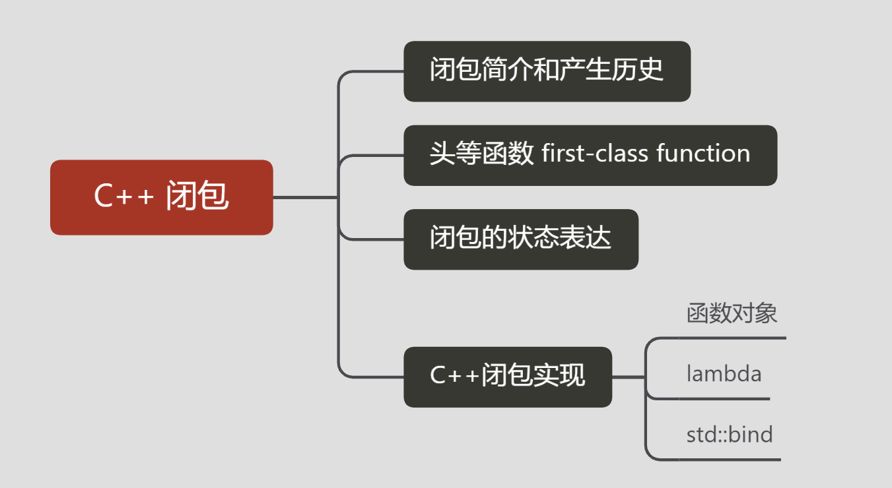

## 简介

> 在计算机科学中，闭包（英语：Closure），又称词法闭包（Lexical Closure）或函数闭包（function closures），是在支持头等函数的编程语言中实现词法绑定的一种技术。闭包在实现上是一个结构体，它存储了一个函数（通常是其入口地址）和一个关联的环境（相当于一个符号查找表）。环境里是若干对符号和值的对应关系，它既要包括约束变量（该函数内部绑定的符号），也要包括自由变量（在函数外部定义但在函数内被引用），有些函数也可能没有自由变量。闭包跟函数最大的不同在于，当捕捉闭包的时候，它的自由变量会在捕捉时被确定，这样即便脱离了捕捉时的上下文，它也能照常运行。捕捉时对于值的处理可以是值拷贝，也可以是名称引用，这通常由语言设计者决定，也可能由用户自行指定（如C++）。

- 词法作用域（lexically scoped）的名字绑定（name binding）：在词法作用域（C++ 的词法作用域是静态绑定的，包括块、函数、类、命名空间、全局作用域等）中，变量名与其词法上下文的标识符相关联，而独立于运行时的调用栈；

- 函数被当作头等公民（first-class citizen）：在运行时可以构造一个函数对象并将其作为参数传递给其他函数；


-----

> 闭包和匿名函数经常被用作同义词。但严格来说，匿名函数就是字面意义上没有被赋予名称的函数，而闭包则实际上是一个函数的实例，也就是说它是存在于内存里的某个结构体。如果从实现上来看的话，匿名函数如果没有捕捉自由变量，那么它其实可以被实现为一个函数指针，或者直接内联到调用点，如果它捕捉了自由变量那么它将是一个闭包；而闭包则意味着同时包括函数指针和环境两个关键元素。在编译优化当中，没有捕捉自由变量的闭包可以被优化成普通函数，这样就无需分配闭包结构体，这种编译技巧被称为函数跃升。


### 头等函数 first-class function

头等函数（first-class function）是指在程序设计语言中，函数被当作头等公民。这意味着，函数可以作为别的函数的参数、函数的返回值，赋值给变量或存储在数据结构中。 有人主张应包括支持匿名函数（函数字面量，function literals）。在这样的语言中，函数的名字没有特殊含义，它们被当作具有函数类型的普通的变量对待。


### 闭包和状态表达

闭包可以用来在一个函数与一组“私有”变量之间创建关联关系。在给定函数被多次调用的过程中，这些私有变量能够保持其持久性。变量的作用域仅限于包含它们的函数，因此无法从其它程序代码部分进行访问。不过，变量的生存期是可以很长，在一次函数调用期间所创建所生成的值在下次函数调用时仍然存在。正因为这一特点，闭包可以用来完成信息隐藏，并进而应用于需要状态表达的某些编程范型中。


### 闭包和头类函数

典型的支持闭包的语言中，通常将函数当作头等函数——在这些语言中，函数可以被当作参数传递、也可以作为函数返回值、绑定到变量名、就像字符串、整数等简单类型。

比如： 回调函数

## C++ 闭包的实现

**C++**

> C++早期标准允许通过重载operator()来定义函数对象。这种对象的行为在某种程度上与函数式编程语言中的函数类似。它们可以在运行时动态创建、保存状态，但是不能如闭包一般方便地隐式获取局部变量，并且有“专物专用”的繁琐问题——对于每一段闭包代码都要单独写一个函数对象类。

**C++11**

> C++11标准已经支持了闭包，这是一种特殊的函数对象，由特殊的语言结构——lambda表达式自动构建。C++闭包中保存了其代码内全部向外引用的变量的拷贝或引用。如果是对外界环境中的对象的引用，且闭包执行时该外界环境的变量已经不存在（如在调用栈上已经展开），那么可导致未定义行为，因为C++并不扩展这些被引用的外界环境的变量的生命期。示例代码如下：

```cpp
#include <algorithm>
#include <cmath>

void abssort(float* x, unsigned n) {
    std::sort(x, x + n,
        // Lambda expression begins
        [](float a, float b) {
            return (std::abs(a) < std::abs(b));
        } // end of lambda expression
    );
}
```


### C++ 函数对象 重载 operator()

**函数对象**（function object是一个程序设计的对象允许被当作普通函数来调用。

> 函数对象（也称 函子）是实现 operator() 的任何类型。 此运算符被称为调用运算符 （有时称为应用程序运算符）。 C++ 标准库主要使用函数对象作为容器和算法内的排序条件。
> 相对于直接函数调用，函数对象有两个优势。 第一个是函数对象可包含状态。 第二个是函数对象是一个类型，因此可用作模板参数。

**示例：**

```cpp
#include <iostream>
using namespace std;

class MyFunctor {
public:
    MyFunctor(int tmp) : round(tmp) {}
    int operator()(int tmp) { return tmp + round; }
private:
    int round;
};

int main() {
    int round = 2;
    MyFunctor f(round);    // 调用构造函数
    cout << "result = " << f(1) << endl;    // operator()(int tmp)
    return 0;
}
```

```
result = 3
```


### C++ lambda


1. 捕获
2. 参数列表 可有可无. (也称为 *lambda 声明符*)
3. 可变规范 可有可无.
4. 异常规范 可有可无.
5. 尾随-返回类型 可有可无.
6. lambda 定义。

-----

**C++ 17 lambda**

```
[ capture-list ] ( params ) mutable(optional) constexpr(optional)(c++17) exception attribute -> ret { body } 

// 简化语法
[ capture-list ] ( params ) -> ret { body }     
[ capture-list ] ( params ) { body }    
[ capture-list ] { body } 
```

- **capture-list**：捕捉列表，这个不用多说，前面已经讲过，记住它不能省略；
- **params**：参数列表，可以省略（但是后面必须紧跟函数体）；
- **mutable**：可选，将`lambda`表达式标记为`mutable`后，函数体就可以修改传值方式捕获的变量；
- **constexpr**：可选，C++17，可以指定`lambda`表达式是一个常量函数；
- **exception**：可选，指定`lambda`表达式可以抛出的异常；
- **attribute**：可选，指定`lambda`表达式的特性；
- **ret**：可选，返回值类型；
- **body**：函数执行体。

#### C++ lambda 捕获变量

类似参数传递方式（值传递、引入传递、指针传递），在Lambda表达式中，外部变量的捕获方式也有值捕获、引用捕获、隐式捕获。

**C++11中的Lambda表达式捕获外部变量主要有以下形式：**

| 捕获形式    | 说明                                                         |
| ----------- | ------------------------------------------------------------ |
| []          | 不捕获任何外部变量                                           |
| [变量名, …] | 默认以值得形式捕获指定的多个外部变量（用逗号分隔），如果引用捕获，需要显示声明（使用&说明符） |
| [this]      | 以值的形式捕获this指针                                       |
| [=]         | 以值的形式捕获所有外部变量                                   |
| [&]         | 以引用形式捕获所有外部变量                                   |
| [=, &x]     | 变量x以引用形式捕获，其余变量以传值形式捕获                  |
| [&, x]      | 变量x以值的形式捕获，其余变量以引用形式捕获                  |

示例：

- []：默认不捕获任何变量；
- [=]：默认以值捕获所有变量；
- [&]：默认以引用捕获所有变量；
- [x]：仅以值捕获x，其它变量不捕获；
- [&x]：仅以引用捕获x，其它变量不捕获；
- [=, &x]：默认以值捕获所有变量，但是x是例外，通过引用捕获；
- [&, x]：默认以引用捕获所有变量，但是x是例外，通过值捕获；
- [this]：通过引用捕获当前对象（其实是复制指针）；
- [*this]：通过传值方式捕获当前对象；


```cpp
#include <algorithm>
#include <cmath>

void abssort(float* x, unsigned n) {
    std::sort(x, x + n,
        // Lambda expression begins
        [](float a, float b) {
            return (std::abs(a) < std::abs(b));
        } // end of lambda expression
    );
}
```


### std::bind

std::bind是这样一种机制，它可以预先把指定可调用实体的某些参数绑定到已有的变量，产生一个新的可调用实体，这种机制在回调函数的使用过程中也颇为有用。

**示例：**

```cpp
#include <iostream>
#include <functional>
using namespace std;

int func(int tmp, int round) {
    return tmp + round;
}

int main()
{
    using namespace std::placeholders;    // adds visibility of _1, _2, _3,...

    int round = 2;
    std::function<int(int)> f = std::bind(func, _1, round);
    cout << "result = " << f(1) << endl;
    return 0;
}
```

```
result = 3
```


### 相关链接

[头等函数wiki](https://zh.wikipedia.org/wiki/%E5%A4%B4%E7%AD%89%E5%87%BD%E6%95%B0)

[闭包wiki](https://zh.wikipedia.org/wiki/%E9%97%AD%E5%8C%85_(%E8%AE%A1%E7%AE%97%E6%9C%BA%E7%A7%91%E5%AD%A6))

[惰性求值wiki](https://zh.wikipedia.org/wiki/%E6%83%B0%E6%80%A7%E6%B1%82%E5%80%BC)