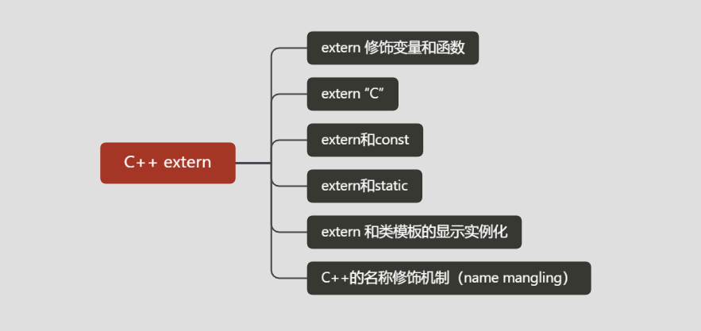
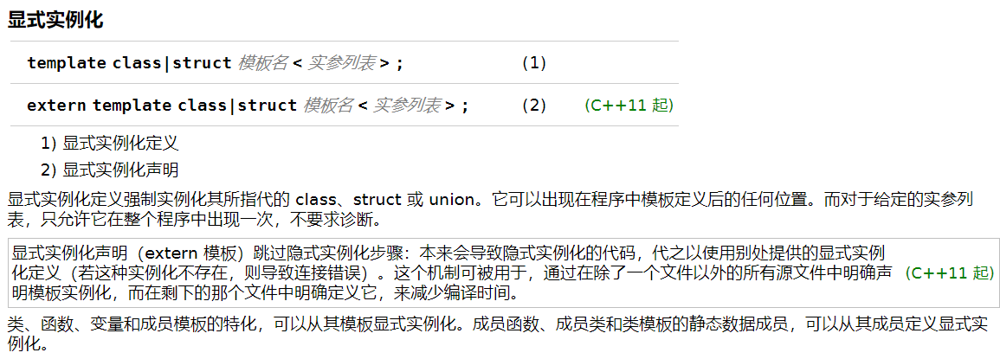

## 简介

**`extern`** 关键字可应用于全局变量、函数或模板声明。 它指定该符号具有**外部链接**


**`extern`** 关键字有四种含义，具体取决于上下文：

- 在非 **`const`** 全局变量声明中， **`extern`** 指定在其他编译单元中定义变量或函数。 **`extern`** 必须应用于除了定义变量的所有文件中。
- 在 **`const`** 变量声明中，它指定变量具有 extern al 链接。 **`extern`** 必须应用于所有文件中的所有声明。 （ **`const`** 默认情况下，全局变量具有内部链接。）
- ** extern "C"** 指定在其他位置定义函数并使用 C 语言调用约定。 extern"C" 修饰符也可以应用于块中的多个函数声明。
- 在模板声明中， **`extern`** 指定模板已在其他位置实例化。 **`extern`** 告诉编译器它可以重复使用另一个实例化，而不是在当前位置创建新的实例化。 有关此用法的详细信息 **`extern`** ，请参阅[显式实例化](https://docs.microsoft.com/zh-cn/cpp/cpp/explicit-instantiation?view=msvc-160)。


作为C语言的扩展，C++保留了一部分过程式语言的特点，因而它可以定义不属于任何类的全局变量和函数。但是，C++毕竟是一种面向对象的设计语言，为了支持函数的重载，C++对全局函数的处理方式有着明显的不同。


## extern 声明变量和函数

 声明extern关键字的全局变量和函数可以使得它们能够跨文件被访问。


- 全局函数的声明语句中，关键字extern可以省略，因为全局函数默认是extern类型的。


### 非常量 全局变量的外部链接

当链接器**`extern`**在全局变量声明之前看到时，它将在另一个转换单元中查找定义。**`const`**默认情况下，全局范围内的非变量声明是外部的。仅适用**`extern`**于不提供定义的声明。

```cpp
//fileA.cpp
int i = 42; // declaration and definition

//fileB.cpp
extern int i;  // declaration only. same as i in FileA

//fileC.cpp
extern int i;  // declaration only. same as i in FileA

//fileD.cpp
int i = 43; // LNK2005! 'i' already has a definition.
extern int i = 43; // same error (extern is ignored on definitions)
```

### const 全局变量的外部链接

一个**`const`**全局变量默认有内在联系。如果您希望变量具有外部链接，请将**`extern`**关键字应用于定义以及其他文件中的所有其他声明：

```
//fileA.cpp
extern const int i = 42; // extern const definition

//fileB.cpp
extern const int i;  // declaration only. same as i in FileA
```


-----

### extern constexpr链接

> 在 Visual Studio 2017 版本15.3 及更早版本中，编译器始终提供 **`constexpr`** 变量内部链接，即使该变量已标记 **`extern`** 。 在 Visual Studio 2017 版本15.5 及更高版本中， [/zc： extern Constexpr](https://docs.microsoft.com/zh-cn/cpp/build/reference/zc-externconstexpr?view=msvc-160)编译器开关实现了符合标准的正确行为。 最终，选项将成为默认值。 [/permissive-](https://docs.microsoft.com/zh-cn/cpp/build/reference/permissive-standards-conformance?view=msvc-160)选项不启用 **/Zc： extern Constexpr**。
>
> C++复制
>
> ```cpp
> extern constexpr int x = 10; //error LNK2005: "int const x" already defined
> ```
>
> 如果标头文件包含已声明的变量 **`extern`** **`constexpr`** ，则必须将其标记 `__declspec(selectany)` 为正确地将其重复的声明组合在一起：
>
> C++复制
>
> ```cpp
> extern constexpr __declspec(selectany) int x = 10;
> ```


### 示例

我们一般把所有的全局变量和全局函数的实现都放在一个*.cpp文件里面，然后用一个同名的*.h文件包含所有的函数和变量的声明。如：

```cpp
/*Demo.h*/
#pragma once
extern int a;
extern int b;
int add(int a,int b);
```

```cpp
/*Demo.cpp*/
#include "Demo.h" /*这句话写或者不写在本例中都行，不过建议不写*/
/*不写不会出问题，写了有些情况下会出问题，下面有解释*/
int a =10;
int b =20;

int add(intl,intr)
{
return l +r;
}
```

如果将Demo.cpp写成了Demo.c，编译器会告诉你说无法解析的外部符号。

因为Demo.c里面的实现会被C编译器处理，然而C++和C编译器在编译函数时存在差异，所以会存在找不到函数的情况。


```
//fileA.cpp
int i = 42; // declaration and definition

//fileB.cpp
extern int i;  // declaration only. same as i in FileA

//fileC.cpp
extern int i;  // declaration only. same as i in FileA

//fileD.cpp
int i = 43; // LNK2005! 'i' already has a definition.
extern int i = 43; // same error (extern is ignored on definitions)
```


## C++的名称修饰机制（name mangling）

C++编译器是名字修饰使用得出名的编译器。第一个C++编译器的实现是翻译成C语言源代码，以便于让C编译器编译成目标代码。正因如此，符号名必须服从C语言的标识符规则。直至后来，能直接产生机器语言或汇编语言的编译器出现了以后，系统的链接器也是基本上不支持C++的符号的，所以仍然需要名字修饰。

C++语言并没有规定一个标准的名字修饰方式，所以各款编译器都使用各自的名字修饰方式。C++还有一套复杂的语言特性，例如类、模板、命名空间和运算符重载。这改变了基于上下文或用法的特定符号的意义。关于这些特性的元数据能够用改编（修饰）调试符号的名字来消除二义性。正因为这些特性的名字修饰系统并没有跨编译器标准化，所以几乎没有链接器可以链接不同编译器产生的目标代码。


### 示例

考虑一个下面的C++程序中的两个`f()`的定义：

```cpp
int  f (void) { return 1; }
int  f (int)  { return 0; }
void g (void) { int i = f(), j = f(0); }
```

这些是不同的函数，除了函数名相同以外没有任何关系。如果不做任何改变直接把它们当成C代码，结果将导致一个错误——C语言不允许两个函数同名。所以，C++编译器将会把它们的类型信息编码成符号名，结果类似下面的的代码：

```cpp
int  __f_v (void) { return 1; }
int  __f_i (int)  { return 0; }
void __g_v (void) { int i = __f_v(), j = __f_i(0); }
```

注意`g()`也被名字修饰了，虽然没有任何名字冲突。名字修饰应用于C++的任何符号。


## extern “C”

作为面向对象的语言，C++为了支持函数重载，函数在被C++编译后在符号库中的名字与C语言的不同。

假如某个函数的原型为void foo(int x, int y);该函数被C编译器编译后在符号库中的名字为_foo，而C++编译器则会产生_foo_int_int之类的名字。_foo_int_int这样的名字是包含了函数名以及形参，C++就是靠这种机制来实现函数重载的。 

被extern “C”修饰的函数或者变量是按照C语言方式编译和链接的，所以可以用一句话来概括extern “C”的真实目的：实现C++与C的混合编程。

**注意：**

- extern "C" 只是 `C++` 的关键字，不是 `C` 的

- 被 extern "C" 修饰的目标一般是对一个全局C或者 `C++` 函数的声明

  从源码上看 extern "C" 一般对头文件中函数声明进行修饰。 `C` 和 `cpp` 中头文件函数声明的形式都是一样的（因为两者语法基本一样），对应声明的实现却可能由于语言特性而不同了( `C` 库和 `C++` 库里面当然会不同)。

- extern "C" 这个关键字声明的真实目的，就是实现 `C++` 与C及其它语言的混合编程

- 被 extern "C" 限定的函数或变量是 `extern` 类型的。

- 被 extern "C" 修饰的变量和函数是按照 `C` 语言方式编译和连接的。

- 如果在一个文件里定义了`char g_str[] = "123456";`在另外一个文件中必须使用extern char g_str[ ];来声明。不能使用`extern char* g_str;`来声明。extern是严格的声明。且`extern char* g_str`只是声明的一个全局字符指针。

- 声明可以声明n次，但是定义只能定义一次。

## extern “C”的惯用法

```cpp
#ifdef __cplusplus 
extern "C" {
#endif
    /* ... */
#ifdef __cplusplus
}
#endif
```


### 示例

在C++中引用C语言中的函数和变量，在包含C语言头文件时(假设为cExample.h)，需进行以下处理：

c语言文件：

```c
/* c语言头文件：cExample.h */
#ifndef C_EXAMPLE_H
#define C_EXAMPLE_H
extern int add(int x, int y);
#endif

/* c语言的实现文件：cExample.c */
#include "cExample.h"
int add(int x, int y)
{
    return x + y;
}

/* c++实现文件，调用add：cppFile.cpp */
extern "C"
{
#include "cExample.h";
}
int main()
{
    add(2, 3);
    return 0;
}
```

如果C++调用一个C语言编写的.DLL时，在包含.DLL的头文件或声明接口函数时，应该也要加上extern “C”。

```c
/* c++头文件cppExample.h */ 
 #ifndef CPP_EXAMPLE_H 
 #define CPP_EXAMPLE_H 
 extern "C" int add(int x, int y); 
 #endif

 /* c实现文件cFile.c */ 
 extern int add(int x, int y); 
 int main() 
 { 
 add(2, 3); 
 return 0; 
 }
```


## extern和static

- extern表明该变量在别的地方已经定义过了，在这里要使用那个变量。

- static 表示静态的变量，分配内存的时候，存储在静态区，不存储在栈上面。

- extern和static不能同时修饰一个变量

- static修饰的全局变量声明与定义同时进行

- static修饰全局变量的作用域只能是本身的编译单元


## extern和const

- C++中const修饰的全局常量具有跟static相同的特性，即它们只能作用于本编译模块中，且static修饰的是全局变量，但是const可以与extern连用来声明该常量可以作用于其他编译模块中。
- 当const单独使用时它就与static相同，而当与extern一起合作的时候，它的特性就跟extern的一样了

## extern 和类模板的显示实例化 C++11



[cppreference](https://zh.cppreference.com/w/cpp/language/class_template)


-----

参考

[extern (C++)](https://docs.microsoft.com/en-us/cpp/cpp/extern-cpp?view=msvc-160)

[C/C++ 中的 static, extern](https://medium.com/@alan81920/c-c-%E4%B8%AD%E7%9A%84-static-extern-%E7%9A%84%E8%AE%8A%E6%95%B8-9b42d000688f)

[类模板](https://zh.cppreference.com/w/cpp/language/class_template)