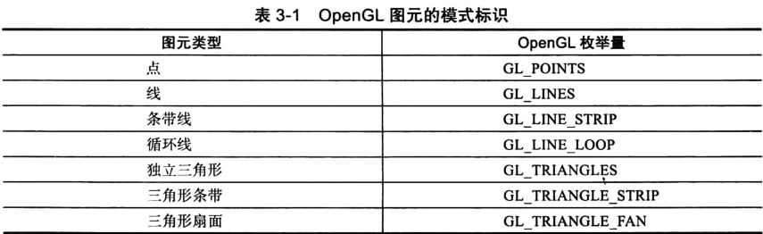

-----

# OpenGL Graphics Primitives


# 点 The Vertex

所有的几何原语都是用顶点来描述的，顶点是定义点本身的坐标、线段的端点或多边形的角。

为了在OpenGL中绘制一个顶点，我们使用OpenGL函数 `glVertex`。该功能有以下变化:

```cpp
void glVertex2d( GLdouble x, GLdouble y )
void glVertex2f( GLfloat x, GLfloat y )
void glVertex2i( GLint x, GLint y )
void glVertex2s( GLshort x, GLshort y )
void glVertex3d( GLdouble x, GLdouble y, GLdouble z )
void glVertex3f( GLfloat x, GLfloat y, GLfloat z )
void glVertex3i( GLint x, GLint y, GLint z )
void glVertex3s( GLshort x, GLshort y, GLshort z )
void glVertex4d( GLdouble x, GLdouble y, GLdouble z, GLdouble w )
void glVertex4f( GLfloat x, GLfloat y, GLfloat z, GLfloat w )
void glVertex4i( GLint x, GLint y, GLint z, GLint w )
void glVertex4s( GLshort x, GLshort y, GLshort z, GLshort w )
```

**绘制OpenGL图元 :**

```cpp
glBegin (mode);
    glVertex* (...);
    .....
    glVertex* (...);
glEnd ();
```

> `mode`是图元类型

**glBegin()与glEnd()之间只能使用下列OpenGL函数：**

| 函数                           | 函数的作用               |
| :----------------------------- | :----------------------- |
| glVertex*()                    | 设置顶点坐标             |
| glColor*()                     | 设置RGBA颜色             |
| glIndex*()                     | 设置颜色索引             |
| glSecondaryColor*()            | 设置纹理应用后的辅助颜色 |
| glNormal*()                    | 设置法线向量坐标         |
| glMaterial*()                  | 设置材料属性             |
| glFogCoord*()                  | 设置雾坐标               |
| glTexCoord*()                  | 设置纹理坐标             |
| glMultiTexCoord*()             | 为多重纹理设置纹理坐标   |
| glVertexAttrib*()              | 设置通用的顶点属性       |
| glEdgeFlag*()                  | 控制边界的绘制           |
| glArrayElement*()              | 提取顶点数组数据         |
| glEvalCoord*(), glEvalPoint*() | 生成坐标                 |
| glCallList*(), glCallLists*()  | 执行显示列表             |

# 基础图元类型

| 类型              | 说明                 |
| :---------------- | :------------------- |
| GL_POINTS         | 单个顶点集           |
| GL_LINES          | 多组双顶点线段       |
| GL_POLYGON        | 单个简单填充凸多边形 |
| GL_TRAINGLES      | 多组独立填充三角形   |
| GL_QUADS          | 多组独立填充四边形   |
| GL_LINE_STRIP     | 不闭合折线           |
| GL_LINE_LOOP      | 闭合折线             |
| GL_TRAINGLE_STRIP | 线型连续填充三角形串 |
| GL_TRAINGLE_FAN   | 扇形连续填充三角形串 |
| GL_QUAD_STRIP     | 连续填充四边形串     |




------

```cpp
void glPointSize(GLfloat size);
```

- 参数size设置点的宽度（以象素为单位）,必须大于0.0，缺省时为1.0。

------

# 线 Lines

```cpp
void glLineWidth(GLfloat width);
```

- 设置线宽（以象素为单位）。参数width必须大于0.0，缺省时为1.0。

```
void glEnable(GL_LINE_STIPPLE);
void glLineStipple(factor, pattern);
```

- 在绘制虚点线之前必须先启动虚点模式，即调用函数glEnable(GL_LINE_STIPPLE);结束时，调用glDisable(GL_LINE_STIPPLE)关闭。

------

# 多边形 Polygon

- 将多边形渲染为点集、轮廓线或者实体

- 多边形面的反转和裁减

```cpp
void glPolygonMode(GLenum face, GLenum mode);
```


> **void glPolygonMode(GLenum face, GLenum mode);**
>
> Use this function in order to change how the polygon will be rendered. By default, the polygon is filled with the current color. However, we can disable filling the polygon and display its outline or the vertices forming it.
>
> | **Parameter** | **Description**                                              | **Values**                               |
> | :------------ | :----------------------------------------------------------- | :--------------------------------------- |
> | face          | Specifies which face of polygons is affected by the mode change. | `GL_FRONT` `GL_BACK` `GL_FRONT_AND_BACK` |
> | mode          | Specifies the new drawing mode. `GL_FILL` is the default, producing filled polygons. `GL_LINE` produces polygon outlines, and `GL_POINT` only plots the points of the vertices. | `GL_FILL` `GL_LINE` `GL_POINT`           |

//

```cpp
void glFrontFace(GLenum mode);
```

//TODO

```cpp
void glCullFace(GLenum mode);
```

> **Program View**
>
> The program basically consists of 4 visible components: Vertices, Primitives, Grid, and Background. Here is the functionality supported by the program that allows you to manipulate the view of these components.
>
> 1. Vertices
>    - IncreaseVertex Size. Click 'X' to increase size and 'x' to decrease size. You can also select the +- menu items under Vertexsize.
>    - Change the vertex Color. You can do this by selecting the VertexColor menu items.
>    - Showthe vertices. Click the 'p' key or select the Show/Hide Points menu item under the Vertex submenu.
>    - Showthe numbers associated with vertices. click the 'n' key or select the Show/Hide Numbers menu item under the Vertex submenu.
> 2. Primitives
>    - Change the primitive Color. You can do this by selecting the Primitivemenu items or by pressing the Up and Down keys.
>    - Change point size if the primitive is a point. Click 'S' to increase size and 's' to decrease size. You can also select the +- menu items under Primitivesize.
>    - Change line width in case the primitive is a line. Click 'L' to increase width and 'l' to decrease width. You can also select the +- menu items under Primitivewidth.
>    - Showthe primitive border and change the border color if the primitive is a polygon. You can change border color and showborder using the menu items under Primitive.
> 3. Grid
>    - IncreaseGrid Line Width. Click 'W' to increase width and 'w' to decrease width. You can also select the +- menu items under Gridwidth.
>    - Change the grid lines color. You can do this by selecting the Back Color menu items.
>    - Showthe grid. Click the 'g' key or select the Show/Hide Grid menu item under the Grid submenu.
> 4. Background
>    - Change the background color. You can do this by selecting the Back Color menu items.

------

**顶点和颜色函数表:**

```cpp
glVertex2f( x, y );             glVertex2fv( xyArray );
glVertex2d( x, y );             glVertex2dv( xyArray );
glVertex2i( x, y );             glVertex2iv( xyArray );
glVertex3f( x, y, z );          glVertex3fv( xyzArray );
glVertex3d( x, y, z );          glVertex3dv( xyzArray );
glVertex3i( x, y, z );          glVertex3iv( xyzArray );

glColor3f( r, g, b );           glColor3f( rgbArray );
glColor3d( r, g, b );           glColor3d( rgbArray );
glColor3ub( r, g, b );          glColor3ub( rgbArray );
glColor4f( r, g, b, a);         glColor4f( rgbaArray );
glColor4d( r, g, b, a);         glColor4d( rgbaArray );
glColor4ub( r, g, b, a);        glColor4ub( rgbaArray );
```

------

**Demo**

```cpp
#include <GL/gl.h>
#include <GL/glut.h>   // freeglut.h might be a better alternative, if available.
 

void display() {  // Display function will draw the image.
 
    glClearColor( 0, 0, 0, 1 );  // (In fact, this is the default.)
    glClear( GL_COLOR_BUFFER_BIT );
    
    glBegin(GL_TRIANGLES);
    glColor3f( 1, 0, 0 ); // red
    glVertex2f( -0.8, -0.8 );
    glColor3f( 0, 1, 0 ); // green
    glVertex2f( 0.8, -0.8 );
    glColor3f( 0, 0, 1 ); // blue
    glVertex2f( 0, 0.9 );
    glEnd(); 
    
    glutSwapBuffers(); // Required to copy color buffer onto the screen.
 
}


int main( int argc, char** argv ) {  // Initialize GLUT and 

    glutInit(&argc, argv);
    glutInitDisplayMode(GLUT_SINGLE);    // Use single color buffer and no depth buffer.
    glutInitWindowSize(500,500);         // Size of display area, in pixels.
    glutInitWindowPosition(100,100);     // Location of window in screen coordinates.
    glutCreateWindow("GL RGB Triangle"); // Parameter is window title.
    glutDisplayFunc(display);            // Called when the window needs to be redrawn.
    
    glutMainLoop(); // Run the event loop!  This function does not return.
                    // Program ends when user closes the window.
    return 0;

}
```

------

# Demo

```cpp
//点的大小，直线线型和线宽的示例
#include <gl/glut.h>
/*点的绘制
OpenGL中定义的点放在函数glBegin()和glEnd()之间，有函数glBegin()的参数指定绘制图元的类型。
在OpenGL中绘制一个点时，点大小的默认值是一个像素。可以用函数glPointSize(GLfloat size)修改这个值。这个函数采用一个参数来指定画点时以像素为单位的近似直径。但是不是任意大小点都支持，通常使用下面的代码来获取点大小的范围和他们的之间最小的中间值：
GLfloat sizes[2];//保存绘制点的尺寸范围
GLfloat step;//保存绘制点尺寸的步长
glGetFloatv(GL_POINT_SIZE_RANGE,sizes);
glGetFloatv(GL_POINT_SIZE_RANULARITY,&step);
在OpenGL程序中，我们常可以利用离散的点来拟合一些常见的曲线，如圆，螺旋线等待。
*/
void RenderScene()
{
    glClear(GL_COLOR_BUFFER_BIT);
    glColor3f(0.0f,0.0f,0.0f);
 
    GLfloat sizes[2];//保存绘制点的尺寸范围
    GLfloat step;//保存绘制点尺寸的步长
    GLfloat curSize;//当前绘制的点的大小
    glGetFloatv(GL_POINT_SIZE_RANGE,sizes);//获得点的尺寸范围
    glGetFloatv(GL_POINT_SIZE_GRANULARITY,&step);//获得点尺寸的步长
 
    //绘制不同大小的点
    curSize = sizes[0];
    for (int i=0; i < 25; i++)
    {
        glPointSize(curSize);//设置点的大小
        glBegin(GL_POINTS);
        glVertex3f(25.0+i*8,200.0f,0.0f);
        glEnd();
        curSize += step * 2;
    }
    //绘制一条宽度为5的直线
    glLineWidth(5);//设置线宽
    glBegin(GL_LINES);
    glVertex3f(20.0f,150.0f,0.0f);
    glVertex3f(220.0f,150.0f,0.0f);
    glVertex3f(200.0f,160.0f,0.0f);
    glVertex3f(200.0f,160.0f,0.0f);
    glEnd();
 
    //在xy平面内绘制了两条直线(0,0,0)到(10,0,0)和(0,10,0)到(20,5,0).
    glBegin(GL_LINE_STRIP);
    glVertex3f(0.0f,0.0f,0.0f);
    glVertex3f(10.0f,10.0f,0.0f);
    glVertex3f(20.0f,5.0f,0.0f);
    glEnd();
    
    //画了一个三角形
    glBegin(GL_LINE_LOOP);
    glVertex3f(100.0f,100.0f,0.0f);
    glVertex3f(150.0f,150.0f,0.0f);
    glVertex3f(200.0f,50.0f,0.0f);
    glEnd();
 
    //绘制一条虚线 
    glEnable(GL_LINE_STIPPLE);
    glLineStipple(1,0x00ff);//设置点划线模式
    glBegin(GL_LINES);
    glVertex3f(20.0f,120.0f,0.0f);
    glVertex3f(220.0f,120.0f,0.0f);
    glEnd();
 
    //绘制一条宽度为3的点划线 
    glLineWidth(3); 
    glLineStipple(1,0xff0c);
    glBegin(GL_LINES);
    glVertex3f(20.0f,80.0f,0.0f);
    glVertex3f(220.0f,80.0f,0.0f);
    glEnd();
    //增加重复因子绘制的点划线 
    glLineStipple(4,0xFF0C);
    glBegin(GL_LINES);
    glVertex3f(20.0f,40.0f,0.0f);
    glVertex3f(220.0f,40.0f,0.0f);
    glEnd();
    glDisable(GL_LINE_STIPPLE);
 
    glFlush();
}
/*直线的绘制
使用模式GL_LINES可以在两点之间画线；
有时我们需要在一系列的顶点之间绘制连续直线，此时需要用到GL_LINE_STRIP或GL_LINE_LOOP模式。GL_LINE_STRIP模式可以根据指定的一系列顶点，从一个顶点到另一个顶点用连续的线段画线。特别的，当沿着某条曲线指定一系列靠的很近的点，使用GL_LINE_STRIP模式可以绘制一条曲线。
GL_LINE_LOOP模式与GL_LINE_STRIP模式类似，只是会在指定的最后一个顶点与第一个顶点之间画最后一条线。
直线的属性包括线宽和线型。在OpenGL中可用 void glLineWidth(GLfloat width)指定线宽。
可以用下面的代码来获取线宽范围和他们的之间的最小间隔：
GLfloat sizes[2];//保存线宽的尺寸范围
GLfloat step;//保存线宽尺寸的最小间隔
glGetFloarv(GL_LINE_WIDTH_RANGE,sizes);
glGetFloarv(GL_LINE_WIDTH_GRANULARITY,&step);
数组sizes中保存了glLineWidth的最小有效值和最大有效值，而变量step将保存线宽之间允许的最小增量。
Microsoft的OpenGL实现允许线宽从0.5到10.0，最小增量为0.125.
除了修改线宽，可以用虚线或短划线么事创建直线，为此需要先调用glEnable(GL_LINE_STIPPLE);然后调用glLineStipple(GLint factor,GLushort pattern);来创建画线的模式。pattern是一个16位值，它指定了画线是所用的模式，每一位代表线段的一部分是开还是关。默认情况下，每一位对应一个像素，但factor参数充当倍数可以增加模式的宽度。另外在应用模式时，pattern是逆向使用的，即模式的最低有效位最先作用于指定线段。
*/
void ChangeSize(GLsizei w,GLsizei h)
{
    if(h == 0)
    {
        h = 1;
    }
    glViewport(0,0,w,h);
 
    glMatrixMode(GL_PROJECTION);
    glLoadIdentity();
 
    if (w <= h)
    {
        glOrtho(0.0f,250.0f,0.0f,250.0f*h/w,1.0f,-1.0f);
    }
    else
    {
        glOrtho(0.0f,250.0f*w/h,0.0f,250.0f,1.0f,-1.0f);
 
    }
    glMatrixMode(GL_MODELVIEW);
    glLoadIdentity();
}
void SetupRC()
{
    glClearColor(1.0f,1.0f,1.0f,1.0f);
}
void main()
{
    glutInitDisplayMode(GLUT_RGB | GLUT_SINGLE);
    glutCreateWindow("点与线");
    glutDisplayFunc(RenderScene);
    glutReshapeFunc(ChangeSize);
    SetupRC();
    glutMainLoop();
}
/*
在上面的程序中，由于OpenGL使用的是一种状态机制，故此我们在绘制第一条直线前设置线宽为5，不仅影响了第一条直线，还使绘制的虚线线宽也为5，直到在绘制第一条点划线前将线宽该为3为止，这样后面绘制的直线均为3，直到再次修改为止。故此在绘制图形的时候，尽可能将状态相同或部分状态相同的图形放在一起绘制，可以提高程序的执行效率。
*/
```

# 相关链接

[OpenGL\]图元的绘制——空间点/直线;图元整理](https://blog.csdn.net/shimazhuge/article/details/17896791) 

[https://www.khronos.org/opengl/wiki/Primitive](https://www.khronos.org/opengl/wiki/Primitive)

[https://www3.ntu.edu.sg/home/ehchua/programming/opengl/CG_Introduction.html](https://www3.ntu.edu.sg/home/ehchua/programming/opengl/CG_Introduction.html)

[https://www.codeproject.com/Articles/23991/OpenGL-Geometric-Primitives](https://www.codeproject.com/Articles/23991/OpenGL-Geometric-Primitives)

[Rendering Primitives with OpenGL](https://www.3dgep.com/rendering-primitives-with-opengl/?cf_chl_jschl_tk=6fd9128e97e1e6bc52ccd3c24332d84275639580-1586337904-0-Acc0m2lzZxe7SyrxdBO28lMaII4gR292Blidm4X8UWbdFBUmOqjExLOcQPSnfBkpr37HD1BY7PILtmhyYXAZ9DnkGJA7EfkuDpf52Kpyk7RhTb4eamVrRc3Ambysjq8Wtd81SjjZeq0_w-RyElBKDaXCOQOb_BJWLaH_fporKKas-59LYZlpj2a-PvZCrWUt6DEdov6gZjTFCVwsFckQjwjL--O_3JwwylbdOLpPlAnl4ocdT_LIcoqOm-lYhynxEDDICKp8uEERFwTl-jRenOWG4f0DHwPUniN57Zs2Dne5DJSmjFGzTb6J-T-0V89TQg)

[https://www.glprogramming.com/red/index.html](https://www.glprogramming.com/red/index.html)

[https://github.com/wzpan/orgwiki/blob/master/opengl_vertex.org](https://github.com/wzpan/orgwiki/blob/master/opengl_vertex.org)


