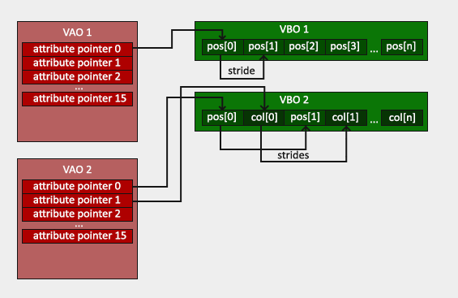
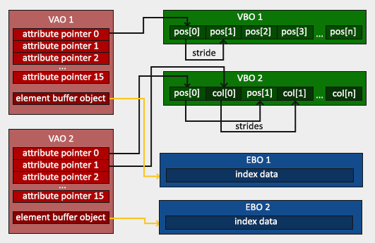
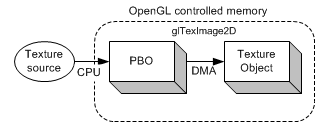
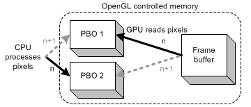
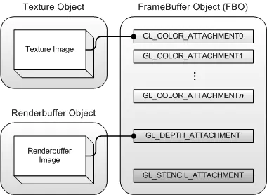

-----


# OpenGL 缓冲区对象 buffer object

缓冲区对象(buffer object)，允许应用程序地指定把哪些数据存储在图形服务器中。

VAO VBO EBO PBO 概述

VBO

> 顶点缓冲对象VBO是在显卡存储空间中开辟出的一块内存缓存区，用于存储顶点的各类属性信息，如顶点坐标，顶点法向量，顶点颜色数据等。在渲染时，可以直接从VBO中取出顶点的各类属性数据，由于VBO在显存而不是在内存中，不需要从CPU传输数据，处理效率更高。
>
> 所以可以理解为VBO就是显存中的一个存储区域，可以保持大量的顶点属性信息。并且可以开辟很多个VBO，每个VBO在OpenGL中有它的唯一标识ID，这个ID对应着具体的VBO的显存地址，通过这个ID可以对特定的VBO内的数据进行存取操作。

VAO

> VBO保存了一个模型的顶点属性信息，每次绘制模型之前需要绑定顶点的所有信息，当数据量很大时，重复这样的动作变得非常麻烦。VAO可以把这些所有的配置都存储在一个对象中，每次绘制模型时，只需要绑定这个VAO对象就可以了。
>
> VAO是一个保存了所有顶点数据属性的状态结合，它存储了顶点数据的格式以及顶点数据所需的VBO对象的引用。
>
> VAO本身并没有存储顶点的相关属性数据，这些信息是存储在VBO中的，VAO相当于是对很多个VBO的引用，把一些VBO组合在一起作为一个对象统一管理。

EBO

> 索引缓冲对象EBO相当于OpenGL中的顶点数组的概念，是为了解决同一个顶点多次重复调用的问题，可以减少内存空间浪费，提高执行效率。当需要使用重复的顶点时，通过顶点的位置索引来调用顶点，而不是对重复的顶点信息重复记录，重复调用。
>
> EBO中存储的内容就是顶点位置的索引indices，EBO跟VBO类似，也是在显存中的一块内存缓冲器，只不过EBO保存的是顶点的索引。

PBO

> 储存像素数据的缓冲区对象称为**Pixel Buffer Object (PBO)**。

------

# VBO

- VBO是OpenGL提供的一种特性，主要是用于在非立即模式下（使用glBegin/glEnd这种方式）用来保存顶点数据（包括位置、纹理、颜色等），同时提供了更新这些数据的方法。 

- VBO相比较立即模式的渲染来说效率更高，这主要是因为VBO的数据一般会放在显存中而不是内存中。

- 通俗点说VBO就好像是显卡中开辟的一块存储区域，用来把以前放在内存中的数据放在了显存中，便于更加方便的传输处理。 

- VBO特性是在OpenGL1.5版本引入的。

相关函数

| 函数            |                                                              |
| :-------------- | :----------------------------------------------------------- |
| glGenBuffers    | 创建顶点缓冲区对象                                           |
| glBindBuffer    | 将顶点缓冲区对象设置为当前数组缓冲区对象(array buffer object)或当前元素(索引）缓冲区对象(element buffer object) |
| glBufferData    | 为顶点缓冲区对象申请内存空间，并进行初始化(视传入的参数而定) |
| glBufferSubData | 初始化或更新顶点缓冲区对象                                   |
| glDeleteBuffers | 删除顶点缓冲区对象                                           |

## 创建缓冲区对象 Generate

```cpp
void glGenBuffers(GLsizei n,GLuint *buffers);
```

- 在buffers数组中返回n个当前未使用的缓冲区对象标识。注意在buffers数组中返回的标识名称并不需要是连续的整数。0是一个保留的缓冲区对象名称，从来不会被glGenBuffers()作为缓冲区对象标识返回。

```cpp
GLboolean glIsBuffer(GLuint buffer);
```

- 如果buffer是一个已经绑定的缓冲区对象的名称，而且还没有删除则返回GL_TRUE，否则返回GL_FALSE。

------

## 激活缓冲区对象 Bind

```cpp
void glBindBuffer(GLenum target,GLuint buffer);
```

１. 当buffer是一个首次使用的非零无符号整数时，它就创建一个新的缓冲区对象，并把buffer分配给这个缓冲区对象，作为它的名称

２. 当绑定到一个以前创建的缓冲区对象时，这个缓冲区对象便成为活动的缓冲区对象

３. 当绑定到一个值为零的buffer时，OpenGL就会停止使用缓冲区对象

## 用数据分配和初始化缓冲区对象 Buffer Data

```cpp
void glBufferData(GLenum target,GLsizeiptr size,const GLvoid *data,GLenum usage);
```

**数据的读写模式**

- 流模式：缓冲区对象中的数据只被指定一次，并且使用这些数据的频率较低
- 静态模式：缓冲区对象的数据只指定一次，但是使用这些数据的频率很高
- 动态模式：缓冲区对象的数据不仅常常需要进行更新，而且使用频率也非常高
- 注意，如果请求分配的内存数量超过了服务器能够分配的内存，glBufferData()将返回GL_OUT_OF_MEMORY错误。如果usage并不是允许使用的值之一，则返回GL_INVALID_VALUE。

## 更新缓冲区对象的数据

**方法一、用提供的数据替换被绑定的缓冲区对象的一些数据子集**

```cpp
void glBufferSubData(GLenum target,GLintptr ofsset,GLsizeiptr size,const GLvoid *data);
```

- 用data指向的数据更新与target相关联的当前绑定缓冲区对象中从offset(以字节为单位)开始的size个字节数据。target参数与glBufferData的target参数一致。

- 注意，如果size小于0或者size+offset大于缓冲区对象创建时所指定的大小，glBufferSubData()将产生一个GL_INVALID_VALUE错误。

**方法二、选择绑定的缓冲区对象，然后根据需要来写入新值(或简单地读取数据，这取决于内存的访问权限)，就像对数组进行赋值一样**

```cpp
GLvoid * glMapBuffer(GLenum target,GLenum access);
```

- 返回一个指针，指向与target相关联的当前绑定缓冲区对象的数据存储。target参数与glBufferData的target参数一致。参数access必须是GL_READ_ONLY、GL_WRITE_ONLY或GL_READ_WRITE之一，表示客户可以对数据进行的操作。

- 注意，如果需要修改缓冲区中的大多数数据，这种方法很有用，但如果有一个很大的缓冲区并且只需要更新很小的一部分值，这种方法效率就很低。这时使用glMapBufferRange()效率更高。它允许只修改所需的范围内的数据值。

```cpp
GLvoid * glMapBufferRange(GLenum target,GLintptr offset,GLsizeiptr length,GLbitfield access);
```

- 完成缓冲区对象的数据更新之后，可以调用glUnmapBuffer()取消对这个缓冲区的映射：

```cpp
GLboolean glUnmapBuffer(GLenum target);
```

- 表示对当前绑定缓冲区对象的更新已经完成，并且这个缓冲区可以释放。

## 在缓冲区对象之间复制数据

**在OpenGL 3.1以前版本中，这个过程分两步：**

１. 把数据从缓冲区对象复制到应用程序的内存中。

２. 绑定到新的缓冲区对象，然后更新该缓冲区对象的数据。

**在OpenGL 3.1中**

- `glCopyBufferSubData()`用于复制数据，而不需要迫使数据在应用程序的内存中做短暂停留。

```cpp
void glCopyBufferSubData(GLenum readbuffer,GLenum writebuffer,GLintptr readoffset,GLintptr writeoffset,GLsizeiptr size);
```

- 把数据从与readbuffer相关联的缓冲区对象复制到绑定到writebuffer的缓冲区对象。
- 参数readbuffer和writebuffer与glBufferData的target参数一致。
- readoffset、writeoffset为偏移量，size为复制到数据的数量。

## 清除缓冲区对象

完成了对缓冲区对象的操作之后，可以释放它的资源，并使它的标识可以其他缓冲区对象使用。

```cpp
void glDeleteBuffers(GLsizei n,const GLuint *buffers);
```

- 删除n个缓冲区对象，它们的标识名称就是buffers数组的元素。

- 注意，如果试图删除不存在的缓冲区对象或标识为0的缓冲区对象，该操作将被忽略，并不会产生错误。

-----

**示例：使用缓冲区对象存储顶点数组数据，并绘制**

```cpp
#define BUFFER_OFFSET(bytes) ((GLubyte *)NULL+(bytes))
 
GLuint buffers[2];
GLfloat vertices[][3]={ //包含顶点数据

{-1.0, -1.0, -1.0},
{1.0, -1.0, -1.0},
{1.0, 1.0, -1.0},
{-1.0, 1.0, -1.0},
{-1.0, -1.0, 1.0}, 
{1.0, -1.0, 1.0},
{1.0, 1.0, 1.0},
{-1.0, 1.0, 1.0}
};
 
GLbyte indices[][4]={ //包含索引数据
{0,1,2,3},
{4,7,6,5},
{0,4,5,1},
{3,2,6,7},
{0,3,7,4},
{1,5,6,2}
};
 
glGenBuffers(2,buffers);                                                 //生成缓冲区对象标识符
glBindBuffer(GL_ARRAY_BUFFER,buffers[0]);                                //绑定顶点缓冲区对象
glBufferData(GL_ARRAY_BUFFER,sizeof(vertices), vertices,GL_STATIC_DRAW); //请求数据的存储空间并用指定数据进行初始化
glBindBuffer(GL_ELEMENT_ARRAY_BUFFER,buffers[1]);                        //绑定索引缓冲区对象
glBufferData(GL_ELEMENT_ARRAY_BUFFER,sizeof(indices), indices,GL_STATIC_DRAW);
glEnableClientState(GL_VERTEX_ARRAY);                                    //启用顶点数组
glVertexPointer(3,GL_FLOAT,0,BUFFER_OFFSET(0));                          //指定顶点数组数据
glDrawElements(GL_QUADS,24,GL_UNSIGNED_BYTE,BUFFER_OFFSET(0));           //根据索引绘图(注意：顶点数据和索引各自使用不同的缓冲区)
```

若没有使用缓冲区对象，则上面这段代码传进的偏移量

```cpp
glVertexPointer(3,GL_FLOAT,0,BUFFER_OFFSET(0)); 
glDrawElements(GL_QUADS,24,GL_UNSIGNED_BYTE,BUFFER_OFFSET(0)); 
```

应该是这样改成实际的客户端数据指针

```cpp
glVertexPointer(3,GL_FLOAT,0, vertices); 
glDrawElements(GL_QUADS,24, indices);
```

使用缓冲区对象后，类似glVertexPointer()这种以指针为参数的OpenGL函数不再从指针所指位置取数据，函数会先把指针转化为整数，假设转化后的结果为k，则会从当前缓冲区的第k个字节开始取数据(NULL转化为整数后通常是0，即缓冲区最开始的位置)。

# VAO

VAO （ Vertex Array Object ）是OpenGL用来处理顶点数据的一个缓冲区对象，它不能单独使用，都是结合VBO来一起使用的。VAO是**OpenGL CoreProfile** 引入的一个特性。**事实上在CoreProfile中做顶点数据传入时，必须使用VAO方式。**

VAO对象中存储的内容包括： 

1. VAO开启或者关闭的状态（`glEnableVertexAttribArray`和`glDisableVertexAttribArray`) 
2. 使用`glVertexAttribPointer`对顶点属性进行的设置 
3. 存储顶点数据的VBO对象



**1.创建VAO**

创建VAO使用`glGenVertexArrays`参数与创建其他缓冲区对象的glGenBuffers类似

```cpp
void glGenVertexArrays( GLsizei n, GLuint *arrays);
```

**2.绑定并设置VAO**

在创建VAO之后，需要使用`glBindVertexArray`设置它为当前操作的VAO，之后我们所有关于顶点数据的设置（包括数据使用的VBO对象，顶点的属性设置的信息都会被存储在VAO之中），在设置完成之后一般会解绑VAO，然后在需要绘制的时候启用相应的VAO对象。具体的代码如下所示：

```cpp
//创建VAO
GLuint VAO;
glGenVertexArrays(1, &VAO);
//设置当前VAO，之后所有操作(注意：这些操作必须是上文VAO中包含的内容所注明的调用，其他非VAO中存储的内容即使调用了也不会影响VAO）存储在该VAO中
glBindVertexArray(VAO);
   glBindBuffer(GL_ARRAY_BUFFER, VBO); //设置了VBO
   glBufferData(GL_ARRAY_BUFFER, sizeof(vertices), vertices, GL_STATIC_DRAW);//设置VBO中的数据
    glVertexAttribPointer(0, 3, GL_FLOAT, GL_FALSE, 3 * sizeof(GLfloat), (GLvoid*)0); //设置顶点属性（索引为0的属性，与shader中的内容有交互）
    glEnableVertexAttribArray(0); //设置开启顶点属性（索引为0的属性,与shader中的内容有交互）
glBindVertexArray(0); //解绑VAO（解绑主要是为了不影响后续VAO的设置，有点类似于C++中指针delete后置空，是个好习惯）12345678910
```

通过上面的代码就完成了对VAO的设置，当我们需要绘制的时候，使用的代码类似于：

```c++
glUseProgram(shaderProgram);
glBindVertexArray(VAO); //绑定我们需要的VAO，会导致上面所有VAO保存的设置自动设置完成
someOpenGLFunctionThatDrawsOurTriangle();   
glBindVertexArray(0);   //解绑VAO1234
```

另外需要注意的是，当我们使用EBO的时候，VAO中也会记录索引信息，因此完整的VAO所包含的内容图如下所示（添加了EBO）：



# EBO

> 索引缓冲对象（Element Buffer Object，EBO）

- 索引缓冲对象EBO相当于OpenGL中的**顶点数组**的概念，是为了解决同一个顶点多次重复调用的问题，可以减少内存空间浪费，提高执行效率。**当需要使用重复的顶点时，通过顶点的位置索引来调用顶点，而不是对重复的顶点信息重复记录，重复调用。**

- EBO中存储的内容就是**顶点位置的索引indices**，EBO跟VBO类似，也是在显存中的一块内存缓冲器，只不过EBO保存的是顶点的索引。

创建EBO并绑定，用glBufferData（以GL_ELEMENT_ARRAY_BUFFER为参数）把索引存储到EBO中：

```cpp
GLuint EBO;  
glGenBuffers(1, &EBO);  
glBindBuffer(GL_ELEMENT_ARRAY_BUFFER, EBO);  
glBufferData(GL_ELEMENT_ARRAY_BUFFER, sizeof(indices), indices, GL_STATIC_DRAW);
```

当用EBO绑定顶点索引的方式绘制模型时，需要使用glDrawElements而不是glDrawArrays：

```cpp
glDrawElements(GL_TRIANGLES, 6, GL_UNSIGNED_INT, 0);
```

- 第一个参数指定了要绘制的**模式**；
- 第二个参数指定要绘制的**顶点个数**；
- 第三个参数是**索引的数据类型**；
- 第四个参数是**可选的EBO中偏移量设定**。

------

# PBO

> 像素缓冲区对象 （PBO）

- OpenGL ARB_pixel_buffer_object 扩展与ARB_vertex_buffer_object.很相似。为了缓冲区对象不仅能存储顶点数据，还能存储像素数据，它简单地扩展了 ARB_vertex_buffer_object extension。

- 储存像素数据的缓冲区对象称为**Pixel Buffer Object (PBO)**。

- ARB_pixel_buffer_object extension借鉴了VBO所有的框架和API，而且还多了两个**"Target" 标签**。

  这俩**Target**协助PBO储存管理器(OpenGL驱动)决定缓冲区对象的最佳位置：**系统内存、共享内存、显卡内存。**

   Target标志指明其上绑定的PBO的两种不同的用途：

   **GL_PIXEL_PACK_BUFFER_ARB       ——传递像素数据到PBO中**

   **GL_PIXEL_UNPACK_BUFFER_ARB ——从PBO中传回数据。**

> 例如，glReadPixels()和glGetTexImage()是"pack"像素操作， glDrawPixels(), glTexImage2D() ，glTexSubImage2D() 是"unpack" 操作。
>
> 当一个PBO绑定的Target为GL_PIXEL_PACK_BUFFER_ARB时, glReadPixels()是从OpenGL的帧缓冲区（FBO）读取像素数据，并将数据写(pack)入PBO中。当一个PBO绑定的Target为GL_PIXEL_UNPACK_BUFFER_ARB时,glDrawPixels()是从PBO读取(unpack)像素数据并复制到OpenGL帧缓冲区（FBO）中。

- **PBO的主要优点**是可以通过DMA (Direct Memory Access) 快速地在显卡上传递像素数据，而不影响CPU的时钟周期（中断）。另一个优势是它还具备异步DMA传输。

**让我们对比使用PBO前后的纹理传送方法：**

从图像文件或视频中加载纹理：

- 首先，资源被加载到系统内存（Client）中，然后使用`glTexImage2D()`函数从系统内存复制到OpenGL纹理对象中(Client->Server)。
- 这两次数据传输(加载和复制)完全由CPU执行。
- 不使用PBO的纹理加载


-----

使用PBO的纹理加载：

- 原图像可以直接加载到PBO中，而PBO是由OpenGL控制的。
- 虽然CPU有参与加载纹理到PBO，但不涉及将像素数据从PBO传输到纹理对象的工作，而是由GPU(OpenGL驱动)来负责PBO到纹理对象的数据传输的，这也就意味着OpenGL执行DMA传输操作不会占用CPU的时钟周期。
- 此外，OpenGL还可以安排稍后执行的异步DMA传输。所以glTexImage2D()可以立即返回，CPU也无需等待像素数据的传输了，可以继续其他工作。




> 主要有两种优化像素数据传输性能的PBO方法：
>
> [1.streaming texture update](http://www.songho.ca/opengl/gl_pbo.html#unpack)
>
> [2.asynchronous read-back from the framebuffer.](http://www.songho.ca/opengl/gl_pbo.html#pack)

## 创建PBO

- Pixel Buffer Object使用VBO的所有API。
- 不同的是多了两个针对PBO的额外标志：GL_PIXEL_PACK_BUFFER_ARB和GL_PIXEL_UNPACK_BUFFER_ARB. GL_PIXEL_PACK_BUFFER_ARB 从OpenGL传送像素数据到你的程序中， GL_PIXEL_UNPACK_BUFFER_ARB 将像素数据从程序传送到OpenGL中。OpenGL使用这些标志来决定PBO最佳的内存位置。
- 例如，上传纹理数据到FBO(unpack)时，使用显卡内存。读帧缓冲区（FBO）时，使用系统内存。OpenGL 驱动会参照target标志来决定PBO所在的内存位置。

### 创建一个PBO需要三个步骤:

1、使用`glGenBuffersARB()`新建一个缓冲区对象 

2、使用`glBindBufferARB()`绑定一个缓冲区对象 

3、使用`glBufferDataARB()`复制像素信息到缓冲区对象

**注：**

- 如果让`glBufferDataARB()`的数据源数组接收的指针为空指针，那么PBO仅分配数据的大小的内存空间。
- `glBufferDataARB()`方法最后一个参数对PBO具有指导作用，它告诉PBO如何使用些缓冲区对象。
- GL_STREAM_DRAW_ARB (unpack)是 streaming texture upload 。`GL_STREAM_READ_ARB (pack)`是异步的帧缓冲区read-back。

## PBO映射

- PBO提供了一种内存映射机制，可以映射OpenGL控制的缓冲区对象到客户端的内存地址空间中。

- 客户端可以使用`glMapBufferARB()`, `glUnmapBufferARB()`函数修改全部或部分缓冲区对象。

```cpp
void* glMapBufferARB(GLenum target, GLenum access)
GLboolean glUnmapBufferARB(GLenum target)
```

- glMapBufferARB()返回一个指向缓冲区对象的指针，如果成功返回此指针，否则返回NULL。

- Target参数是GL_PIXEL_PACK_BUFFER_ARB 或GL_PIXEL_UNPACK_BUFFER_ARB。

- 第二个参数，指定映射的缓冲区的访问方式：从PBO中读数据(GL_READ_ONLY_ARB)，写数据到PBO中(GL_WRITE_ONLY_ARB) 或读写PBO(GL_READ_WRITE_ARB)。

- 注意如果GPU仍使用此缓冲区对象，glMapBufferARB()不会返回，直到GPU完成了对相应缓冲区对象的操作。为了避免等待，在使用glMapBufferARB之前，使用glBufferDataARB，并传入参数NULL。然后，OpenGL将废弃旧的缓冲区，为缓冲区分配新的内存。

- 缓冲区对象必须取消映射,可使用glUnmapBufferARB()。如果成功，glUnmapBufferARB()返回GL_TRUE 否则返回GL_FALSE。

## 例子：两个PBO的Streaming texture上传

**源码下载:**[pboUnpack.zip](http://www.songho.ca/opengl/files/pboUnpack.zip).

- 这个例子使用PBO，上传(uppack)streaming textures到OpenGL texture object.你可以通过空格键切换不同的传送模式：单个PBO，两个PBOs ，无PBO)，并对比它们之间效率的差异。

在PBO模式下，每一帧都直接将源纹理写入映射的像素缓冲区（PBO）。然后，这些纹理数据使用glTexSubImage2D()函数，从PBO传送到纹理对象中。使用PBO，OpenGL可以在PBO和纹理对象之间执行异步DMA传输。这显著提高了纹理上传的性能。如果显卡支持异步的DMA操作，glTexSubImage2D()会立即返回。CPU无需等待纹理拷贝，便可以做其它事情


可以使用多个PBO来尽可能提升streaming传输性能。 图中表示同时使用两个PBO：glTexSubImage2D()从一个PBO中读取数据，同时将源纹理写入到另一个PBO当中。

第n帧，PBO1正被glTexSubImage2D()函数使用。而PBO2用于读取新的纹理。在第n+1帧时，2个PBO交换角色，并继续更新纹理。因为DMA传输的异步性，更新和复制可被同时执行。CPU将新纹理更新到一个PBO中，同时GPU从另一个PBO中复制纹理。

```cpp
// "index" 用于从PBO中拷贝像素数据至texture object
// "nextIndex" 用于更新另一个PBO中的像素数据
index = (index + 1) % 2;
nextIndex = (index + 1) % 2;
 
// 绑定纹理
glBindTexture(GL_TEXTURE_2D, textureId);
// 绑定PBO
glBindBufferARB(GL_PIXEL_UNPACK_BUFFER_ARB, pboIds[index]);
// 从PBO中拷贝像素数据至texture object
// 使用offset替代ponter.glTexSubImage2D(GL_TEXTURE_2D, 0, 0, 0, WIDTH, HEIGHT,GL_BGRA, GL_UNSIGNED_BYTE, 0);
// 绑定另一个PBO，用texture source对它进行更新glBindBufferARB(GL_PIXEL_UNPACK_BUFFER_ARB, pboIds[nextIndex]);
// 注意：glMapBufferARB()会引起同步问题// 如果GPU正在使用这块buffer, glMapBufferARB()将会等待
// 直到GPU完成操作. 为了避免等待，你可以先调用
// glBufferDataARB() ，并传入NULL指针， 然后再调用glMapBufferARB()。
// 如果按照上面的方法调用的话, PBO之前存储的数据将会被丢弃，并且
// glMapBufferARB() 将会立即返回一个新分配的指针，
// 即使GPU仍然在使用之前的数据
glBufferDataARB(GL_PIXEL_UNPACK_BUFFER_ARB, DATA_SIZE, 0, GL_STREAM_DRAW_ARB);
// 映射buffer object（PBO）到客户端内存
GLubyte* ptr = (GLubyte*)glMapBufferARB(GL_PIXEL_UNPACK_BUFFER_ARB,GL_WRITE_ONLY_ARB);
if(ptr){ 
  // 直接更新映射的buffer 
  updatePixels(ptr, DATA_SIZE); 
  glUnmapBufferARB(GL_PIXEL_UNPACK_BUFFER_ARB); 
  // release the mapped buffer
}
// 在使用完PBO以后，通过ID 0 来释放PBO
// 一旦绑定到0，所有的像素操作都将被重置
glBindBufferARB(GL_PIXEL_UNPACK_BUFFER_ARB, 0);
```

## 例子：异步Read-back

- 这个例子从帧缓冲区(左侧图)读取像素数据到PBO中，之后在右侧窗体中画出来，并修改图像的亮度。你可以按空格键打开或关闭PBO，来测试glReadPixels()函数的性能差异。传统的glReadPixels()阻塞渲染管线，直到所有的像素传输完毕。然后，它把控制权交给程序。使用PBO的glReadPixels()可使用异步DMA传输，立即返回，无需等待。因此程序(CPU)可执行其它操作，当GPU传输数据时。



此例子使用2个PBO。在第n帧时，程序使用glReadPixels()从OpenGL读取像素信息到PBO1中，在PBO2 中处理像素数据。读数据和处理数据是同时进行的。因为glReadPixels()在PBO1上立即返回，CPU可以在PBO2中处理数据而没有延迟。我们可以在每一帧中交换PBO1和PBO2。

```cpp
// "index" 用于从FBO中读取像素到PBO
// "nextIndex" 用于更新另一个PBO中的像素
index = (index + 1) % 2;
nextIndex = (index + 1) % 2;
 
// 设置读取的目标framebuffer
glReadBuffer(GL_FRONT);
 
// 从FBO中读取像素至PBO
// glReadPixels()将会立刻返回
glBindBufferARB(GL_PIXEL_PACK_BUFFER_ARB, pboIds[index]);
glReadPixels(0, 0, WIDTH, HEIGHT, GL_BGRA, GL_UNSIGNED_BYTE, 0);
 
// 映射PBO到客户端，并通过CPU处理其数据
glBindBufferARB(GL_PIXEL_PACK_BUFFER_ARB, pboIds[nextIndex]);
GLubyte* ptr = (GLubyte*)glMapBufferARB(GL_PIXEL_PACK_BUFFER_ARB,
GL_READ_ONLY_ARB);
if(ptr)
{
  processPixels(ptr, ...);
  glUnmapBufferARB(GL_PIXEL_PACK_BUFFER_ARB);
}
 
// 重置PBO的像素操作
glBindBufferARB(GL_PIXEL_PACK_BUFFER_ARB, 0);
```

# FBO

OpenGL 默认把 framebuffer 当作渲染的目的地。它由窗口系统创建并管理。framebuffer Object 是个二维数组的集合，它包括 color buffers, depth buffer, stencil buffer。

OpenGL扩展，GL_ARB_framebuffer_object 提供了创建额外非可显示的 framebuffer object(FBO)的接口。FBO 称作应用程序可创建的 framebuffer 以区别默认的窗口系统提供的framebuffer。通过使用FBO，OpenGL 应用可以重定向渲染输出，让它输出到FBO而不是传统的窗口系统提供的 framebuffer.

与窗口系统提供的帧缓冲区类似，FBO包含一系列渲染目的地的集合；包括颜色，深度和模板缓冲区。 FBO中的这些逻辑缓冲区称为可附着的 frame buffer。

有两种类型的可附着的 framebuffer;纹理(Texture)和renderbuffer。如果纹理被附加到FBO，OpenGL将执行“渲染到纹理”。如果renderbuffer被附加到FBO，则OpenGL会执行“离屏渲染”。

顺便说一下，renderbuffer是在GL_ARB_framebuffer_object扩展中定义的一种新类型的存储对象。它在渲染过程中用作单个2D图像的渲染目的地。

下图显示了FBO，纹理和renderbuffer之间的连接。多个纹理对象或renderbuffer对象可以通过附着点附加到FBO上。



FBO中，

- 有多个颜色附加点（GL_COLOR_ATTACHMENT0，...，GL_COLOR_ATTACHMENTn），
- 一个深度附加点（GL_DEPTH_ATTACHMENT）
- 一个模板附加点（GL_STENCIL_ATTACHMENT）。

颜色附着点的数量取决于实现，但每个FBO必须至少具有一个颜色附加点。您可以使用GL_MAX_COLOR_ATTACHMENTS查询最大数量的颜色附加点，这些数据由显卡支持。

FBO具有多个颜色附加点的原因是允许在同一时间将颜色缓冲区渲染到多个目的地。这个“多个渲染目标”（MRT）可以由GL_ARB_draw_buffers扩展完成。请注意，FBO本身不存放数据，它只有多个附着点。这有点像数据结构中的指针，它只存放指针，而不存放数据。

FBO提供了一种高效的切换机制;从FBO中分离先前的帧缓冲区，并将一个新的可附着的帧缓冲图像附加到FBO中。切换可附着的帧缓冲图像比在FBO之间切换要快得多。 FBO提供g`lFramebufferTexture2D()`来切换2D纹理对象，并将`glFramebufferRenderbuffer()`切换到renderbuffer对象。

## 创建FBO

**glGenFramebuffers()**

```cpp
void glGenFramebuffers(GLsizei n, GLuint* ids)
void glDeleteFramebuffers(GLsizei n, const GLuint* ids)
```

glGenFramebuffers() 需要2个参数：

- 第一个是要创建的帧缓冲区的数量；
- 第二个参数是指向GLuint变量或数组以存储单个ID或多个ID的指针。
- 它返回未使用的framebuffer对象的ID。 ID 0表示默认的帧缓冲区，它是由窗口系统提供的帧缓冲区。
- 而，当FBO不再使用时，可以通过调用glDeleteFramebuffers()来删除。

**glBindFramebuffer()**

创建FBO之后，必须先绑定FBO。

```cpp
void glBindFramebuffer(GLenum target, GLuint id)
```

- 第一个参数target为GL_FRAMEBUFFER;
- 第二个参数为framebuffer对象的ID。 FBO绑定后，所有的OpenGL操作都会影响到当前绑定的FBO。
- 对象ID，0保留给默认的窗口系统提供的帧缓冲区。因此，为了取消绑定当前帧缓冲区（FBO），请在glBindFramebuffer() 中使用ID 0。

## Renderbuffer

- 另外，renderBuffer对象是新引入的用于离屏渲染。它允许将场景直接渲染到renderbuffer对象，而不是渲染到纹理对象。

- Renderbuffer只是一个包含可渲染内部格式的单个映像的数据存储对象。它用于存储没有相应纹理格式的OpenGL逻辑缓冲区，如模板或深度缓冲区。

`glGenRenderbuffers()`

```cpp
void glGenRenderbuffers(GLsizei n, GLuint* ids)
void glDeleteRenderbuffers(GLsizei n, const Gluint* ids)
```

一旦创建了一个renderbuffer，它返回非零正整数。 ID 0为OpenGL保留。

`glBindRenderbuffer()`

```cpp
void glBindRenderbuffer(GLenum target, GLuint id)
```

与其他OpenGL对象相同，您必须在引用之前绑定当前的renderbuffer对象。 renderbuffer对象的目标参数应为GL_RENDERBUFFER。

`glRenderbufferStorage()`

```cpp
void glRenderbufferStorage(GLenum  target,
                           GLenum  internalFormat,
                           GLsizei width,
                           GLsizei height)
```

当创建一个renderbuffer对象时，它没有任何数据存储，所以我们必须为它分配一个内存空间。这可以通过使用`glRenderbufferStorage()`来完成。

- 第一个参数必须是GL_RENDERBUFFER;
- 第二个参数是可渲染颜色（GL_RGB，GL_RGBA等），可渲染深度（GL_DEPTH_COMPONENT）或可渲染模板（GL_STENCIL_INDEX）;
- width和height是以像素为单位的renderbuffer图像的尺寸。

宽度和高度应小于GL_MAX_RENDERBUFFER_SIZE，否则会生成GL_INVALID_VALUE错误。

`glGetRenderbufferParameteriv()`

```cpp
void glGetRenderbufferParameteriv(GLenum target,
                                  GLenum param,
                                  GLint* value)
```

您还可以获取当前绑定的renderbuffer对象的各种参数。

- 目标应该是GL_RENDERBUFFER;
- 第二个参数是参数的名称;
- 最后一个是指向整数变量的指针，用于存储返回的值。

renderbuffer参数的可用名称为：

```cpp
GL_RENDERBUFFER_WIDTH
GL_RENDERBUFFER_HEIGHT
GL_RENDERBUFFER_INTERNAL_FORMAT
GL_RENDERBUFFER_RED_SIZE
GL_RENDERBUFFER_GREEN_SIZE
GL_RENDERBUFFER_BLUE_SIZE
GL_RENDERBUFFER_ALPHA_SIZE
GL_RENDERBUFFER_DEPTH_SIZE
GL_RENDERBUFFER_STENCIL_SIZE
```

## 将图像附加到FBO

FBO本身不存放作何数据。相反，我们必须在FBO上附加可附加的framebuffer图像（纹理或renderbuffer对象）。该机制允许FBO快速切换（拆除和附加）FBO中的可附着的帧缓冲图像。切换可附加的帧缓冲区比在FBO之间切换要快得多。并且，它可以节省不必要的数据副本和内存消耗。例如，纹理可以附加到多个FBO，并且其图像可以由多个FBO共享。

**将2D纹理图像附加到FBO**

```cpp
glFramebufferTexture2D(GLenum target,
                       GLenum attachmentPoint,
                       GLenum textureTarget,
                       GLuint textureId,
                       GLint  level)
```

glFramebufferTexture2D()是将2D纹理图像附加到FBO。

- 第一个参数必须是GL_FRAMEBUFFER;
- 第二个参数是连接纹理图像的连接点。 FBO具有多个颜色附加点（GL_COLOR_ATTACHMENT0，...，GL_COLOR_ATTACHMENTn），GL_DEPTH_ATTACHMENT和GL_STENCIL_ATTACHMENT;
- 第三个参数“textureTarget”在大多数情况下是GL_TEXTURE_2D;
- 第四个参数是纹理对象的标识符;
- 最后一个参数是要附加的纹理的mipmap级别。

如果textureId参数设置为0，则纹理图像将从FBO中分离。如果纹理对象被删除时仍然附着在FBO上，则纹理图像将自动从当前绑定的FBO中分离。但是，如果它附加到多个FBO并被删除，那么它将仅从绑定的FBO分离，但不会与任何其他无约束的FBO分离。

**附加到Renderbuffer图像到FBO**

```cpp
void glFramebufferRenderbuffer(GLenum target,
                               GLenum attachmentPoint,
                               GLenum renderbufferTarget,
                               GLuint renderbufferId)
```

可以通过调用glFramebufferRenderbuffer()来附加renderbuffer。

- 第一和第二个参数与glFramebufferTexture2D()相同;
- 第三个参数必须是GL_RENDERBUFFER;
- 最后一个参数是renderbuffer对象的ID。

如果renderbufferId参数设置为0，则renderbuffer图像将从FBO中的附加点分离。如果renderbuffer对象被删除时，仍然附着在FBO上，那么它将自动从绑定的FBO中分离出来。但是，它不会与任何其他无约束的FBO分离。

## 检查FBO状态

一旦可连接的图像（纹理和renderbuffer）附加到FBO，并且在执行FBO操作之前，必须使用glCheckFramebufferStatus()验证FBO状态是否完整。如果FBO未完成，则任何绘图和读取命令（glBegin（），glCopyTexImage2D（）等）将失败。

```cpp
GLenum glCheckFramebufferStatus(GLenum target)
```

glCheckFramebufferStatus()验证当前绑定的FBO上的所有附加图像和帧缓冲区参数。而且，这个函数不能在glBegin（）/ glEnd（）对中调用。目标参数应为GL_FRAMEBUFFER。在检查FBO后返回非零值。如果满足所有要求和规则，则返回GL_FRAMEBUFFER_COMPLETE。否则，它返回一个相关的错误值，它告诉什么规则被违反。

FBO完整性规则为：

- framebuffer可附加图像的宽度和高度必须不为零。
- 如果图像附加到颜色附着点，则图像必须具有可呈现颜色的内部格式。 （GL_RGBA，GL_DEPTH_COMPONENT，GL_LUMINANCE等）
- 如果图像附加到GL_DEPTH_ATTACHMENT，则图像必须具有深度可渲染内部格式。 （GL_DEPTH_COMPONENT，GL_DEPTH_COMPONENT24等）
- 如果图像附加到GL_STENCIL_ATTACHMENT，则图像必须具有模板可渲染内部格式。 （GL_STENCIL_INDEX，GL_STENCIL_INDEX8等）
- FBO必须至少安装一张图片。
- 附加FBO的所有图像必须具有相同的宽度和高度。
- 附加颜色附件点的所有图像必须具有相同的内部格式。

请注意，即使满足上述所有条件，OpenGL驱动程序也可能不支持某些内部格式和参数的组合。如果OpenGL驱动程序不支持特定的实现，那么glCheckFramebufferStatus()返回GL_FRAMEBUFFER_UNSUPPORTED。

## 例子

有时，需要动态生成动态纹理。最常见的示例是生成镜像/反射效果，动态多维数据集/环境映射和阴影贴图。动态纹理可以通过将场景渲染到纹理来实现。渲染到纹理的一种传统方法是像一般的draw缓冲区，然后使用glCopyTexSubImage2D（）将framebuffer图像复制到纹理。

使用FBO，我们可以将场景直接渲染到纹理，所以我们不必使用窗口系统提供的帧缓存。更进一步，我们可以消除额外的数据拷贝（从帧缓存到纹理）。

使用FBO还有另一个优势。在传统情况下，如果纹理分辨率大于渲染窗口的大小，则窗口区域中的区域将被剪切。然而，FBO并不受这类问题的影响。您可以创建一个大于显示窗口的framebuffer-renderable图像。

以下代码是在渲染循环开始之前设置FBO和可附加的可帧缓冲图像。请注意，不仅纹理图像附加到FBO，而且renderBuffer图像也附加到FBO的深度附着点上。我们实际上并没有使用这种深度缓冲区，但是FBO本身需要深度测试。如果我们不将此可渲染深度图像附加到FBO，则由于缺少深度测试，渲染输出将被损坏。如果在FBO渲染期间也需要模板测试，则附加的渲染缓存图像应附加到GL_STENCIL_ATTACHMENT。

```cpp
...
// create a texture object
GLuint textureId;
glGenTextures(1, &textureId);
glBindTexture(GL_TEXTURE_2D, textureId);
glTexParameteri(GL_TEXTURE_2D, GL_TEXTURE_MAG_FILTER, GL_LINEAR);
glTexParameteri(GL_TEXTURE_2D, GL_TEXTURE_MIN_FILTER, GL_LINEAR_MIPMAP_LINEAR);
glTexParameteri(GL_TEXTURE_2D, GL_TEXTURE_WRAP_S, GL_CLAMP_TO_EDGE);
glTexParameteri(GL_TEXTURE_2D, GL_TEXTURE_WRAP_T, GL_CLAMP_TO_EDGE);
glTexParameteri(GL_TEXTURE_2D, GL_GENERATE_MIPMAP, GL_TRUE); // automatic mipmap
glTexImage2D(GL_TEXTURE_2D, 0, GL_RGBA8, TEXTURE_WIDTH, TEXTURE_HEIGHT, 0,
             GL_RGBA, GL_UNSIGNED_BYTE, 0);
glBindTexture(GL_TEXTURE_2D, 0);

// create a renderbuffer object to store depth info
GLuint rboId;
glGenRenderbuffers(1, &rboId);
glBindRenderbuffer(GL_RENDERBUFFER, rboId);
glRenderbufferStorage(GL_RENDERBUFFER, GL_DEPTH_COMPONENT,
                      TEXTURE_WIDTH, TEXTURE_HEIGHT);
glBindRenderbuffer(GL_RENDERBUFFER, 0);

// create a framebuffer object
GLuint fboId;
glGenFramebuffers(1, &fboId);
glBindFramebuffer(GL_FRAMEBUFFER, fboId);

// attach the texture to FBO color attachment point
glFramebufferTexture2D(GL_FRAMEBUFFER,        // 1. fbo target: GL_FRAMEBUFFER 
                       GL_COLOR_ATTACHMENT0,  // 2. attachment point
                       GL_TEXTURE_2D,         // 3. tex target: GL_TEXTURE_2D
                       textureId,             // 4. tex ID
                       0);                    // 5. mipmap level: 0(base)

// attach the renderbuffer to depth attachment point
glFramebufferRenderbuffer(GL_FRAMEBUFFER,      // 1. fbo target: GL_FRAMEBUFFER
                          GL_DEPTH_ATTACHMENT, // 2. attachment point
                          GL_RENDERBUFFER,     // 3. rbo target: GL_RENDERBUFFER
                          rboId);              // 4. rbo ID

// check FBO status
GLenum status = glCheckFramebufferStatus(GL_FRAMEBUFFER);
if(status != GL_FRAMEBUFFER_COMPLETE)
    fboUsed = false;

// switch back to window-system-provided framebuffer
glBindFramebuffer(GL_FRAMEBUFFER, 0);
...
```

渲染到纹理的渲染过程与普通绘图几乎相同。我们只需要将渲染目的地从窗口系统提供的framebuffer切换到FBO即可。

```cpp
...
// set rendering destination to FBO
glBindFramebuffer(GL_FRAMEBUFFER, fboId);

// clear buffers
glClear(GL_COLOR_BUFFER_BIT | GL_DEPTH_BUFFER_BIT);

// draw a scene to a texture directly
draw();

// unbind FBO
glBindFramebuffer(GL_FRAMEBUFFER, 0);

// trigger mipmaps generation explicitly
// NOTE: If GL_GENERATE_MIPMAP is set to GL_TRUE, then glCopyTexSubImage2D()
// triggers mipmap generation automatically. However, the texture attached
// onto a FBO should generate mipmaps manually via glGenerateMipmap().
glBindTexture(GL_TEXTURE_2D, textureId);
glGenerateMipmap(GL_TEXTURE_2D);
glBindTexture(GL_TEXTURE_2D, 0);
...
```

请注意，glGenerateMipmap()也作为FBO扩展的一部分包含，以便在修改基本级别的纹理图像之后显式生成mipmap。如果GL_GENERATE_MIPMAP设置为GL_TRUE，则glTex {Sub} Image2D()和glCopyTex {Sub} Image2D()触发自动mipmap生成（在OpenGL 1.4或更高版本中）。但是，由于FBO不调用glCopyTex {Sub} Image2D（）来修改纹理，因此FBO操作不会自动生成基本层次的纹理。因此，必须显式地调用glGenerateMipmap（）来生成mipmap。

另外，如果您需要对纹理进行后处理，则可以与像素缓冲区对象（PBO）组合，以有效地修改纹理。


## 相关链接

[OpenGL 缓冲区对象（*BO）](https://juejin.im/post/5d27056351882562e16010ee#heading-5)

[如何正确理解 opengl 的 vao ？](https://www.zhihu.com/question/30095978)

[VAO 与 VBO 的前世今生](http://www.photoneray.com/opengl-vao-vbo/)

[OpenGL顶点数据传输速度优化](https://blog.csdn.net/you_lan_hai/article/details/50994121)

[OpenGL图形渲染管线、VBO、VAO、EBO概念及用例](https://blog.csdn.net/dcrmg/article/details/53556664)

[pbo](http://www.songho.ca/opengl/gl_pbo.html)

[fbo](http://www.songho.ca/opengl/gl_fbo.html)

[OpenGL 之 FBO--视频美颜的基础](https://www.jianshu.com/p/c16c7e7cdf91)

[https://www.jianshu.com/p/c16c7e7cdf91](https://blog.csdn.net/xiajun07061225/article/details/7283929)

[帧缓冲](https://learnopengl-cn.readthedocs.io/zh/latest/04 Advanced OpenGL/05 Framebuffers/)

[Framebuffer Object](https://www.khronos.org/opengl/wiki/Framebuffer_Object)


