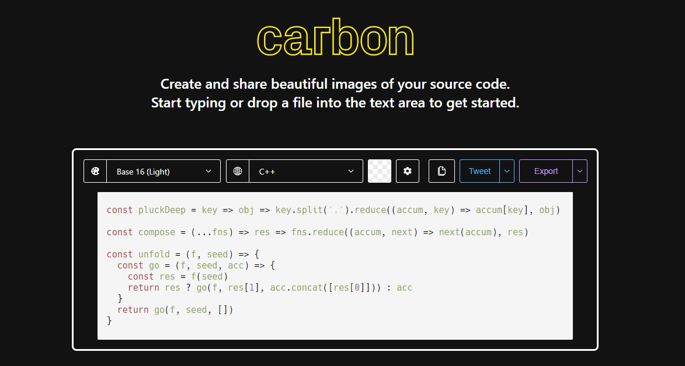

-----

## PPT 插入代码

[Carbon | Create and share beautiful images of your source code](https://carbon.now.sh/)

7个图片生成网站

[Top 7: Best Online Tools To Create Elegant Code Screenshots | Our Code World](https://ourcodeworld.com/articles/read/1451/top-7-best-online-tools-to-create-elegant-code-screenshots)

## 相关参考

[create source code image - Google 搜索](https://www.google.com.hk/search?q=create+source+code+image&newwindow=1&safe=strict&ei=_Q6dYNP6NOnVmAXk0ZDgAw&oq=create+source+code+image&gs_lcp=Cgdnd3Mtd2l6EANQAFgAYJcBaABwAHgAgAEAiAEAkgEAmAEAqgEHZ3dzLXdpeg&sclient=gws-wiz&ved=0ahUKEwiT7YSwyMbwAhXpKqYKHeQoBDwQ4dUDCA4&uact=5)

[6 Awesome Ways to Take A Screenshot of your Code ― Scotch.io](https://scotch.io/bar-talk/6-awesome-ways-to-take-a-screenshot-of-your-code)

[Carbon | Create and share beautiful images of your source code](https://carbon.now.sh/)

[carbon-app/carbon: Create and share beautiful images of your source code (github.com)](https://github.com/carbon-app/carbon)

[Instacode](http://instaco.de/)

[SRC to PNG converter (team411.github.io)](https://team411.github.io/src2img/)

[Which tool allows to generate such nice source code pictures? - Stack Overflow](https://stackoverflow.com/questions/17826129/which-tool-allows-to-generate-such-nice-source-code-pictures)

