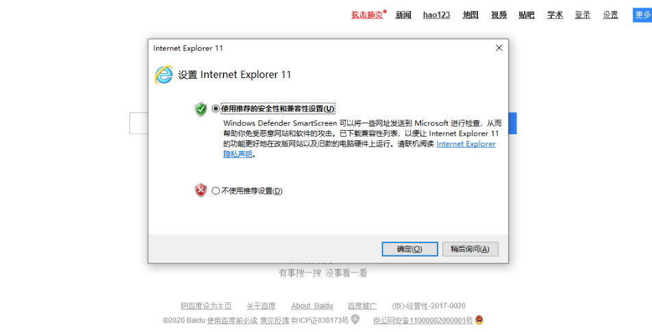

-----


## 简介


## scoop安装

确保[安装 PowerShell 5（](https://aka.ms/wmf5download)或更高版本，包括[PowerShell 核心](https://docs.microsoft.com/en-us/powershell/scripting/install/installing-powershell-core-on-windows?view=powershell-6)）和[.NET 框架 4.5（](https://www.microsoft.com/net/download)或更高版本）。

查看powershell 版本

```
Get-Host | Select-Object Version
```

------

在 PowerShell 中输入下面内容，保证允许本地脚本的执行：

```
set-executionpolicy remotesigned -scope currentuser
```

执行下面的命令安装 Scoop：

```
Invoke-Expression (New-Object System.Net.WebClient).DownloadString('https://get.scoop.sh')
```

或者

```
iwr -useb get.scoop.sh | iex
```

注意：如果遇到错误，则可能需要使用以下命令更改执行策略（即启用Powershell）

```
Set-ExecutionPolicy RemoteSigned -scope CurrentUser
```

测试一下

```
scoop help
```

------

### 自定义安装路径

```
[environment]::setEnvironmentVariable('SCOOP','D:\Scoop','User')
$env:SCOOP='D:\Scoop'
iex (new-object net.webclient).downloadstring('https://get.scoop.sh')
```

自定义路径 D:

将全局应用安装到自定义目录

假设目标目录是`D:\Applications\Scoop\globalApps`,在PowerShell命令控制台中运行：

```
[environment]::setEnvironmentVariable('SCOOP_GLOBAL','D:\Applications\Scoop\globalApps','Machine')
$env:SCOOP_GLOBAL='D:\Applications\Scoop\globalApps'
```

### scoop 安装失败常见解决办法


#### 安装中断


#### PowerShell的安全策略

报错信息

```powershell
PowerShell requires an execution policy in [Unrestricted, RemoteSigned, ByPass] to run Scoop.
For example, to set the execution policy to 'RemoteSigned' please run :
'Set-ExecutionPolicy RemoteSigned -scope CurrentUser'
```

解决：

修改PowerShell的安全策略，输入y确认

```
Set-ExecutionPolicy RemoteSigned -Scope CurrentUser
```


#### 无法连接到scoop 官网

```powershell
使用“1”个参数调用“DownloadString”时发生异常:“无法连接到远程服务器”
所在位置 行:1 字符: 1
+ iex (new-object net.webclient).downloadstring('https://get.scoop.sh')
+ ~~~~~~~~~~~~~~~~~~~~~~~~~~~~~~~~~~~~~~~~~~~~~~~~~~~~~~~~~~~~~~~~~~~~~
    + CategoryInfo          : NotSpecified: (:) [], MethodInvocationException
    + FullyQualifiedErrorId : WebException
```


切换命令安装

```
iex (new-object net.webclient).downloadstring('https://raw.githubusercontent.com/lukesampson/scoop/master/bin/install.ps1')
```

如果不行，请使用vpn安装或者指定相关端口

#### 连接超时

```powershell
iex : 使用“2”个参数调用“DownloadFile”是发生异常:“请求被中止: 未能创建 SSL/TLS 安全通道。”
所在位置 行:1 字符: 1
+ iex (new-object net.webclient).downloadstring('https://get.scoop.sh')
+ ~~~~~~~~~~~~~~~~~~~~~~~~~~~~~~~~~~~~~~~~~~~~~~~~~~~~~~~~~~~~~~~~~~~~~
    + CategoryInfo          : NotSpecified: (:) [Invoke-Expression], MethodInvocationException
    + FullyQualifiedErrorId : WebException, Microsoft.PowreShell.Commands.InvokeExpressionCommand
```


```powershell
[Net.ServicePointManager]::SecurityProtocol = [Net.SecurityProtocolType]::Tls12
```


如果是新系统，可以尝试以下操作：打开ie，在弹出的窗口点击确定




安装测试

```powershell
scoop help
```

```
Usage: scoop <command> [<args>]

Some useful commands are:

alias       Manage scoop aliases
bucket      Manage Scoop buckets
cache       Show or clear the download cache
checkup     Check for potential problems
cleanup     Cleanup apps by removing old versions
config      Get or set configuration values
create      Create a custom app manifest
depends     List dependencies for an app
export      Exports (an importable) list of installed apps
help        Show help for a command
hold        Hold an app to disable updates
home        Opens the app homepage
info        Display information about an app
install     Install apps
list        List installed apps
prefix      Returns the path to the specified app
reset       Reset an app to resolve conflicts
search      Search available apps
status      Show status and check for new app versions
unhold      Unhold an app to enable updates
uninstall   Uninstall an app
update      Update apps, or Scoop itself
virustotal  Look for app's hash on virustotal.com
which       Locate a shim/executable (similar to 'which' on Linux)


Type 'scoop help <command>' to get help for a specific command.
```


### scoop使用Aria2多线程下载

```
scoop install aria2
```


## scoop 基本命令 

| 命令      | 动作         |
| :-------- | :----------- |
| search    | 搜索软件名   |
| install   | 安装软件     |
| update    | 更新软件     |
| status    | 查看软件状态 |
| uninstall | 卸载软件     |
| info      | 查看软件详情 |
| home      | 打开软件主页 |

通过下面的命令查看具体的命令的使用方式

```
scoop help [command]
```

**示例:**

1. 列出已安装的所有包

   ```
   scoop list
   ```

2. Scoop 命令说明

   ```
   scoop help
   ```

3. 获取某个包的安装信息

   ```
   scoop info python
   ```

4. 打开某个包的官网

   ```
   scoop home python
   ```

5. 禁止某个包更新

   ```
   scoop hold python
   ```

### 使用代理

用于一些下载较慢的情况。具体使用见[官方Wiki](https://github.com/lukesampson/scoop/wiki/Using-Scoop-behind-a-proxy)。

这里仅记录使用当前用户的网络代理配置：

```
# 使用当前用户的默认代理
scoop config proxy currentuser@default

# 移除代理
scoop config rm proxy

# 设置代理(http) 示例
scoop config proxy 127.0.0.1:4412
```

### 检查问题

在安装各种包时，或者进行了一些配置，可能会造成一些冲突或错误，这时可以使用`scoop checkup`来检查问题，并按照其提示来解决。

而解决大部分问题的一个方案是**重置**：

```
scoop reset *
```

它会重置所有的环境变量、快捷方式以解决冲突。


## scoop 软件管理

```
scoop help install
```

```
Usage: scoop install <app> [options]

e.g. The usual way to install an app (uses your local 'buckets'):
     scoop install git

To install an app from a manifest at a URL:
     scoop install https://raw.githubusercontent.com/ScoopInstaller/Main/master/bucket/runat.json

To install an app from a manifest on your computer
     scoop install \path\to\app.json

Options:
  -g, --global              Install the app globally
  -i, --independent         Don't install dependencies automatically
  -k, --no-cache            Don't use the download cache
  -s, --skip                Skip hash validation (use with caution!)
  -a, --arch <32bit|64bit>  Use the specified architecture, if the app supports it
```

**示例**

```
scoop search git
scoop install git
scoop uninstall git
```

全局安装

```
scoop install oraclejdk8 -g;
```

### 软件更新

```
scoop status
scoop update git
# 更新所有包
scoop update *
scoop update * --global
# 清除旧版本安装信息
scoop cleanup *
scoop cleanup * --global
```

#### 导出安装软件列表

```
scoop.cmd export > app_list.txt
```

#### 更新所有安装软件

```
scoop update * && scoop cleanup *
```

#### Python 版本切换

### 使用Aria2多线程下载

```
scoop install aria2
```

如果用了`aria2`还是很慢，可以关闭它：

```
scoop config aria2-enabled false
```


## scoop 软件包管理

```
scoop help bucket
```

```
Usage: scoop bucket add|list|known|rm [<args>]

Add, list or remove buckets.

Buckets are repositories of apps available to install. Scoop comes with
a default bucket, but you can also add buckets that you or others have
published.

To add a bucket:
    scoop bucket add <name> [<repo>]

e.g.:
    scoop bucket add extras https://github.com/lukesampson/scoop-extras.git

Since the 'extras' bucket is known to Scoop, this can be shortened to:
    scoop bucket add extras

To list all known buckets, use:
    scoop bucket known
```

### 添加软件包

由于 Scoop 的存储桶本质上都是一个个 git 库，所以想要添加额外的存储库，需要有 git 环境支撑，输入 `scoop install git` 进行安装即可。

输入 `scoop bucket known` 就能查看官方已知的存储桶列表

```
scoop bucket add <仓库名>
"extras": "https://github.com/lukesampson/scoop-extras.git",
"versions": "https://github.com/scoopinstaller/versions",
"nightlies": "https://github.com/scoopinstaller/nightlies",
"nirsoft": "https://github.com/kodybrown/scoop-nirsoft",
"php": "https://github.com/nueko/scoop-php.git",
"nerd-fonts": "https://github.com/matthewjberger/scoop-nerd-fonts.git",
"nonportable": "https://github.com/oltolm/scoop-nonportable",
"java": "https://github.com/se35710/scoop-java",
"games": "https://github.com/Calinou/scoop-games"
```

**示例**

```
scoop bucket add dorado https://github.com/h404bi/dorado
scoop install dorado/<App 名>
```


例如

```
scoop bucket add extras
```

### 常用软件包列表

[known-application-buckets](https://github.com/lukesampson/scoop#known-application-buckets)

## scoop 卸载

[卸载scoop](https://github.com/lukesampson/scoop/wiki/Uninstalling-Scoop)


### scoop 创建自己的软件包

> 进阶操作
>
> #### 自定义软件包
>
> 应用清单
>
> [App Manifests](https://github.com/lukesampson/scoop/wiki/App-Manifests)
>
> 创建你自己的软件包
>
> [creating-your-own-bucke](https://github.com/lukesampson/scoop/wiki/Buckets#creating-your-own-bucket)


## 其他

### 安装 MySQL

由于包版本可能更新，Scoop 在包安装目录下提供一个`current`的软链接文件夹，表示当前使用版本的包。因此我们只需进入该目录查找我们需要的文件。 确定 MySQL 已安装，然后进入 Scoop 安装目录下的`/apps/mysql/current`目录，并进入其中的`bin`目录，并输入以下命令：

```
# 初始化本地数据库
mysqld --initialize
# 安装 MySQL 服务
mysqld --install mysql
# 启动 MySQL 服务
sc start mysql
# 使用初始密码进入 MySQL：初始密码为空
# mysql -u root -p
# 运行数据库
mysqld --console
# 修改 MySQL 8 的密码插件及初始密码
ALTER USER 'root'@'localhost' IDENTIFIED WITH mysql_native_password BY 'password';
# 退出数据库
quit;
# 停止 MySQL 服务
sc stop mysql
```


### 相关参考

[scoop官网](https://scoop.sh/)

[scoop GitHub](https://github.com/lukesampson/scoop)

[scoop 文档](https://github.com/lukesampson/scoop/wiki)

[少数派](https://sspai.com/post/52496)

[scoop-config](https://gythialy.github.io/scoop-config/)

[Linnzh/Blog/issues/42](https://github.com/Linnzh/Blog/issues/42)

[jszbug](https://jszbug.com/7gtwknbs.html)