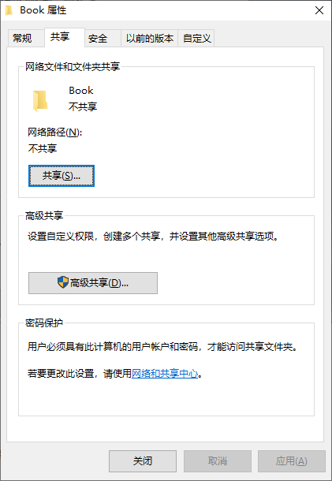
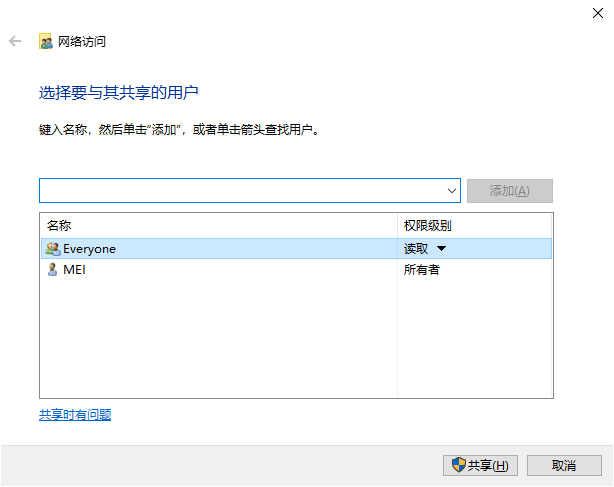
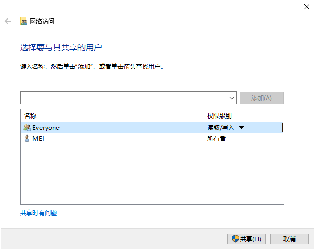
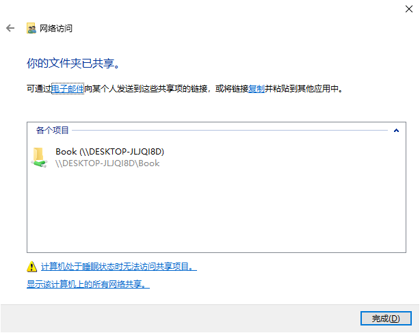
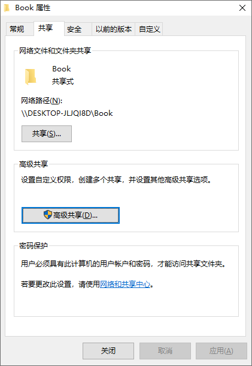

-----

## Windows10局域网共享文件夹

## 1.设置文件夹为共享，并添加everyone权限

添加共享用户

修改权限

根据共享路径访问文件夹

根据需要启用密码保护

## 相关参考

[在 Windows 10 中通过网络共享文件 (microsoft.com)](https://support.microsoft.com/zh-cn/windows/在-windows-10-中通过网络共享文件-b58704b2-f53a-4b82-7bc1-80f9994725bf)

[win10局域网共享文件夹_u011311291的博客-CSDN博客_win10局域网共享设置](https://blog.csdn.net/u011311291/article/details/88068448)