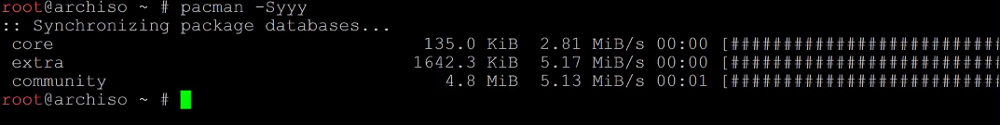

-----

有线连接 `# dhcpcd`

无线连接 `# wifi-menu`


# 安装


# 联网

检测网络

```
ip a
```

有线网连接


```
iwd+systemd-networkd
```


## 无线网

无线网连接

```
iwctl
```

进入iwd模式，输入

```text
device list
```

查看你的网卡名字，这里假设是wlan0，输入

```text
station wlan0 scan
```

检查扫描网络，输入

```text
station wlan0 get-networks
```

查看网络名字，假设名字叫BUPT-portal，输入

```text
station wlan0 connect BUPT-portal
```

接着输入密码（如果有密码的话），输入

```text
exit
```

退出iwd模式

连接成功之后，检查可以连接到pacman源

```text
pacman -Syyy
```


连接 看这个

https://lisongmin.github.io/os-systemd-networkd/


打开网卡

https://www.cnblogs.com/vachester/p/5637027.html 


硬件阻塞

Hard blocked

rfkill unblock

https://bbs.archlinux.org/viewtopic.php?id=173808

您可以使用这个索引号让 rfkill 停使或者使用某个设备，例如：

1. `rfkill block 0`

停用系统中第一个启用RFKill的设备。

您还可以使用 rfkill 阻断某一类设备，或者所有启用了RFKill的设备。例如：

1. `rfkill block wifi` 

停用系统中的所有Wi-Fi设备。要停用所有启用了RFKill的设备，请运行：

1. `rfkill block all`

要重新使用设备，请运行 `rfkill unblock`。要获得 rfkill 可停用的完整设备类别列表，请运行 rfkill help。

### 获取镜像

[https://wiki.archlinux.org/index.php/Mirrors_(%E7%AE%80%E4%BD%93%E4%B8%AD%E6%96%87)#%E5%BC%BA%E5%88%B6_pacman_%E5%88%B7%E6%96%B0%E8%BD%AF%E4%BB%B6%E5%8C%85%E5%88%97%E8%A1%A8](https://wiki.archlinux.org/index.php/Mirrors_(简体中文)#强制_pacman_刷新软件包列表)


连接成功之后，检查可以连接到pacman源

```text
pacman -Syyy
```

如图说明一切正常

重新设置mirrorlist（可选，建议）：

使用reflector来获取速度最快的6个镜像，并将地址保存至/etc/pacman.d/mirrorlist

```bash
reflector -c China -a 6 --sort rate --save /etc/pacman.d/mirrorlist
```

使用reflector来获取速度最快的6个镜像，并将地址保存至/etc/pacman.d/mirrorlist

```bash
reflector -c China -a 6 --sort rate --save /etc/pacman.d/mirrorlist
```


然后我们在配置文件 "/etc/pacman.conf" 里修改清华源

```bash
#added sources
[archlinuxcn]
Server=https://mirrors.tuna.tsinghua.edu.cn/archlinuxcn/$arch
[antergos]
Server=https://mirrors.tuna.tsinghua.edu.cn/antergos/$repo/$arch
```


### **更新系统时间**

使用`timedatectl`命令来确保时间是同步的：

```text
timedatectl set-ntp true
timedatectl status # 确保设置成功
```


# 分区 

[Fdisk文档](https://wiki.archlinux.org/index.php/Fdisk)


检查和分区

```
lsblk
```

```
cfdisk
```

分区格式化

```
mkfs.ext4
```

挂载分区

```
mount /dev/nvme0n1p5 /mnt
```

```
 # mkswap /dev/sdX2
 # swapon /dev/sdX2
```

```reStructuredText
mkdir /mnt/boot
```

```text
mount /dev/nvme0n1p2 /mnt/boot
```

挂载镜像

挂载，就是把设备依附到目录树上，linux下一切皆文件，挂载之后，这个分区就成了一个文件夹了。首先挂载根分区。

```text
mount /dev/sdb5 /mnt
```

由于需要使用UEFI引导，所以需要创建其挂载点并挂载。

```text
mkdir -p /mnt/boot/efi
mount /dev/sdb2 /mnt/boot/efi
```

还创建了home目录，所以也要挂载

```text
mount /dev/sdb7 /mnt/home
```


# 安装基本系统

```
pacstrap /mnt base linux linux-firmware nano
```


## 生成fstab文件

```bash
genfstab -U /mnt >> /mnt/etc/fstab
```

检查生成的fstab文件

```bash
cat /mnt/etc/fstab
```

## 正式配置新系统

切换到装好的系统

```bash
arch-chroot /mnt
```

# 进入系统

设置时区

```bash
ln -sf /usr/share/zoneinfo/Asia/Shanghai /etc/localtime
```

或

```bash
timedatectl set-timezone Asia/Shanghai
```

同步硬件时钟

```bash
hwclock --systohc
```

设置locale

```bash
nano /etc/locale.gen
```

生成locale

```bash
locale-gen
```


创建并写入/etc/locale.conf文件

```bash
nano /etc/locale.conf 
```

填入内容，注意这里只能填这个

```bash
LANG=en_US.UTF-8
```

5.创建并写入hostname

```bash
nano /etc/hostname
```


修改hosts

7.为root用户创建密码

```text
passwd
```

然后输入并确认密码（linux终端的密码没有回显，输完直接回车就好）

8.创建启动器

安装基本的包，这里使用grub为启动器

```bash
pacman -S grub efibootmgr networkmanager network-manager-applet dialog wireless_tools wpa_supplicant os-prober mtools dosfstools ntfs-3g base-devel linux-headers reflector git
```

**如果你不知道这些包的作用，请务必确保输入的指令与上面的一致**


检查完毕回车，需要选择直接回车就好，等待安装结束


输入

```bash
grub-install --target=x86_64-efi --efi-directory=/boot --bootloader-id=Arch
```


**为了让grub接管启动器之后还能正确地进入Windows系统**

首先创建文件夹

```bash
mkdir /mnt/windows10
```

挂载Windows系统所处的区，我这里是nvme0n1p4

```bash
mount /dev/nvme0n1p4 /mnt/windows10
```

生成grub.cfg

```bash
grub-mkconfig -o /boot/grub/grub.cfg
```


# 退出新系统并取消挂载

```
exit
```

或者

```
umount -a
```


```
reboot
```


# 进入系统

启动网络服务

```text
systemctl enable --now NetworkManager
```

设置WiFi

```text
nmtui
```


## 新建用户并授权

```text
useradd -m -G wheel mir
```

wheel后面是你的用户名，这里输入的是mir

为用户创建密码

```text
passwd mir
```

输入并确认密码

授权

```text
EDITOR=nano visudo
```

***

使用以下命令添加一个用户

```text
useradd -m -G "附加组" -s "登陆shell" "用户名"
```

其中：

- `-m`/`--create-home`：创建用户主目录/home/[用户名]
- `-G`/`--groups`：用户要加入的附加组列表；使用逗号分隔多个组，不要添加空格；如果不设置，用户仅仅加入初始组。
- `-s`/`--shell`：用户默认登录shell的路径

1. 赋予用户root权限

- 安装sudo软件包: `pacman -S sudo`
- 在`/etc/sudoers`文件中的`root ALL=(ALL) ALL`行下添加`yourname ALL=(ALL) ALL`

## 安装显卡驱动

安装AMD集显驱动

```text
pacman -S xf86-video-amdgpu
```

安装NVIDIA独显驱动

```text
pacman -S nvidia nvidia-utils
```


## 安装Display Server

这里用的是开源世界最为流行的xorg

```text
pacman -S xorg
```


## 安装字体

```
pacman -S noto-fonts-cjk
```

## 配置引导程序

> 安装引导程序之后才能进入系统

我用的引导程序是**[GRUB](https://wiki.archlinux.org/index.php/GRUB)**，首先安装必要的软件包：

```text
pacman -S grub efibootmgr
```

这里详细介绍一下UEFI系统如何安装配置GRUB：

1. 首先使用以下命令安装到系统：

```text
grub-install --target=x86_64-efi --efi-directory=/efi --bootloader-id=ArchLinux
```

note: 因为我的EFI分区在`/efi`目录下，所以上述命令的`--efi-directory`参数就设置为`/efi` 2. 使用`grub-mkconfig`生成grub配置文件：`grub-mkconfig -o /boot/grub/grub.cfg`

### **安装wifi网络管理工具**

如果你不安装的话，新系统是无法联网的哦 我用的是`iwd`，简单方便又强大

```text
pacman -S iwd
```

*如果你没有安装wifi网络管理工具，或者你安装的工具需要gui支持，那么恭喜你，你的系统还是无法联网，恭喜你可以重新体验一次完整的archlinux安装流程:)*

如果你按照我上面写的安装了wifi工具`iwd`，那么你还需要做一些额外的工作才能正常使用它： 启动iwd服务，为了以后的使用，建议直接设置为开机自启动，详细方法可以参考**[systemd](https://wiki.archlinux.org/index.php/Systemd#Using_units)**

```text
systemctl start iwd.service # 启动服务
systemctl enable iwd.service # 开机自启动服务
```

你是不是以为这样就能使用iwd来连接wifi了？那你就大错特错了， 

**你还需要启动`systemd-networkd.service`和`systemd-resolved.service`才行，因为新系统默认不会自启动这两个服务，需要你手动开启** 


# 安装显示服务器

## xorg


对于intel显卡，我安装的是官方的`xf86-video-intel`驱动：

```text
pacman -S xf86-video-intel
```

对于NVIDIA显卡，我安装的是开源驱动`nouveau`：

```text
pacman -S mesa xf86-video-nouveau
```

# 卸载

删除相关分区

删除UEFI 引导 win使用Easy UEFI


## QV2ray

```bash
yay -S v2ray qv2ray
```

设置好代理以后，如果想让终端使用代理，可以直接在终端里面写上(地址和端口写上自己设置好的)：

```bash
export all_proxy=socks5://127.0.0.1:1088
```

这样的设置只是让当前终端临时可用系统代理，比较好的做法是在`~/.xprofile`里面写上：

```bash
alias proxy_up='export all_proxy=socks5://127.0.0.1:1088'
alias proxy_down='unset all_proxy'
```

然后在自己想用代理的时候就用上`proxy_up`，想要关掉代理的时候就用`proxy_down`。 可以使用`curl -i httpbin.org/get`来查看自己的ip，如果确实发生了改变，那应该就是成功地设置代理了。