-----

## An Importance Sampling Method for arbitrary BRDFs used in Global Illumination Applications

> 一种全局照明应用中任意BRDFs的重要采样方法
>

## Abstract 摘要

全局照明算法应用：

- 现代电影的特效
- 室内灯光设计
- 电子游戏

真实感图像渲染

- 数值计算模拟光的传播[Mil84, WRC88, GSCH93, GTGB84, CWH93]
- 全局照明算法[wh80, CPC84, Kaj86, WH92]
- 提高蒙特卡洛方法[VG94, Sbe96, Vea97, BSW00, ARBJ03,BGH05, JTE05, CJAMJ05, CETC06]  

本文主要内容：

1. 全局照明反射模型的最新技术
2. 一个适合全局照明系统的场景编辑器，自研图形格式：GRF
3. BRDF 编辑器
4. 一般BRDFs的有效采样
5. 有效的光照采样和BRDF产品功能

## 第一章 Introduce 简介

### 1.1Realistic Image Synthesis 真实感图形生成

全局照明是计算机图形学的一个领域，它的目标是产生真实的图像，展示光与真实物体相互作用时产生的大部分效果。这是一个主要目标，但目前这个目标是有限的，因为模仿自然从来不是一项简单的任务。必须考虑以下几个方面:

- 几何模型的构建
- 纹理和透明度的应用
- 照明和阴影技术
- 使用硬件技术实现实时可视化

-----

光照和阴影模型来计算表面上每一点的强度和颜色。

有两类照明算法:

- Local Illumination methods (LI) 局部照明方法
- Global Illumination method (GI) 全局照明方法

> 它们之间的关系取决于物体之间是否有相互反射。

-----

场景中呈现的物体的外观、亮度和颜色将取决于：

- 表面特性:色彩、透明度、反射率等。
- 观察者在现场的位置。
- 照明条件，如光源的强度、几何形状和位置，
- 环境和大气条件(雾、烟等)。

> 阴影计算的核心集中在模拟光与物体的复杂相互作用。在现实意义上是复杂的，数以百万计的相互反射发生，因此很难完全模拟它们。为了简化这一过程，我们使用了理想漫反射面和理想镜面等理论情况。

### 1.2 The dual nature of light 光的波粒二象性

#### The Propagation of Light  光的传播

可见光，波长从400到700纳米不等。

700纳米以上的波长是肉眼不可见的，它们对应于所谓的红外光。在400纳米以下的光叫做紫外线。

对应的电磁辐射频率 $3.84 \times 10^{14}$到$7.69 \times 10^{14} \mathrm{~Hz}$

#### Interaction of Light and Matter 光与物质的相互作用

光照和着色模型需要考虑光与物质的相互作用，需要考虑折射和反射。

### 1.3 Representation of Surfaces 曲面的球面表示

描述物体表面反射行为的方法是双向反射分布函数(BRDF)。这个数学函数是双向的，因为它取决于两个方向，一个指向观察者，另一个指向光源。

通过这种方式，BRDF或反射率模型描述了反射光的颜色和分布。选择特定的模型和参数使我们能够模拟特定类型的材料，因此它是真实图像生成的重要组成部分。

## 第二章 Reflectance models in Global Illumination 全局光照的反射模型

### 2.1 A Light Model for Global Illumination 全局光照的灯光模型

#### Mathematical Notation 数学符号

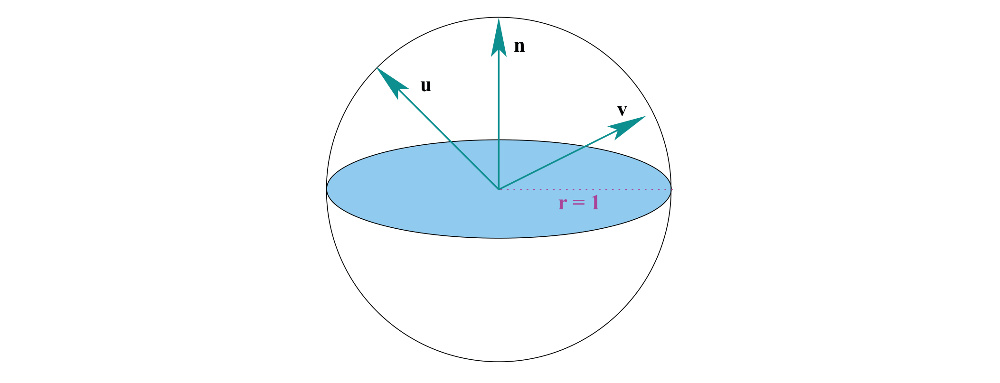

- $\mathcal{S}^{2}$域是所有标准化方向的集合。XY平面把球体分成两个相等的半球。

- surface normal 表面法线 定义为z轴方向的单位向量

$$
\mathbf{n} \stackrel{\text { def }}{=}(0.0 .1)
$$

- 正面半球定义 Omegasub

$$
\Omega \stackrel{\text { def }}{=} \quad\left\{\mathbf{v} \in \mathcal{S}^{2} \mid \mathbf{v} \cdot \mathbf{n}>0\right\}
$$

- 反面半球定义

$$
\mho \stackrel{\text { def }}{=}\left\{\mathbf{v} \in \mathcal{S}^{2} \mid \mathbf{v} \cdot \mathbf{n} \leq 0\right\}
$$

-----

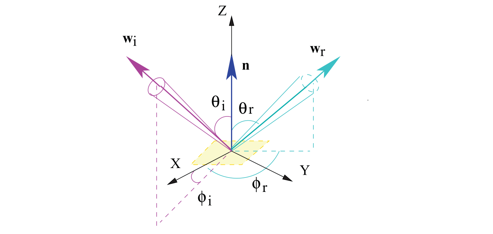

- 在局部坐标系中入射向量和反射向量
- 极角 polar angle  $\theta_{\mathbf{u}}$  向量和Z轴之间的夹角
- 方位角 azimuthal angle  $\phi_{\mathbf{u}}$  在平面XY上关于X轴的投影
- 极坐标和笛卡尔坐标的转换

$$
\begin{array}{l}
x_{\mathbf{u}}=\cos \left(\phi_{\mathbf{u}}\right) * \sin \left(\theta_{\mathbf{u}}\right), \\
y_{\mathbf{u}}=\sin \left(\phi_{\mathbf{u}}\right) * \sin \left(\theta_{\mathbf{u}}\right), \\
z_{\mathbf{u}}=\cos \left(\theta_{\mathbf{u}}\right)
\end{array}
$$

-----

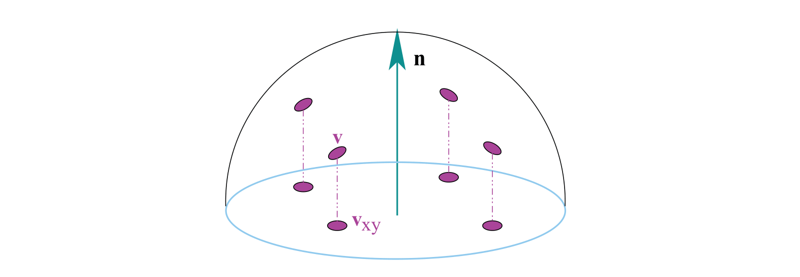

- 二维平面集合定义

$$
\mathbf{v}_{x y} \in \mathcal{D}^{2}
$$

$$
\mathcal{D}^{2} \stackrel{\text { def }}{=} \quad\left\{(x, y) \in E^{2} \text { t.q. } x^{2}+y^{2}<1\right\}
$$

- 映射函数 $h:\Omega \rightarrow \mathcal{D}^{2}$ 映射半球面到二维平面

$$
h(\mathbf{v})=h\left(x_{\mathbf{v}}, y_{\mathbf{v}}, z_{\mathbf{v}}\right) \stackrel{\text { def }}{=}\left(x_{\mathbf{v}}, y_{\mathbf{v}}\right)=\mathbf{v}_{x y}
$$

- h的反函数 （根据二维平面的点返回半球面坐标）

$$
\mathbf{v}=h^{-1}\left(\mathbf{v}_{x y}\right)=h^{-1}\left(x_{\mathbf{v}}, y_{\mathbf{v}}\right)=\left(x_{\mathbf{v}}, y_{\mathbf{v}}, z_{\mathbf{v}}\right) \mid z_{\mathbf{v}}=\sqrt{1-x_{\mathbf{v}}^{2}-y_{\mathbf{v}}^{2}}
$$

- steradian 球面度 符号: $\sigma $

  球面度的微分公式

$$
d \sigma(\mathbf{v}) \stackrel{\text { def }}{=} \frac{d A\left(\theta_{\mathbf{v}}, \phi_{\mathbf{v}}\right)}{r^{2}}=\frac{\left(r d \theta_{\mathbf{v}}\right)\left(r \sin \left(\theta_{\mathbf{v}}\right) d\left(\phi_{\mathbf{v}}\right)\right)}{r^{2}}=\sin \left(\theta_{\mathbf{v}}\right) d\left(\theta_{\mathbf{v}}\right) d\left(\phi_{\mathbf{v}}\right)
$$

- 对任意向量 $\mathbf{v} \in \Omega$定义立体投影角$\sigma_{p}$为:

$$
d \sigma_{p}(\mathbf{v}) \stackrel{\text { def }}{=}(\mathbf{v} \cdot \mathbf{n}) d \sigma(\mathbf{v})
$$

-  area measure 度量面积 $ d A(x, y)$

$$
\begin{array}{c}
d A\left(\mathbf{u}_{x y}\right)=d A\left(x_{\mathbf{u}}, y_{\mathbf{u}}\right)=d x d y=d \sigma_{p}\left(h^{-1}\left(x_{\mathbf{u}}, y_{\mathbf{u}}\right)\right) \\
d \sigma_{p}(\mathbf{u})=d A(h(\mathbf{u}))=d A\left(\mathbf{u}_{x y}\right)
\end{array}
$$

#### Radiant Flux Density 辐射通量密度

#### 基础物理量

|                    物理量                    |      符号      |                     国际单位制                     |                  注释                  |
| :------------------------------------------: | :------------: | :------------------------------------------------: | :------------------------------------: |
|        辐射出射度（Radiant exitance）        |       Me       |                    瓦特每平方米                    |           表面出射的辐射通量           |
|             辐射度（Radiosity）              | *J*e or *J*eλ  |                    瓦特每平方米                    |      表面出射及反射的辐射通量总和      |
|              辐射率（Radiance）              |       Le       |                瓦特每球面度每平方米                | 每单位立体角每单位投射表面的辐射通量。 |
|           辐射能（Radiant energy）           |       Qe       |                        焦耳                        |                 能量。                 |
|    辐射能量密度（Radiant energy density）    |      *ω*e      |                    焦耳每立方米                    |                                        |
|        辐射强度（Radiant intensity）         |       Ie       |                    瓦特每球面度                    |        每单位立体角的辐射通量。        |
|        辐射曝光量（Radiant exposure）        |      *H*e      |                    焦耳每平方米                    |                                        |
|           辐射通量（Radiant flux）           |       Φe       |                        瓦特                        | 每单位时间的辐射能量，亦作“辐射功率”。 |
|             辐照度（Irradiance）             |       Ee       |                    瓦特每平方米                    |          入射表面的辐射通量。          |
| 光谱辐射出射度（Spectral radiant emittance） | *M*eλ 或 *M*eν |        瓦特每立方米 *或* 瓦特每平方米每赫兹        |  表面出射的辐射通量的波长或频率的分布  |
|       光谱辐射率（Spectral radiance）        | *L*eλ 或 *L*eν | 瓦特每球面度每立方米 或 瓦特每球面度每平方米每赫兹 |          常用W⋅sr−1⋅m−2⋅nm−1           |
|      光谱辐照度（Spectral irradiance）       |    Eλ 或 Eν    |        瓦特每立方米 *或* 瓦特每平方米每赫兹        |       通常测量单位为 W·m−2·nm−1        |
|          光谱功率（Spectral power）          |     *Φ*eλ      |                      瓦特每米                      |           辐射通量的波长分布           |
|        光谱强度（Spectral intensity）        |     *I*eλ      |                  瓦特每球面度每米                  |           辐射强度的波长分布           |

- 辐射通量密度是每个单位区域在表面上的辐射通量。辐射通量密度以每平方米瓦特（Wm）为单位进行测量

**能量（Energy）**

能量是所有辐射学中单位的起点，它的单位是焦耳（J）。光源不断地向外发射光子，每一个光子都处在特定的波长上并且携带一定数量的能量。一个波长为$\lambda$的光子所携带的能量为：
$$
Q=\frac{h c}{\lambda}
$$
式子中 $h$ 和 $c$ 为物理学中的两个常量, 其中 $c$ 为光速, $c \approx 299,472,458 m / s, h$ 为 普朗克常量, $h \approx 6.626 \times 10^{-34} \mathrm{~m}^{2} \cdot \mathrm{kg} / \mathrm{s}$ 。

**通量（Flux）**

能量是物理系统在一定时间内做功本领的度量。在处理渲染问题时，基于稳态假设，我们通常是在一个很短的时间跨度上对光进行度量。

**辐射通量**（Radiant flux），又称功率（Power），是单位时间内通过某一个表面或者区域的能量的总和。辐射通量可以通过计算能量与时间的微商得到
$$
\Phi=\lim _{\Delta t \rightarrow 0} \frac{\Delta Q}{\Delta t}=\frac{d Q}{d t}
$$
辐射通量的单位是焦耳每秒 $(J / s)$ 或者瓦特 $(W)$, 前者是后者的定义，而后者更加常用。

离开物体(考虑表面区域)的功率是由物体发出的$\Phi_{e}$的功率和从入射通量$\Phi_{i}$反射的部分$\Phi_{r}$的能量所产生的。
$$
\Phi=\Phi_{e}+\Phi_{r}
$$
注意，我们也可以称透射通量为$\Phi_{t}$。

**辐照度与辐射出射度（Irradiance and Radiant Exitance）**

- 给定有限面元 $A$, 可以定义出该面元上功率关于面积的密度 $\frac{\Phi}{A}$ 。这样的一个物理量在表示到 达物体表面的平均功率密度时叫做**辐照度** (irradiance)，此时用 $E$ 表示;

-  在表示离开物体表面 的平均功率密度时叫做**辐射出射度**（radiant exitance)，此时用 $M$ 表示。辐照度和辐射出射度 的单位是瓦特每平方米 $\left(W / m^{2}\right)$ 。

-----

-  表面出射的辐射通量，用M 或者 exitance表示：

$$
M(x)=\frac{d \Phi(x)}{d A(x)}
$$

- 入射表面的辐射通量，用E 或者 irradiancia 表示：

$$
E(x)=\frac{d \Phi_{i}(x)}{d A(x)}
$$

- 离开表面的能量是自身发出的能量和反射的能量的总和：

$$
M(x)=M_{e}(x)+M_{r}(x)=\frac{d \Phi_{e}(x)}{d A(x)}+\frac{d \Phi_{r}(x)}{d A(x)}
$$

#### The Radiance Function 辐射率函数

**辐射率（Radiance） **：每单位立体角每单位投射表面的辐射通量。

辐射率函数 ：计算给定目标点和目标方向的光照亮度
$$
d L_{r}(x, \mathbf{u})=\frac{d^{2} \Phi(x, \mathbf{u})}{d A_{p}(x) d \sigma(\mathbf{u})}=\frac{d^{2} \Phi(x, \mathbf{u})}{\cos (\mathbf{u}) d A(x) d \sigma(\mathbf{u})}=\frac{d^{2} \Phi(x, \mathbf{u})}{d A(x) d \sigma_{p}(\mathbf{u})} .
$$
单位：
$$
W \cdot m^{-2} \cdot s r^{-1}
$$

-----

同时可以得出入射方向的辐射率计算公式：
$$
d L_{i}(x, \mathbf{v})=\frac{d\left(d \Phi_{i}(x, \mathbf{v})\right)}{d A(x) \cos (\mathbf{v}) d \sigma(\mathbf{v})}=\frac{d E(x, \mathbf{v})}{d \sigma_{p}(\mathbf{v})}
$$

$$
d E(x, \mathbf{v})=d L_{i}(x, \mathbf{v}) \cos (\mathbf{v}) d \sigma(\mathbf{v})
$$

-----

如果我们对所有的立体角的辐射进行积分，我们就得到了单位时间单位面积内到达或离开表面的能量。出射度与辐照度的积分形式为:
$$
\begin{aligned}
M_{r}(x) &=\int_{\Omega} d L_{r}(x, \mathbf{u}) d \sigma_{p}(\mathbf{u}) \\
E(x) &=\int_{\Omega} d L_{i}(x, \mathbf{v}) d \sigma_{p}(\mathbf{v})
\end{aligned}
$$

### 2.2 Dispersion of Light in a Surface 光在表面上的散射

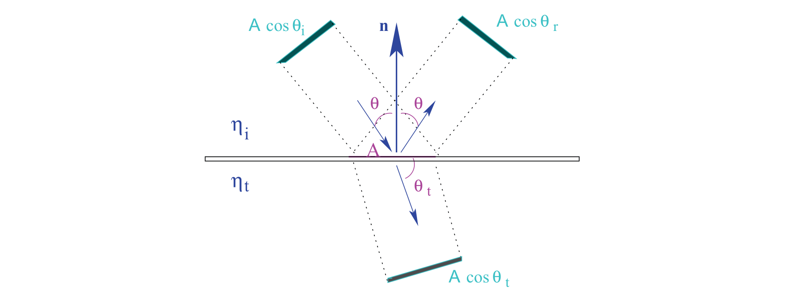

- 当光通过不同的介质时，一部分在介质上反射，另一部分在改变其方向后传播。
- 透射、反射和折射现象是微观事件的宏观表现。

- 使用的规则是基本的能量守恒: 如果我们知道两种介质的折射率，就有可能计算出它所传递的能量。

$$
\Phi_{i} A \cos \left(\theta_{i}\right)=\Phi_{r} A \cos \left(\theta_{r}\right)+\Phi_{t} A \cos \left(\theta_{i}\right)
$$

#### The Law of Reflection 反射定律

- 反射现象使我们能够看到不发光的物体。
- 物体根据其表面以不同的方式反射。
- 反射光线的表面以不同的方式产生光。
- 反射光只向一个方向发出，称为理想镜面反射。
- 反射光向各个方向发散，称为理想漫反射。

**反射定律:**

1. 镜面的入射、反射和法向量在同一平面上。
2. 入射角和反射角相同。

**给定入射方向计算反射方向：**

$$
\begin{array}{l}
\theta_{r}=\theta_{u} \\
\phi_{r}=\phi_{u} \pm \pi, \\
\mathbf{r}=\mathbf{u}-2(\mathbf{u} \cdot \mathbf{n}) \mathbf{n} .
\end{array}
$$

#### The Law of Refraction 折射定律

- 当一束光撞击两种密度(波速)不同的透明介质之间的界面时，光在传输过程中发生折射。
- 光线方向由于入射角和介质的折射率的关系，会发生偏移。
- **全反射现象：**对于一个给定的入射角，折射角是$99^{\circ}$。这种现象叫做全反射。

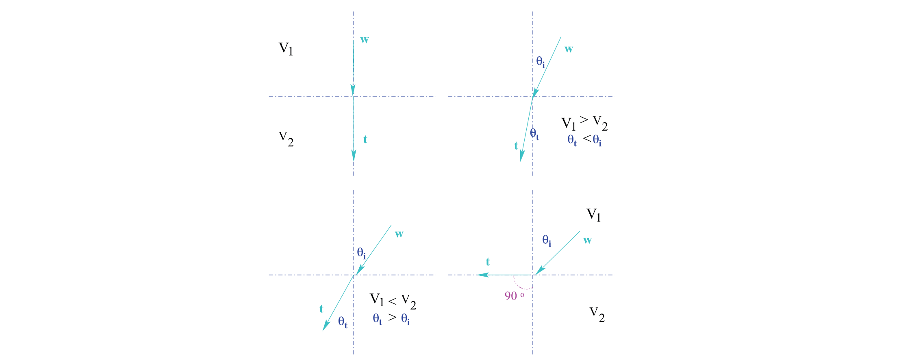

- 第一行，当一束光进入光学密度较大的介质，即具有较大折射率的介质时，光会向垂线方向弯曲。

- 第二行，当光束从密度较高的介质流向密度较低的介质时，它会偏离垂线。

------

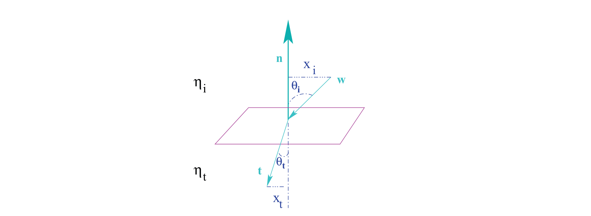

- 入射角与反射角之差的关系是一个定值，用来定义折射率$\eta=x_{i} / x_{t}$

**菲涅尔定律**

1621年，Willebrord Snell阐明了折射现象的定律:

- 入射、反射和折射的光线都在入射平面内
- $\eta_{i} \sin \theta_{i}=\eta_{t} \sin \theta_{t}$

#### The Bidirectional Scattering Distribution Function 双向反射分布函数

- 真实的物体不是纯粹的反射性或纯粹的传递性。
- BSDF or BTDF（双向散射分布函数），是描述散射光的物理行为的数学函数。

$$
\operatorname{BRDF} f_{r}: \Omega_{i} \times \Omega_{r} \longrightarrow \mathbb{R}
$$

$$
\text { BTDF } f_{t}: \Omega_{i} \times \Omega_{t} \longrightarrow \mathbb{R}
$$

- 单位：$s r^{-1}$

### 2.3 The Local Reflection of Light 光的局部反射

#### The Bidirectional Reflectance Distribution Function 双向反射分布函数

- 双向反射率分布函数，是曲面反射率的参数表示。
- 这个函数表示光与物质的相互作用，通过将来自v方向的辐射与离开物体的u方向的辐射联系起来。这是下面关系的常数值:

$$
d L_{r}(x, \mathbf{u}) \propto d E_{i}(x, \mathbf{v})
$$

BRDF是6个参数的函数，但为了降低其复杂度和维数，通常需要进行一些简化。

如果假设：

- 反射率的分布不随表面变化。没有必要把公式中隐含的点x表示出来。
- 光立即反射，因此没有必要直接表达时间变量。这样的简化是不可能模拟磷光现象的。
- 射出的光束与入射的光束有相同的波长λ，即相同的频率ν -;我们忽略了荧光现象。
- 将亮度参数和BRDF、λ简化为三个不同的颜色(RGB)值带。波长隐含在公式中。

则：
$$
f_{r}(\mathbf{u}, \mathbf{v}) \in[0, \infty)
$$
等价于：
$$
f_{r}\left(\theta_{\mathbf{u}}, \phi_{\mathbf{u}}, \theta_{\mathbf{v}}, \phi_{\mathbf{v}}\right)
$$
公式：
$$
f_{r}(\mathbf{u}, \mathbf{v})=\frac{d L_{r}(\mathbf{u})}{d E_{i}(\mathbf{v})}=\frac{d L_{r}(\mathbf{u})}{L_{i}(\mathbf{v}) d \sigma_{p}(\mathbf{v})}
$$

-----

BRDF属性：

- Symmetry 对称性

  它必须服从*Helmholz Reciprocity Rule*，这是光的物理结果，表明BRDF是相对于u和v对称的。

$$
f_{r}(\mathbf{u}, \mathbf{v})=f_{r}(\mathbf{v}, \mathbf{u}) \quad \forall \mathbf{u}, \mathbf{v} \in \Omega
$$

- Energy Conservation Law 能量守恒定律

  入射辐射不能能在任何一点上完全被反射

$$
\int_{\Omega} f_{r}(\mathbf{u}, \mathbf{v}) d \sigma_{p}(\mathbf{v})<1 \quad \forall \mathbf{u} \in \Omega
$$

-----

BRDF 局部坐标系的一种替代方法：

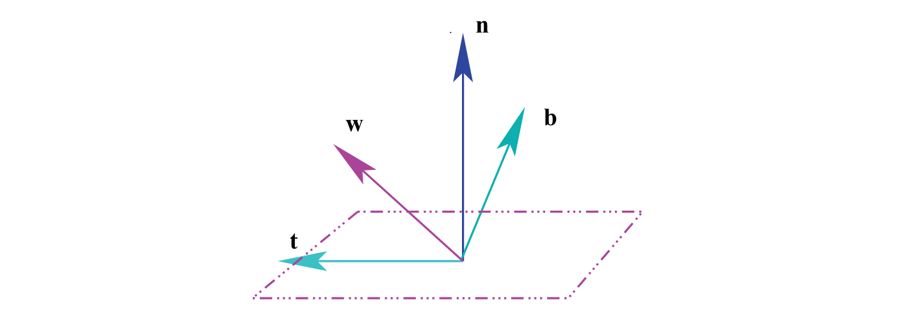
$$
\begin{array}{l}
\mathbf{b} \stackrel{\text { def }}{=}(\mathbf{w} \times \mathbf{t}) \\
\cos \left(\theta_{\mathbf{w}}\right) \stackrel{\text { def }}{=}(\mathbf{n} \cdot \mathbf{w}), \\
\tan \left(\phi_{\mathbf{w}}\right) \stackrel{\text { def }}{=} \frac{(\mathbf{b} \cdot \mathbf{w})}{(\mathbf{t} \cdot \mathbf{w})}
\end{array}
$$

- 副法向量b
- 切向量t

-----

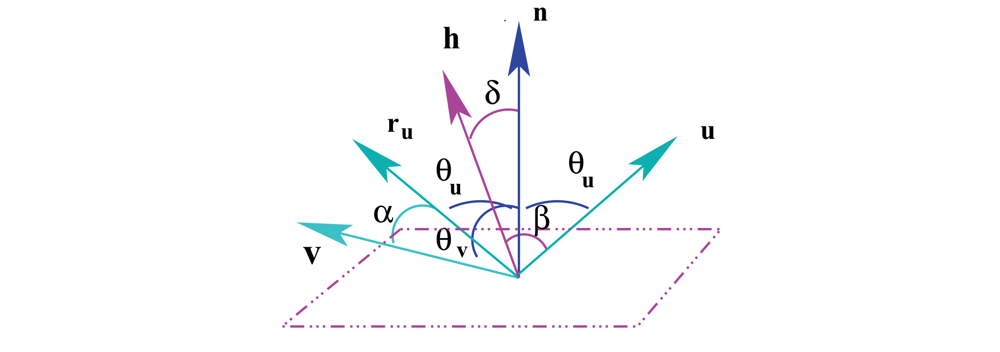
$$
\forall \mathbf{u}, \mathbf{v}, \mathbf{n} \in \Omega\left\{\begin{array}{l}
\alpha \stackrel{\text { def }}{=} \cos ^{-1}\left(\mathbf{r}_{\mathbf{u}} \cdot \mathbf{v}\right), \\
\beta \stackrel{\text { def }}{=} \cos ^{-1}(\mathbf{u} \cdot \mathbf{h}), \\
\delta \stackrel{\text { def }}{=} \cos ^{-1}(\mathbf{h} \cdot \mathbf{n}), \\
\mathbf{h} \stackrel{\text { def }}{=} \frac{\mathbf{u}+\mathbf{v}}{\|\mathbf{u}+\mathbf{v}\|} .
\end{array}\right.
$$

-----

**halfway vector 半角向量**

通常用来计算高光，这种方法避免了反射向量的显式计算，并且易于实现。

**BRDF 分类:**

- Approximated 近似性

  主要目的是提供一个简单的公式，专门设计来模拟一种反射。因此，一个快速的计算模型，可由参数调整，而不背后的物理基础。例如Phong和Blinn-Phong。

- Theoretical 理论性

  这些模型试图近似真实的光色散现象。它们需要更多的计算工作，这有时会区分它们，它们通常不被用于渲染系统。例如Cook-Torrance。每个理论模型都局限于特定类型的材料。

- Experimental 实验性

  有时理论模型并不那么实用。这就是为什么有些模型通过测量数据来模拟真实现象的原因。BRDF可以通过光度仪获得，手动或机械地改变光源和传感器。这一过程可能需要数小时，因此其他技术使用数码相机在一张照片上获取许多BRDF样本。该方法给出的公式也可以通过参数进行调整，但不同之处在于它们是用来调整测量数据的。

**对物质的分类：**

- Isotropic BRDFs 各向同性

  代表一种材料，其反射不取决于表面的方向，通常是粗糙的。可以简化BRDF参数：

$$
f_{r}\left(\theta_{i}, \theta_{r}, \phi_{r}-\phi_{i}\right)
$$

$$
\forall \alpha \in[0,2 \pi], \alpha>0 \Longrightarrow f_{r}\left(\theta_{r}, \phi_{r}, \theta_{i}, \phi_{i}\right)=f_{r}\left(\theta_{r}, \phi_{r}+\alpha, \theta_{i}, \phi_{i}+\alpha\right)
$$

- Anisotropic BRDFs 同向异性

  即使矢量u和v是固定的，当表面以n为角α旋转时，光的反射也会不同。这种材料给条纹外观看到的是拉丝金属效果。

#### Representations for the BRDF 表示BRDF

- 复杂和精细的BRDFs经常考虑到入射和出射角、波长、偏振、位置和时间。

- 对于计算机图形学来说，有许多变量，因此这会导致冗长的计算。更简单的BRDFs在计算光传输时考虑了射线光学而不是波动光学。

- 射线光学把光看作不相互作用的直线射线，每一条射线都携带一定的能量。射线光学通过忽略波长简化了方程的符号和表达式。

- 由于忽略了波长，因此也忽略了光波相互作用所产生的干涉、衍射和偏振的影响。

- 传统上，计算机图形系统要么依赖于分析模型，要么必须存储大量数据来表示，即使是简单的BRDFs。

- 最简单的BRDF表示将BRDF的样本存储在一个规则的四维网格上，并在它们之间进行插值。采用这种方法，插值后的数据容易产生噪声，结果不理想。此外，在掠射角附近通常会有缺失的数据点。

- 除这些问题外，存储一个完整的BRDF，可能需要很多兆字节。

- 鉴于BRDFs的大小和高维，许多技术已经开发出来，以有效地存储和计算它们：

  例如:拟合数据到一个解析模型，使用样条贴片，球面谐波基函数，球面小波和泽尼克多项式。使用前面提到的技术之一来更改变量可以获得更有效的表示方法。使用球谐波来表示BRDF是另一种方法。正弦和余弦的球形类似物，位于频域中。信号的每一部分都被称为基函数，所有基函数的和可以精确地再现原始信号。因为可能需要无数个基函数来精确地重现所需的BRDF，通常只使用这些基函数的子集。使用太少的基函数会导致视觉上的错误，使用太多的基函数在计算上非常昂贵。

- BRDF的因式分解是一种成本较低的方法，可以准确地表示BRDF，也适用于蒙特卡罗渲染系统中的采样。

#### The Surface Reflectance 表面反射率的测定

- （reflectance function）反射函数$\rho$或反射率（albedo）决定了反射能量与入射能量的比值。
- 它接受0到1之间的值，并且没有单位。
- BRDF表现为方向依赖性，反照率只是一个比值。

- 在一个点的反射率计算使用BRDF对给定方向的积分:

$$
\rho(\mathbf{u}) \stackrel{\text { def }}{=} \int_{\Omega} f_{r}(\mathbf{u}, \mathbf{v}) \cos (\mathbf{v}) d \sigma(\mathbf{v}) .
$$

-----

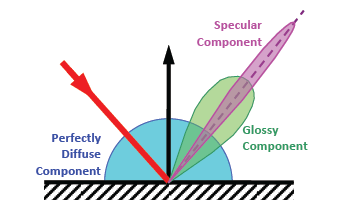

光散射现象可以分为三个部分：

- 均匀漫反射
- 方向漫反射
- 镜面反射

- 镜面反射是一种适用于镜面的现象。它的特征是镜面反射率$\rho_{s}(\mathbf{u}) \in[0,1)$，依赖于入射角和菲涅耳系数。

- 均匀漫反射$\rho_{d} \in[0,1)$，或兰伯特分量（Lambertian component），不依赖于入射方向，在每个方向上都相等地反射光。这是一种理想的现象，因为没有纯粹的漫反射材料。

- 方向漫反射分量，可以考虑不同类型的反射率。

  设$\rho_{h d}(x, \mathbf{u})$为半球方向的反射率，即半球上光照在给定方向上的反射率。

$$
\rho_{h d}(x, \mathbf{u})=\frac{L_{r}(x, \mathbf{u})}{E(x)}=\int_{\Omega} f_{r}(x, \mathbf{u}, \mathbf{v}) d \sigma_{p}(\mathbf{u}) .
$$

- 与方向漫反射分量相关的倒数是方向半球反射率(directional-hemispherical reflectance)，即整个反射半球的积分。

  这两个函数是相同的$\rho_{h d}=\rho_{d h}$，因此我们使用唯一的符号$\rho$。

$$
\rho_{d h}(x, \mathbf{v})=\frac{d E_{r}(x, \mathbf{v})}{d E_{i}(x)}=\int_{\Omega} f_{r}(x, \mathbf{u}, \mathbf{v}) d \sigma_{p}(\mathbf{v})
$$

### The Fresnel Equations 菲涅耳方程

- 当光照射到一个表面并发生反射或透射时，我们不仅需要知道光的新方向，我们还需要知道被反射或传递的能量的比例: 反射率 (reflectivity) R和透射率  (transmittance) T;
- 它们是用麦克斯韦方程组求解的。在 *polished surfaces* 的情况下，这些方程被称为菲涅耳方程。

- 有两种类型发方程：

  - 对于本质上不含锰的介质材料，例如晶体

  - 对于电导体，例如金属。在任何一种情况下，光的偏振都被考虑，并且两个系数与反射和透射现象相关。

菲涅尔方程：
$$
\begin{array}{c}
L_{r}=F L_{i} \\
L_{t}=T\left(\frac{\eta_{t}}{\eta_{i}}\right)^{2} L_{i}
\end{array}
$$

-----

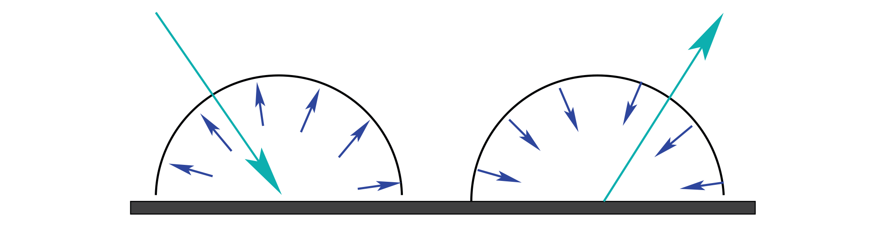

> 方向-半球形反射率 (directional-hemispherical) 和半球形-方向反射率 (hemispherical-directional) 相同。

### 2.4 The Radiance Equation

是Kajiya首先提出，用二阶Fredholm积分来表示光传输方程(LTE)。

光传输方程描述了均衡的辐射分布：$L_{i}(x, \mathbf{v})=L_{r}\left(y, \mathbf{u}^{\prime}\right)$ , y是最近的交点

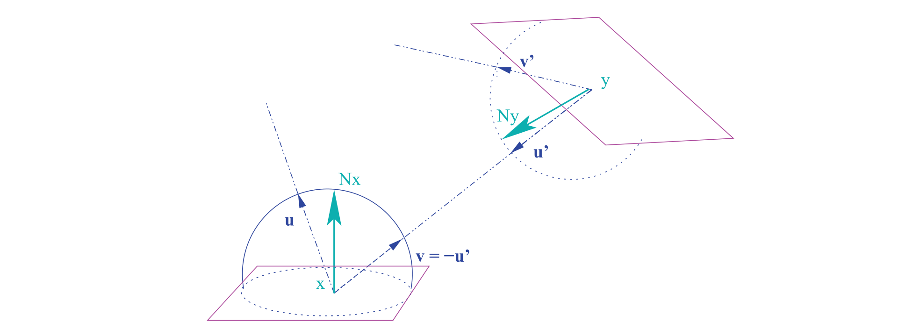

> 光线离开点y到达点x。

-----

$$
\begin{aligned}
L_{r}(\mathbf{u}) & \stackrel{\text { def }}{=} \int_{\Omega} d L_{r}(\mathbf{u}) d \sigma(\mathbf{v}) \\
&=\int_{\Omega} f_{r}(\mathbf{u}, \mathbf{v}) L_{i}(\mathbf{v})(\mathbf{v} \cdot \mathbf{n}) d \sigma(\mathbf{v}) .
\end{aligned}
$$
使用投射立体角测量的辐射方程的最终表达式
$$
\begin{aligned}
L(\mathbf{u}) &=L_{e}(\mathbf{u})+L_{r}(\mathbf{u}) \\
&=L_{e}(\mathbf{u})+\int_{\Omega} f_{r}(\mathbf{u}, \mathbf{v}) L_{i}(\mathbf{v}) d \sigma_{p}(\mathbf{v}) .
\end{aligned}
$$

## 第三章 BRDF模型的研究

着色模型并不总是考虑现实(或物理)，通常认为眼睛看不见的东西不需要计算。

### 3.1 Ideal Specular Reflection (1621) 理想的镜面反射

理想的镜面反射遵循反射定律，向单一方向反射，除反射方向r外，其他方向总是为零。: $L_{r, s}(x, \mathbf{u})=L_{i}\left(x, \mathbf{r}_{\mathbf{u}}\right)$

**方程：**
$$
f_{r, s}(\mathbf{u}, \mathbf{v})=\rho_{s}(\mathbf{v}) \delta_{\mathbf{u}}(\mathbf{v})
$$

$$
\delta_{\mathbf{u}}(\mathbf{v}) \stackrel{\text { def }}{=}\left\{\begin{array}{ll}
1 & i f \mathbf{v}=\mathbf{r}_{\mathbf{u}} \\
0 & \text { else. }
\end{array}\right.
$$

- $\rho_{s}$为该点的镜面反射率

### 3.2 Lambert (1760)

第一个反射率模型是由Minnaert提出的，他想要模拟月球表面反射率。这不仅可以应用到月球上，也可以应用到我们会看到边缘变暗的物体上。该模型由两个参数$\rho_{d}$和一个负责使目标变暗的指数控制。该BRDF的解析表达式为：
$$
f_{r}(\mathbf{u}, \mathbf{v})=\frac{\rho_{d}}{\pi}(\cos (\mathbf{u}) \cos (\mathbf{v}))^{k-1}
$$

> 当k = 1时，这个函数等价于*lambertian*函数。

### 3.4 Torrance-Sparrow (1967)

- 这是一个考虑偏振光的物理模型，用于粗糙表面。
- 表面粗糙度采用v形等长凹陷，称为microfacet 微平面。
- 它们的方向是随机的，并由参数控制，因此可以模拟不同程度的粗糙度。

**完整的BRDF函数如下:**
$$
f_{r}(\mathbf{u}, \mathbf{v})=\frac{k_{d}}{\pi}+\frac{k_{s}}{4 \pi(\mathbf{n} \cdot \mathbf{v})} D(\mathbf{h}) F\left(\theta_{\mathbf{u}}\right) G(\mathbf{u}, \mathbf{v})
$$

- *microfacets distribution* 微平面描述函数 $D: \Omega \rightarrow \mathbb{R}$ , $D(\mathbf{h}) \in[0,1]$

  给出了相对于h矢量排列的平面的法线分布，并由m对其进行了描述，

  Beckmann分布:

$$
D(\mathbf{h})=\frac{1}{m^{2} \cos (\delta)^{4}} \exp \left(\frac{\cos (\delta)^{2}-1}{m^{2} \cos (\delta)^{2}}\right)
$$

- *Fresnel factor* 菲涅尔系数 $F\left(\theta_{\mathbf{u}}\right) \in[0,1]$  给出在每个microfacet上反射的光的比例。其计算的是菲涅尔方程的各极化态系数的线性组合

垂直光偏振系数
$$
r_{\perp}(\theta)=\frac{a^{2}+b^{2}-2 a \cos (\theta)+\cos ^{2}(\theta)}{a^{2}+b^{2}+2 a \cos (\theta)+\cos ^{2}(\theta)}
$$

$$
\begin{array}{c}
2 a^{2}=\sqrt{\left(\eta^{2}-\kappa^{2}-\sin ^{2}(\theta)\right)^{2}+4 \eta^{2} \kappa^{4}}+\left(\eta^{2}-\kappa^{2}-\sin ^{2}(\theta)\right) \\
2 b^{2}=\sqrt{\left(\eta^{2}-\kappa^{2}-\sin ^{2}(\theta)\right)^{2}+4 \eta^{2} \kappa^{4}}\left(\eta^{2}-\kappa^{2}-\sin ^{2}(\theta)\right)
\end{array}
$$

平行光偏振系数
$$
r_{\|}(\theta)=r_{\perp}(\theta) \frac{a^{2}+b^{2}-2 a \sin (\theta) \tan (\theta)+\sin ^{2}(\theta) \tan ^{2}(\theta)}{a^{2}+b^{2}+2 a \sin (\theta) \tan (\theta)+\sin ^{2}(\theta) \tan ^{2}(\theta)}
$$

-  *Geometric attenuation factor* 几何衰减因子 $G(\mathbf{u}, \mathbf{v}) \in[0,1]$ 

  表面由于掩蔽或阴影遮挡，光的一部分不会到达目的地

  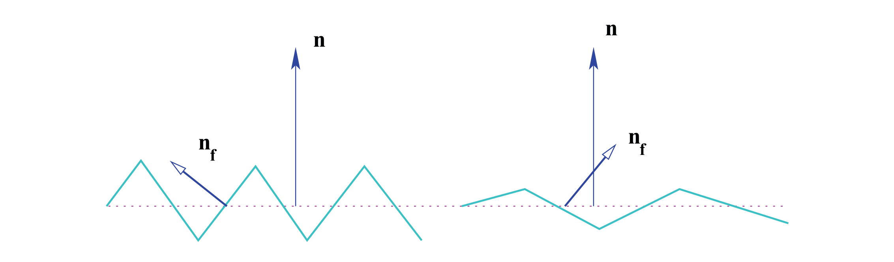

$$
G(\mathbf{u}, \mathbf{v})=\min \left\{1, \frac{2(\mathbf{n} \cdot \mathbf{h})(\mathbf{n} \cdot \mathbf{u})}{(\mathbf{u} \cdot \mathbf{h})}, \frac{2(\mathbf{n} \cdot \mathbf{h})(\mathbf{n} \cdot \mathbf{v})}{(\mathbf{u} \cdot \mathbf{h})}\right\}
$$

> Torrance-Sparrow BRDF  是各向同性材料最完整的物理反射模型之一

### 3.5 Beard-Maxwell (1973)

 Beard-Maxwell BRDF是一种基于物理特性的经验模型，它模拟了一种特定类型的材料，油漆表面。反射主要由表面反射和体积反射两部分组成。

- superficial $f_{r, \text { sup }}$

  表面反射是发生在表面第一层的镜面反射。这一层由microfacet表示，其法线方向遵循统计分布D。

-  volumetric $f_{r, v o l}$

  体积反射分量是由地下水平面的光散射引起的。它主要由两个作用产生:第一层的局部镜面反射(其法线为n)和内部层的光反射的体积反射近似。

$$
f_{r \lambda}(\mathbf{u}, \mathbf{v})=f_{r, s u p \lambda}(\mathbf{u}, \mathbf{v})+f_{r, v o l} \lambda(\mathbf{u}, \mathbf{v}) 
$$

表面反射分量由介质的菲涅耳系数控制 (使用k = 0  y η = 1,65)，计算公式为:
$$
f_{r, s u p}(\mathbf{u}, \mathbf{v})=-\frac{F(\beta)}{F(0)} \frac{f_{r}(\mathbf{h}) \cos ^{2}(\mathbf{h})}{\cos (\mathbf{u}) \cos (\mathbf{v})} S O(\mathbf{u}, \mathbf{h}, \tau, \Omega)
$$

> //TODO:

### 3.6 Phong (1975)

Phong 是一个非常流行的BRDF模型，它是第一个描述non-lambertian表面的模型。

它既不服从能量守恒也不服从相互作用的经验模型，但它的简单性使它成为计算机图形学中最常用的模型之一。

本质上，这个模型是对Torrance & Sparrow的简化，其中G和F因子被降低

D简化为:
$$
D(\mathbf{u}, \mathbf{v})=\cos ^{n}(\alpha)=\left(\mathbf{u} \cdot \mathbf{r}_{\mathbf{v}}\right)^{n}
$$

- 参数$n$ :$n \in[0, \infty]$  用来控制镜面反射

此外，通过对指数算子的优化，该模型可以更快，如Schlick给出的:
$$
\cos ^{n}(\alpha) \approx \frac{\cos (\alpha)}{n-n \cos (\alpha)+\cos (\alpha)} .
$$
第二个和第三个参数是镜面反射系数$k_{s}$和漫反射系数$k_{d}$，均取[0,1]
$$
f_{r}(\mathbf{u}, \mathbf{v})=k_{d}(\mathbf{v} \cdot \mathbf{n})+k_{s}(\mathbf{u} \cdot \mathbf{r})^{n}
$$

### 3.7 Blinn (1977)

通过法向量和半角向量获取高光
$$
D(\mathbf{h})=(\mathbf{n} \cdot \mathbf{h})=\cos (\delta)
$$

$$
f_{r}(\mathbf{u}, \mathbf{v})=k_{d}(\mathbf{u} \cdot \mathbf{n})+k_{s}(\mathbf{n} \cdot \mathbf{h})^{n} \quad \text { with } k_{d}+k_{s}=1
$$

### 3.8 Cook-Torrance (1981)

- 现实中所发生的反射现象既不是纯粹的漫反射面也不是纯粹的镜面，所以线性组合它们并不是最好的选择。
- Cook和Torrance使用光学理论寻找解决方案，他们使用了以前的著作以及一些新想法:只有那些面向h矢量的microfacet才有助于最终的反射。
- 该模型还在渲染领域引入了一种新型材料，区分了金属和非金属表面。
- 反射是用三个组成部分来描述的:环境部分，漫射部分和镜面部分。

$$
\rho=\rho_{a}+k_{s} \rho_{s}+k_{d} \rho_{d}, \quad \text { donde } k_{s}+k_{d}<1
$$

高斯分布
$$
D(\mathbf{h})=\cos (\beta) e^{-\left(\frac{\alpha}{m}\right)^{2}}
$$
Beckman 分布
$$
D(\mathbf{h})=\frac{1}{m^{2} \cos ^{4}(\alpha)} e^{-\left[\frac{\tan (\alpha)}{m}\right]^{2}}
$$

高光计算
$$
f_{r, s}(\mathbf{u}, \mathbf{v})=\frac{F(\beta)}{\pi} \frac{D(\mathbf{h}) G(\mathbf{u}, \mathbf{v})}{(\mathbf{n} \cdot \mathbf{u})(\mathbf{n} \cdot \mathbf{v})}
$$

> //TODO:

### 3.9 Kajiya (1985)

> Kajiya模型[Kaj85]实现了蛮力的各向异性方法，估计了反射强度光的解析形式。它是基于Kirchoff近似和一个平稳的基础方法来近似辐射方程(Eq. 2.12)。Kajiya考虑了一个简化的粗糙表面模型，并在其位置上使用了最近的切面。
>
> 在这项工作中，Kajiya计算和存储反射率在一个表每次表面照明评估。之后，使用表中的值进行线性插值。尽管他使用了一种新的数字t

### 3.10 Poulin-Fournier (1990)

3.11
Strauss (1990)

3.12
He-Torrance-Sillion-Greenberg (1991)

3.13
Ward (1992)	

3.14
Westin (1992)

3.15
Lewis (1993)

3.16
Schlick (1993)

3.17
Hanrahan (1993)

3.18
Oren-Nayar (1994)

3.19
Neumann-Neumann (1996)

3.20
Lafortune (1997)

3.21
Shirley (1997)

3.22
Ashikhmin-Shirley (2000)

3.23
Granier-Hiedrich (2003)

## 第四章 Sampling of the BRDF BRDF采样

## 论文记录

visual human
system [Gla94, Bue01]

 Law of Reflection [FvDaSFH90] 

Helmholz Reciprocity Rule [CP85]

[PF90, KM99] 局部坐标计算BRDF

We consider the following classification given by Ward [War92]: BRDF 分类？

其他相关文章

[Radiant Flux Density (Irradiance and Radiant Exitance)](https://biocyclopedia.com/index/algae/working_with_light/radiant_flux_density_irradiance_and_radiant_exitance.php)

[Radiance  wiki](https://zh.wikipedia.org/wiki/%E8%BE%90%E5%B0%84%E7%8E%87)