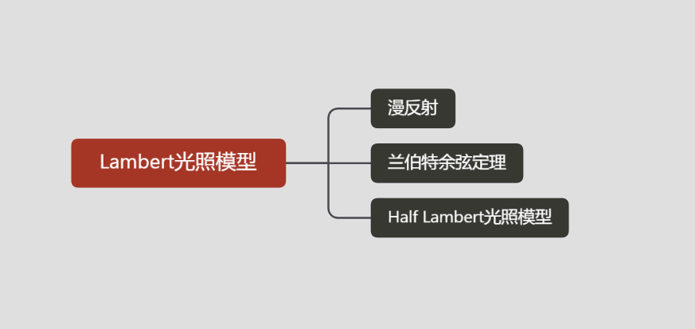
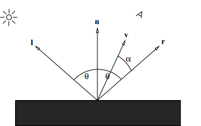
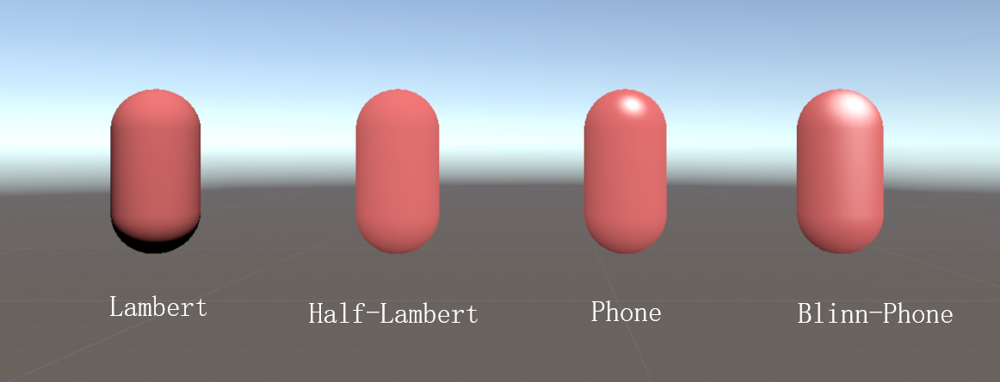
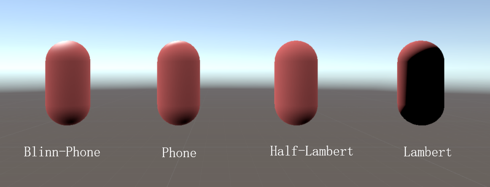
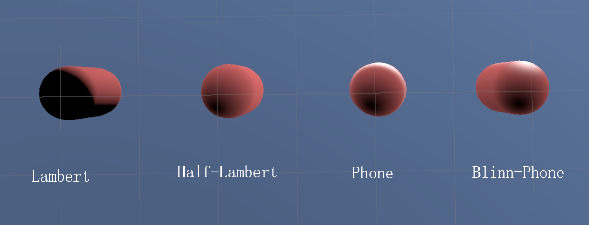

## 简介

基础的反射模型

## 漫反射

漫反射，是投射在粗糙表面上的光向各个方向反射的现象。当一束平行的入射光线射到粗糙的表面时，表面会把光线向着四面八方反射，所以入射线虽然互相平行，由于各点的法线方向不一致，造成反射光线向不同的方向无规则地反射，这种反射称之为“漫反射”或“漫射”。这种反射的光称为漫射光。

特点:

- 光照强度与观察角度没有关系
  从各个角度观看灯光时，它都具有相同明显的强度

- 光照强度跟灯光的入射角有关系
  如果改变光的入射光方向可以看到模型表面的光照强度发生了变化

## 兰伯特余弦定理

> 在光学中，朗伯的余弦定律说，从理想的漫反射表面或理想的漫射辐射体观察到的辐射强度或发光强度与入射光的方向与表面法线之间的夹角θ的余弦成正比。该定律也称为余弦发射定律或兰伯特发射定律。它以约翰·海因里希·兰伯特（Johann Heinrich Lambert）的名字命名，来自他于1760年出版的《Photometria》。

、

**计算方程:**
$$
I _ { d } = k _ { d } m a x ( 0 , \vec{n} \cdot \vec{l} ) L _ { d }\\\\
0 \leq k _ { d } \leq 1
$$

- 漫反射亮度受光线入射方向$l$与单位表面的法线$n$夹角影响
- 受$l$和$n$的夹角的影响，夹角为0时光照最亮，夹角为90度时无光照
- 如果$ \vec{n} \cdot \vec{l} <0$ ，代表光照方向和法线方向相反，此时不做光照处理：$m a x ( 0 , \vec{n} \cdot l ) $ 

## Half Lambert光照模型

> 反射光线强度 = 入射光线颜色 * 漫反射颜色 * (0.5 * ( 法线方向 · 光源方向 ) + 0.5)

该光照模型是由Valve公司开发《半条命》时提出的，是一种用于低光照区域照亮物体的技术。

由前面的兰伯特公式我们知道一旦入射光向量与材质表面的角度大于90度，那么得到的漫反射颜色就会全部变为黑色，没有任何明暗变化效果！

半兰伯特是将n·I得到的结果加工，通常是先乘以0.5，然后再加上0.5，这样就将光照值从（-1，1）重新映射到了（0，1）。

## 常见四种光照模型对比

## 相关链接

[Lambertian_reflectance](https://en.wikipedia.org/wiki/Lambertian_reflectance)

[Lambert's cosine law](https://en.wikipedia.org/wiki/Lambert%27s_cosine_law)

[Lambert Shader.glsl](https://gist.github.com/TomMinor/088766855a5fb161e236)

**PDF**

http://www.cs.cmu.edu/afs/cs/academic/class/15462-s10/www/lec-slides/lec11.pdf

http://www.cs.cornell.edu/courses/cs4620/2010fa/lectures/09shadingBasics.pdf

**https://www.cse.usf.edu/~r1k/MachineVisionBook/MachineVision.files/MachineVision_Chapter9.pdf**

**https://hal.inria.fr/hal-01919501/document**

https://lambertetfils.com/wp-content/uploads/2017/11/Beaubien-Simple-Shade.pdf

**Blog**

[Unity Shader 入门 (5) | 半兰伯特、高光反射、BlinnPhone](https://zhuanlan.zhihu.com/p/114977139)