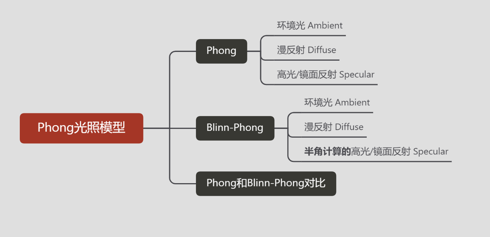
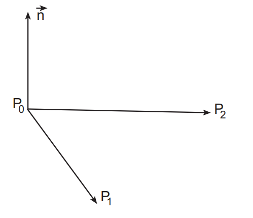
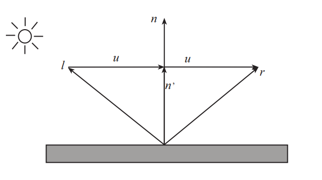
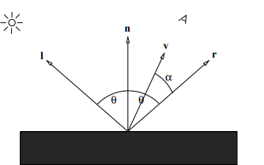
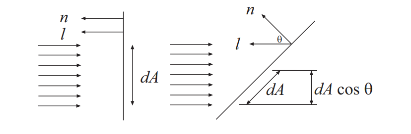
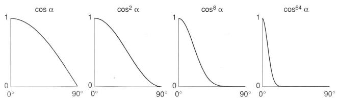
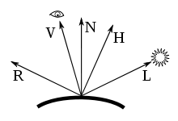

## 简介

在3D计算机图形学中，**Phong**着色是计算机图形学先驱**Bui Tuong Phong**发明的一种用于表面着色的插值技术。也称为Phong插值或法向矢量插值阴影。它会在栅格化的多边形上内插表面法线，并根据内插法线和反射模型计算像素颜色。Phong阴影也可以指Phong插值和Phong反射模型的特定组合。

1. 计算多边形顶点的法向量
2. 双线性插值计算每个像素点的法向量
3. 通过每个像素的法向量计算光强
4. 根据光强绘制像素

**历史：**

在1975年，由Phong提出，以他的名字冠名。是一种局部光照的模型，他认为一个光照模型可以用三种不同的部分组成，主要包括`ambient`,`diffuse`,`specular`(环境光，漫反射和高光)。

### Phong着色法与Gouraud着色法 对比

Phong着色法与Gouraud着色法类似，区别在于进行双线性插值的不是光照强度本身，而是顶点的法线。因此使用这种着色法计算出的高光比Gouraud着色更精确。Phong著色法
与Gouraud著色法比较，Phong著色法的效果更逼真，能够提供更好的光滑曲面的近似值。Phong著色法假设一个平滑变化的曲面为一矢量。

在对于有较小的高光曲线区的反射模型，例如PHONG模型时，Phong著色法比Gouraud著色法更优。但运算程序也比前者为复杂。Gouraud著色法在遇到在较大的多边形模型中央有高光曲线区时会产生严重的问题。因为这些高光曲线区在多边形的顶点处会产生缺失，而Gouraud著色法是基于顶点的颜色的，这些高光曲线区会从多边形的内部缺失。这个问题在Phong著色法中得到了解决。不同于通过多边形差值的Gouraud著色法，Phong著色法中一个矢量是从多边形顶点的法线到多边形表面进行差值的。为了或得到最后的像素颜色，面的法线被差值，应用于一个反射模型。由于Phong著色法需要逐像素点进行计算，因此运算量远大于Gouraud著色法。

Phong光照模型是真实图形学中提出的第一个有影响的光照明模型，该模型只考虑物体对直接光照的反射作用，认为环境光是常量，没有考虑物体之间相互的反射光，物体间的反射光只用环境光表示。Phong光照模型属于简单光照模型。

## 基本概念

Phong模型认为物体表面反射光线由三部分组成：

- 环境光（Ambient）：场景中的其他间接光照
- 漫反射（Diffuse）：散射部分（大但不光亮）
- 高光反射（Specular）：镜面反射部分（小而亮）

## 数学基础

### 平面法线计算

给定一个多边形上任意三个非共线的点，P0 P1 P2，计算该平面的法线：

公式
$$
\vec{n} = ( P _ { 1 } - P _ { 0 } ) \times ( P _ { 2 } - P _ { 0 } )
$$

### 反射向量计算

$$
\begin{gather}
\vec{n}^{\prime}=(\vec{n} \cdot \vec{l}) \vec{n} \\
\vec{u}=\vec{n}^{\prime}-\vec{l} \\
\vec{r}=\vec{l}+2 \vec{u}=\vec{l}+2\left(\vec{n}^{\prime}-\vec{l}\right)=2(\vec{n} \cdot \vec{l}) \vec{n}-\vec{l}
\end{gather}
$$

### 半角向量计算

平均分割了一个角的向量

$$
H = \frac { L + V } { | | L + V | | }
$$

## 公式推导

光照最终结果=环境光照+漫反射光照+镜面反射光照

- 法向量（Normal vector）：$n$
- 视口向量（View vector）：$v$
- 光源向量（Light vector）：$l$
- 反射向量（Reflection vector）：$r$

### 环境光 Ambient

环境光照是考虑到即使在不可见光源的地方，经过各种反射，总会带有微弱的光照。光线追踪的算法会更加准确，但是在这里采用一种简化的方法。就是将光源的颜色，乘以一个很小的系数，再乘以物体的颜色。

由于环境光计算过于复制，并难以计算。在Phong模型中环境光被简化为一个环境光反射系数和环境光光照强度的乘积：

-----

**计算方程:**
$$
0 \leq k _ { a } \leq 1\\\\
I _ { a } = k _ { a } L _ { a }
$$

- **环境光ambient=环境光反射系数*环境光光照强度**

### 漫反射 Diffuse

> **漫反射**（简称**漫射**，英语：diffuse reflection）是指当一束平行的入射光线射到粗糙的表面时，粗糙的表面会把光线向着各个方向反射的现象。虽然入射线互相平行，由于粗糙的表面上的各点的法线方向不一致，造成反射光线向不同的方向无规则地反射。这种反射的光称为漫射光。很多物体，如植物、墙壁、衣服等，其表面粗看起来似乎是平滑，但用放大镜仔细观察，就会看到其表面是凹凸不平的，所以本来是平行的太阳光被这些表面反射后，弥漫地射向不同方向。

、

**计算方程:**
$$
I _ { d } = k _ { d } m a x ( 0 , \vec{n} \cdot \vec{l} ) L _ { d }\\\\
0 \leq k _ { d } \leq 1
$$

- 漫反射亮度受光线入射方向$l$与单位表面的法线$n$夹角影响
- 受$l$和$n$的夹角的影响，夹角为0时光照最亮，夹角为90度时无光照
- 如果$ \vec{n} \cdot \vec{l} <0$ ，代表光照方向和法线方向相反，此时不做光照处理：$m a x ( 0 , \vec{n} \cdot l ) $ 

### 高光反射 Specular

镜面反射是指若反射面比较光滑，当平行入射的光线射到这个反射面时，仍会平行地向一个方向反射出来，这种反射就属于镜面反射

当一束平行光触及光滑物体表面时，光线则发生规律性反射，反射后的光线也相互平行，这种规律性反射称为光的单向反射或镜面反射。但物体的光滑程度是相对的，而一般物体的表面多粗糙不平，入射线虽然为平行光线，但反射后的光线则向各个方向分散，此种现象为光的漫反射。

-----

**计算方程：**
$$
I_{s}=k_{s}(\vec{r} \cdot \vec{v})^{s} L_{s}
$$

- 取反射方向和视口方向的夹角作为高光区域的判定
- 指数系数$s$: 如下图所示，控制高光区域的大小

-----

### Phong 模型

$$
\begin{aligned}
I &=I_{a}+I_{d}+I_{s} \\
&=k_{a} L_{a}+k_{d} \max (0, \vec{n} \cdot \vec{l}) L_{d}+k_{s}(\vec{r} \cdot \vec{v})^{s} L_{s}
\end{aligned}
$$

## Blinn-Phong光照模型

Blinn-Phong光照模型在物理上的正确性不必Phong高，但计算效率提高了很多。当观察向量与反射向量越接近，那么半角向量与法向量N越接近，观察者看到的镜面光成分越强。

#### Blinn-Phong 计算方程

$$
\begin{aligned}
I &=I_{a}+I_{d}+I_{s} \\
&=k_{a} L_{a}+k_{d} \max (0, \vec{n} \cdot \vec{l}) L_{d}+k_{s}(\vec{n} \cdot \vec{h})^{s} L_{s}
\end{aligned}
$$

#### Blinn-Phong和Phong对比

## 相关链接

[Phong+Shading pdf)](https://web.eecs.umich.edu/~sugih/courses/eecs487/lectures/16-Phong+Shading.pdf)

[Illumination I: The Phong Illumination Model pdf](https://www.cs.utexas.edu/~bajaj/graphics2012/cs354/lectures/lect14.pdf)

[一种改进的Phong光照模型及光线跟踪实现](http://gb.oversea.cnki.net/KCMS/detail/detail.aspx?filename=XTFZ200212021&dbcode=CJFD&dbname=cjfd2002)

[Phong wiki](https://en.wikipedia.org/wiki/Phong_reflection_model)

[Jim Blinn](https://en.wikipedia.org/wiki/Jim_Blinn)

[Bui Tuong Phong](https://en.wikipedia.org/wiki/Bui_Tuong_Phong)

[Phong reflection model](https://en.wikipedia.org/wiki/Phong_reflection_model)

Blinn–Phong GLSL多光源实现 [Blinn–Phong reflection model](https://en.wikipedia.org/wiki/Blinn%E2%80%93Phong_reflection_model)

**Blog**

[Phong和Blinn照明模型之间的关系](https://seblagarde.wordpress.com/2012/03/29/relationship-between-phong-and-blinn-lighting-model/)

[blinn-phong-shading](https://garykeen27.wixsite.com/portfolio/blinn-phong-shading)

[百度百科 镜面反射](https://baike.baidu.com/item/%E9%95%9C%E9%9D%A2%E5%8F%8D%E5%B0%84/805523)

**国外大学课程**

使用WebGL实现了一些效果 [CS315: Illumination 2](https://www.cs.uregina.ca/Links/class-info/315/WebGL/Lab7/)

**代码实现**

[OpenGL: Blinn-Phong model implemented in shaders give wrong result](https://stackoverflow.com/questions/50875639/opengl-blinn-phong-model-implemented-in-shaders-give-wrong-result)

[opengl高级光照-Blinn-Phong](https://www.jianshu.com/p/1587e2b96d76)

[DirectX10 Tutorial 8: Lighting Theory and HLSL](https://takinginitiative.wordpress.com/2010/08/30/directx-10-tutorial-8-lighting-theory-and-hlsl/)

[HLSL per-pixel point light using phong-blinn lighting model](https://brooknovak.wordpress.com/2008/11/13/hlsl-per-pixel-point-light-using-phong-blinn-lighting-model/)

[Lambert、Phong、BlinnPhong光照模型(逐顶点+逐像素计算)](https://zhuanlan.zhihu.com/p/85511319)

**论文**

Bui Tuong Phong published his illumination model in 1973: "[Illumination for Computer-Generated Images](http://portal.acm.org/citation.cfm?id=906584&dl=ACM&coll=&CFID=15151515&CFTOKEN=6184618)".

