-----

## 官网

[Directory Opus (gpsoft.com.au)](https://www.gpsoft.com.au/)


## 配置

### 从Win+E启动

#### 设置快捷键

点击自定义

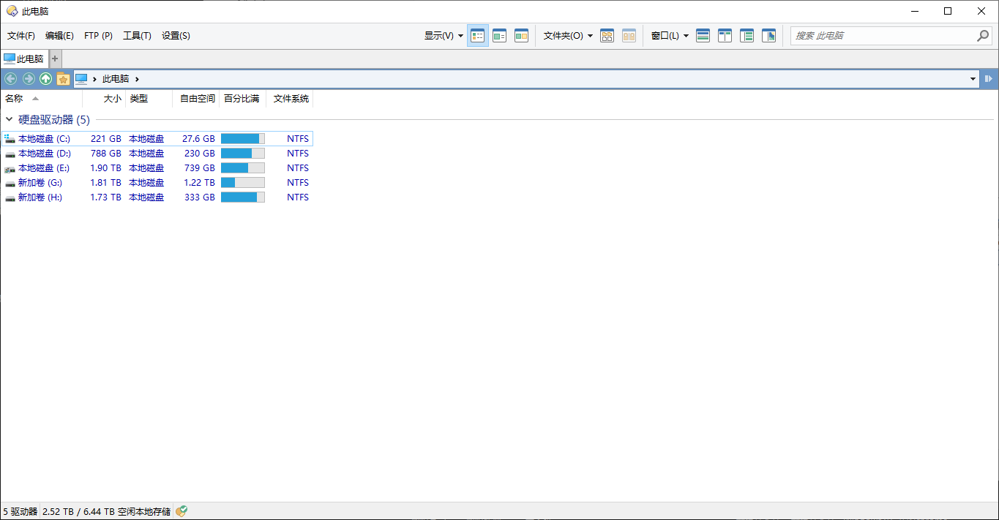


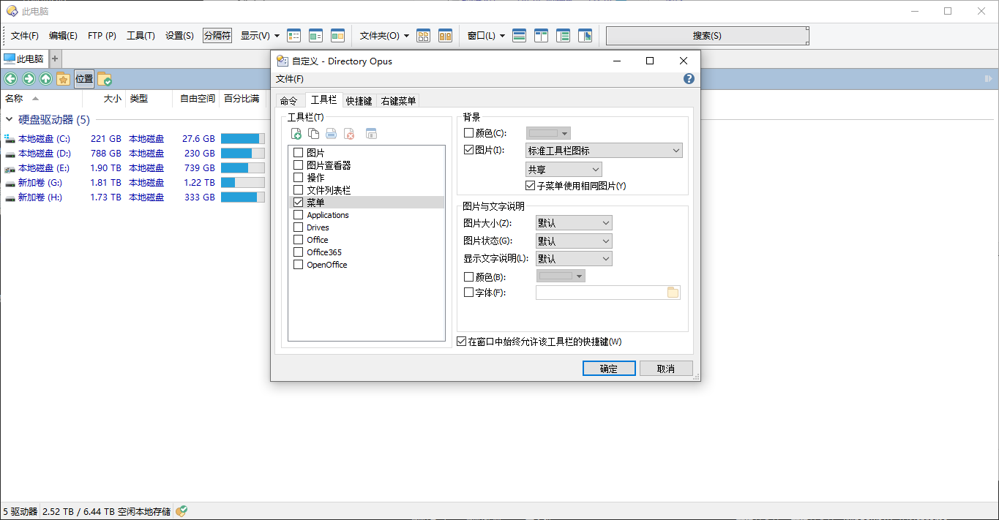


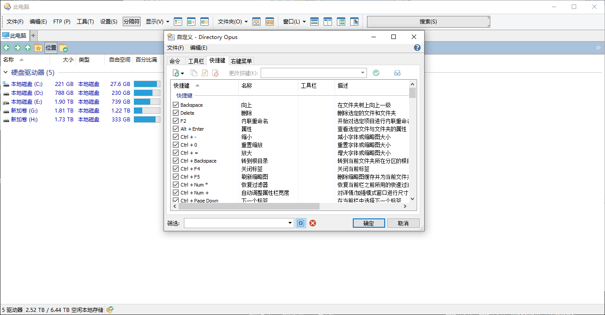


找到Win+E


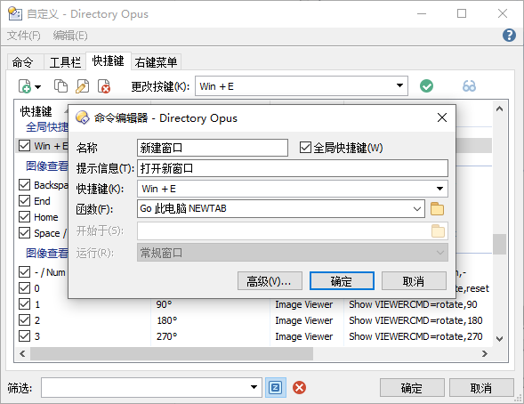


```
Go 此电脑 NEWTAB
```


#### 启动设置

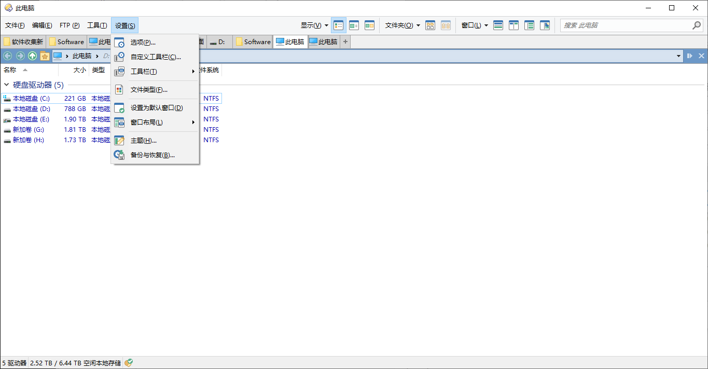


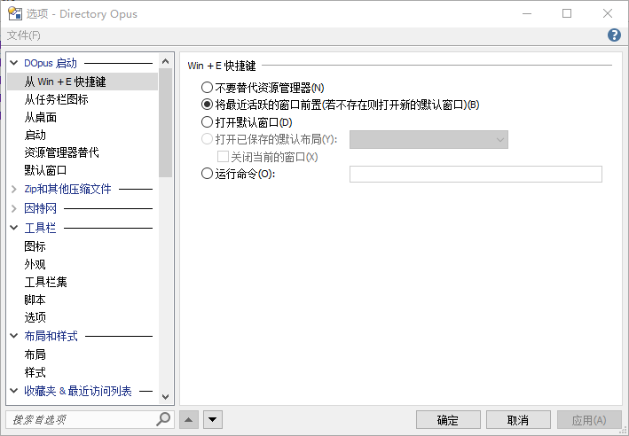

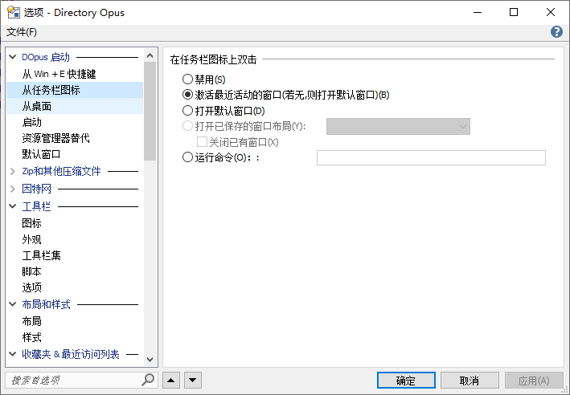

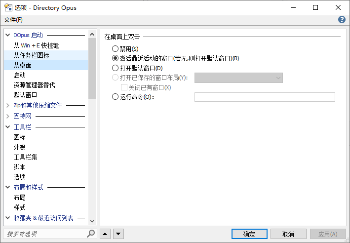

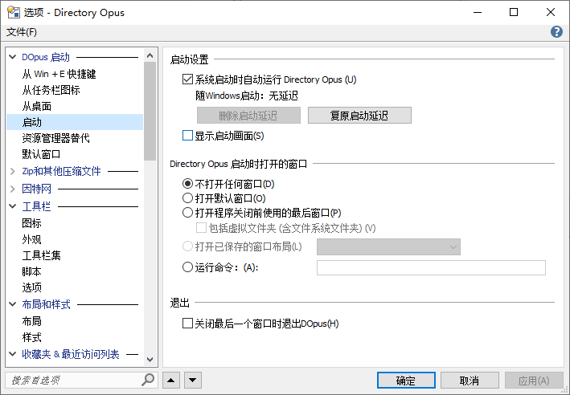

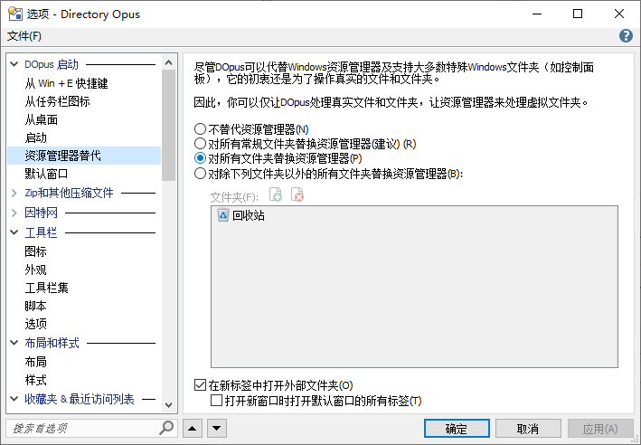


## 标签栏上移

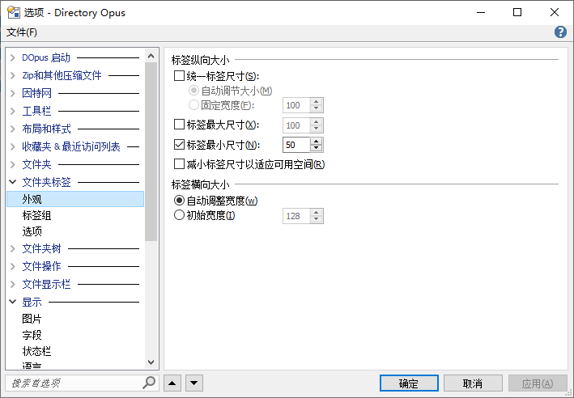

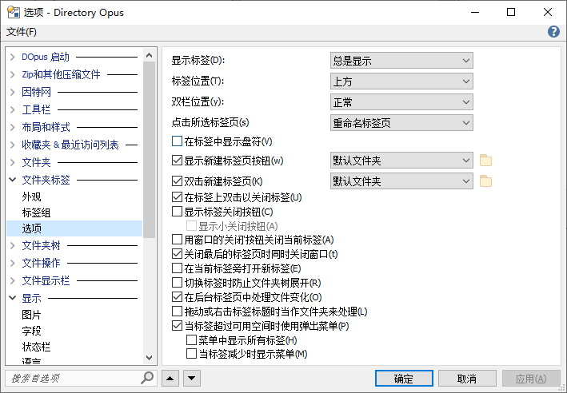


## 窗口标题栏显示完整路径

